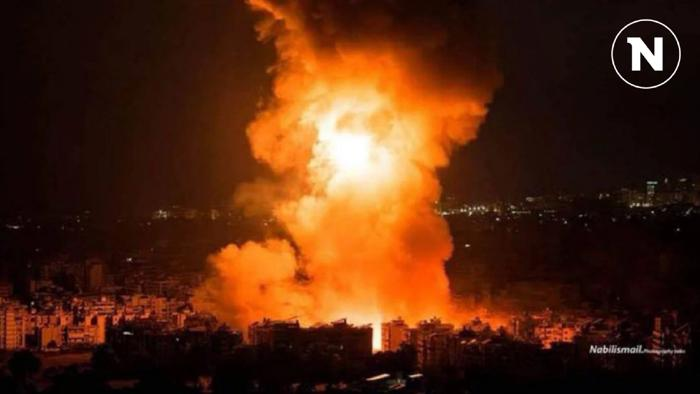
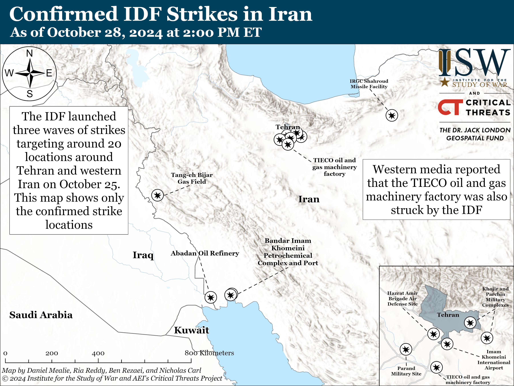
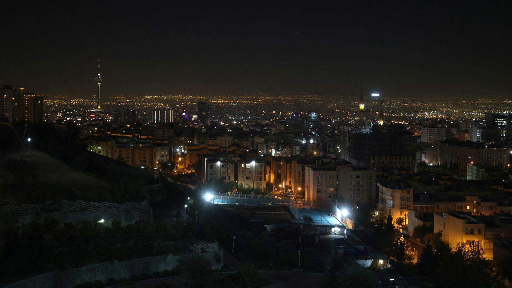
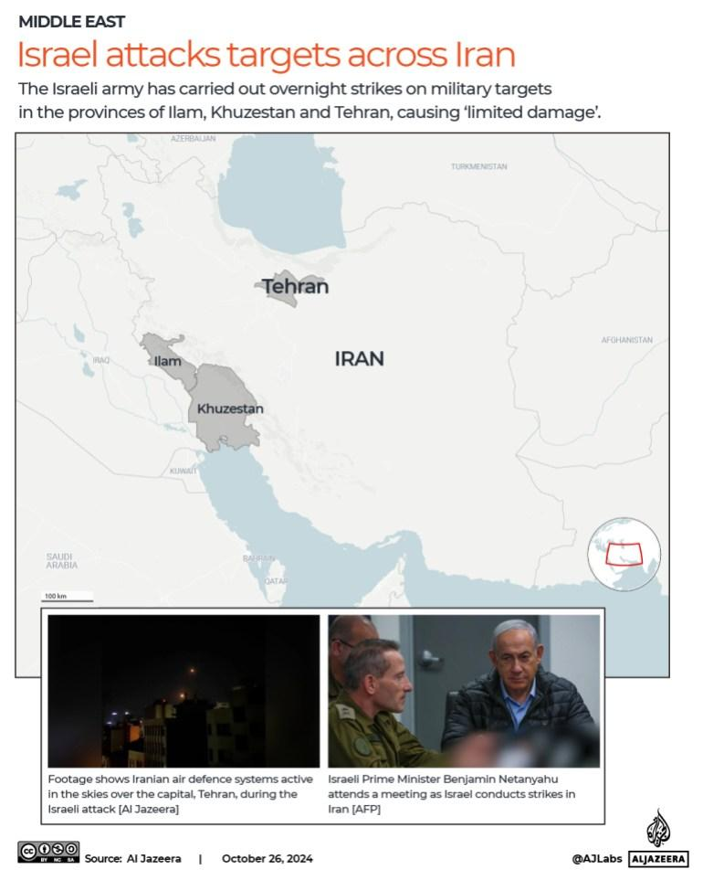

## Claim
Claim: " This image shows Israel launching several waves of revengeful attacks on Iranian military targets on October 26, 2024."

## Actions
```
reverse_search()
image_search("Israel attacks Iranian military targets October 26 2024")
```

## Evidence
### Evidence from `reverse_search`
The image 

### Evidence from `image_search`
The Institute for the Study of War and AEI's Critical Threats Project published a map showing confirmed IDF strikes in Iran as of October 28, 2024, which targeted around 20 locations around Tehran and western Iran on October 25. ([https://www.understandingwar.org/backgrounder/iran-update-october-28-2024](https://www.understandingwar.org/backgrounder/iran-update-october-28-2024)) 

CNN and Al Jazeera also reported on Israeli strikes on military targets in Iran on October 26, 2024. ([https://www.cnn.com/2024/10/26/middleeast/israel-strikes-iran-explainer-intl-hnk](https://www.cnn.com/2024/10/26/middleeast/israel-strikes-iran-explainer-intl-hnk))  ([https://www.aljazeera.com/news/2024/10/26/condemnation-calls-for-restraint-world-reacts-to-israeli-strikes-on-iran](https://www.aljazeera.com/news/2024/10/26/condemnation-calls-for-restraint-world-reacts-to-israeli-strikes-on-iran)) 


## Elaboration
The evidence confirms that Israel launched strikes on Iranian military targets on October 26, 2024. The Institute for the Study of War and AEI's Critical Threats Project published a map showing confirmed IDF strikes in Iran as of October 28, 2024, which targeted around 20 locations around Tehran and western Iran on October 25. CNN and Al Jazeera also reported on Israeli strikes on military targets in Iran on October 26, 2024.

However, the evidence does not provide information about the image itself. Therefore, I cannot verify if the image shows the attacks.

I need more information to verify the claim about the image.


## Actions
```
geolocate()
```

## Evidence
### Evidence from `geolocate`
The most likely countries where the image was taken are: {'Palestine': 0.4, 'Israel': 0.3, 'Bangladesh': 0.04, 'Taiwan': 0.04, 'Ukraine': 0.04, 'China': 0.02, 'Pakistan': 0.02, 'Bulgaria': 0.01, 'Jordan': 0.01, 'Malta': 0.01}

## Elaboration
The evidence suggests that the image could be from Israel or Palestine. Since the claim states that the image shows Israeli attacks on Iran, and the evidence confirms that Israel did attack Iran on October 26, 2024, the claim is plausible. However, without further information, I cannot confirm the image's origin or if it depicts the attacks.


## Actions
```
image_search("Israel attacks Iran October 26 2024 image")
```

## Evidence
### Evidence from `image_search`
From [Source](https://www.understandingwar.org/backgrounder/iran-update-october-26-2024): 
Content: The Institute for the Study of War and AEI's Critical Threats Project published a map showing confirmed IDF strikes around Tehran on October 25, 2024. 


## Elaboration
The evidence confirms that Israel launched strikes on Iranian military targets on October 26, 2024, and the image search results show a map of the confirmed strike locations around Tehran. However, the image search did not return the image in question. Therefore, I cannot confirm that the image depicts the attacks.

I still need more information to verify the claim about the image.


## Final Judgement
The claim is partially supported by the evidence. The evidence confirms that Israel launched strikes on Iranian military targets on October 26, 2024. However, the image itself has not been verified to be related to the attacks. Therefore, the claim is not fully supported. `false`

### Verdict: FALSE

### Justification
The claim is partially supported. While evidence confirms that Israel launched strikes on Iranian military targets on October 26, 2024, as reported by sources like [CNN](https://www.cnn.com/2024/10/26/middleeast/israel-strikes-iran-explainer-intl-hnk) and [Al Jazeera](https://www.aljazeera.com/news/2024/10/26/condemnation-calls-for-restraint-world-reacts-to-israeli-strikes-on-iran), the image in question has not been definitively linked to these attacks.
