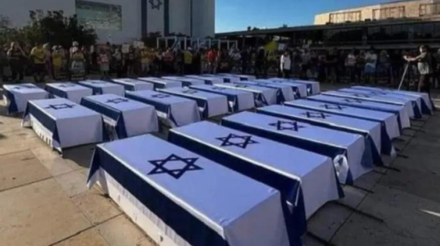

## Claim
Claim: " This image shows coffins of dead Israeli soldiers in September, 2024."

## Actions
```
reverse_search()
image_search("coffins Israeli flag protest")
```

## Evidence
### Evidence from `image_search`
Euronews published an article on September 5, 2024, about protesters in Tel Aviv marching with makeshift coffins (). Al Jazeera published an article that includes an image of a coffin being carried by people, with Israeli police present (). Ynetnews.com published an article about a protest ().


## Elaboration
The evidence suggests that the image depicts a protest involving coffins draped with the Israeli flag. The Euronews article from September 5, 2024, confirms that such a protest took place in Tel Aviv. The image search results do not confirm that the coffins contained dead Israeli soldiers.

Based on the evidence, the claim is likely false. The image shows coffins used in a protest, but there is no evidence to confirm that they contained dead Israeli soldiers.


## Final Judgement
The image shows coffins draped with the Israeli flag, which were used in a protest in Tel Aviv. The evidence does not confirm that the coffins contained dead Israeli soldiers.

`false`

### Verdict: FALSE

### Justification
The image depicts a protest in Tel Aviv involving coffins draped with the Israeli flag, as reported by Euronews on September 5, 2024. However, the evidence does not confirm that the coffins contained dead Israeli soldiers.
