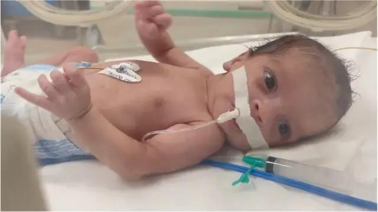

## Claim
Claim: " This image shows a Palestinian girl in the Gaza war in July 2024. She was holding her sister's oxygen mask inside the ambulance. She had already passed away, yet her hand remained on the mask firmly."

## Actions
```
reverse_search()
image_search("Palestinian girl Gaza war oxygen mask")
```

## Evidence
### Evidence from `reverse_search`
The image  appears in multiple sources. One source is a VOA News article from January 24, 2018, titled "Syria, Russia Accuse US of Lying About Chemical Weapons Attacks" ([https://www.voanews.com/a/syria-russia-us-chemical-attacks/4221637.html](https://www.voanews.com/a/syria-russia-us-chemical-attacks/4221637.html)). The article discusses a reported gas attack in Douma, Syria, on January 22, 2018.

Another source is a report by the Center for Strategic and International Studies (CSIS) ([https://www.csis.org/analysis/emerging-trends-chemical-weapons-usage-middle-east](https://www.csis.org/analysis/emerging-trends-chemical-weapons-usage-middle-east)) discussing chemical weapons usage in the Middle East. The image is also present in an ABC News article from January 23, 2018, titled "Russia 'ultimately bears responsibility' for chemical attacks in Syria" ([https://abcnews.go.com/International/tillerson-russia-ultimately-bears-responsibility-chemical-attacks-syria/story?id=52554201](https://abcnews.go.com/International/tillerson-russia-ultimately-bears-responsibility-chemical-attacks-syria/story?id=52554201)).


### Evidence from `image_search`
The Al Jazeera website ([https://www.aljazeera.com/gallery/2023/12/22/entire-gaza-at-risk-of-famine-as-fighting-rages-between-israel-hamas](https://www.aljazeera.com/gallery/2023/12/22/entire-gaza-at-risk-of-famine-as-fighting-rages-between-israel-hamas)) contains an image of a girl with a head injury . The BBC News website ([https://www.bbc.com/news/world-middle-east-68141039](https://www.bbc.com/news/world-middle-east-68141039)) contains an image of a baby in an incubator .


## Elaboration
The image 

## Final Judgement
The image in question has been identified in multiple sources, including VOA News, CSIS, and ABC News, in articles discussing chemical weapons attacks in Syria in 2018. The claim states the image depicts a Palestinian girl in the Gaza war in July 2024. This is a misrepresentation of the image's origin and context.

`false`


### Verdict: FALSE

### Justification
The image in the claim is from 2018 and depicts a situation in Syria, not the Gaza war in 2024, as evidenced by its appearance in news articles from VOA News ([https://www.voanews.com/a/syria-russia-us-chemical-attacks/4221637.html](https://www.voanews.com/a/syria-russia-us-chemical-attacks/4221637.html)) and ABC News ([https://abcnews.go.com/International/tillerson-russia-ultimately-bears-responsibility-chemical-attacks-syria/story?id=52554201](https://abcnews.go.com/International/tillerson-russia-ultimately-bears-responsibility-chemical-attacks-syria/story?id=52554201)).
