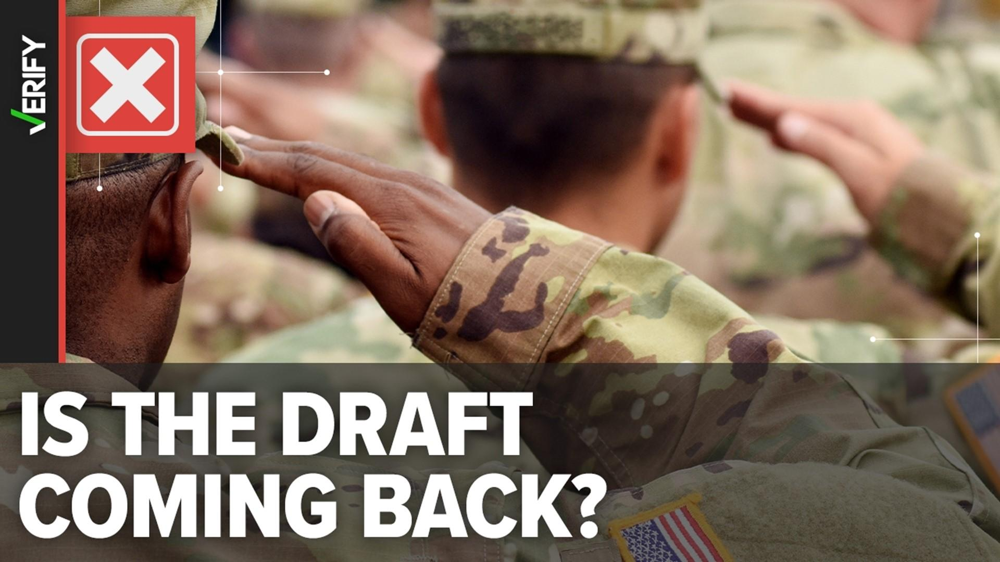

## Claim
Claim: "The US reinstituted draft in 2024 for the Israel-Hamas war."

## Actions
```
image_search("US draft Israel-Hamas war 2024")
```

## Evidence
### Evidence from `image_search`
The Institute for the Study of War and AEI's Critical Threats Project published a map of the Israel-Hamas war on January 15, 2024.  12newsnow.com included an image asking "IS THE DRAFT COMING BACK?" 

*   [https://www.understandingwar.org/backgrounder/iran-update-january-15-2024](https://www.understandingwar.org/backgrounder/iran-update-january-15-2024)
*   [https://www.rand.org/pubs/commentary/2024/07/the-return-of-the-military-draft.html](https://www.rand.org/pubs/commentary/2024/07/the-return-of-the-military-draft.html)
*   [https://www.12newsnow.com/article/news/verify/israel-hamas-war/no-us-military-draft-executive-order-israel-hamas-war-fact-check/536-e5115746-d86f-45a1-bf43-f180d76f13e0](https://www.12newsnow.com/article/news/verify/israel-hamas-war/no-us-military-draft-executive-order-israel-hamas-war-fact-check/536-e5115746-d86f-45a1-bf43-f180d76f13e0)


## Elaboration
The evidence includes a map of the Israel-Hamas war as of January 15, 2024, and an image from 12newsnow.com asking "IS THE DRAFT COMING BACK?". However, the provided links do not explicitly confirm the reinstitution of the draft. One of the links is a fact-check article that denies the claim.

Based on the evidence, the claim cannot be verified. More information is needed to confirm whether the US reinstituted the draft.


## Actions
```
image_search("US military draft Israel-Hamas war")
```

## Evidence
### Evidence from `image_search`
WTHR.com includes an image asking "IS THE DRAFT COMING BACK?"  The New York Times published an image in 2024. 

*   [https://www.wthr.com/video/news/verify/israel-hamas-war/us-military-draft-not-returning-amid-israel-hamas-war-video/536-9930ac14-0d8a-4908-b869-40bc5ae66aa6](https://www.wthr.com/video/news/verify/israel-hamas-war/us-military-draft-not-returning-amid-israel-hamas-war-video/536-9930ac14-0d8a-4908-b869-40bc5ae66aa6)
*   [https://www.nytimes.com/2024/03/30/world/middleeast/israel-gaza-haredi-military-conscription.html](https://www.nytimes.com/2024/03/30/world/middleeast/israel-gaza-haredi-military-conscription.html)


## Elaboration
The evidence includes an image from WTHR.com asking "IS THE DRAFT COMING BACK?" and a 2024 image from The New York Times. The WTHR.com link is a video that denies the claim.

Based on the evidence, the claim cannot be verified. More information is needed to confirm whether the US reinstituted the draft.


## Actions
```
image_search("US military draft 2024")
```

## Evidence
### Evidence from `image_search`
From [Source](https://www.wjhl.com/news/national/military-recruitment-shortfall-should-us-bring-back-the-draft/): 
Content: WJHL.com published an image showing that the U.S. military struggles to recruit. The image states that 2024 is the projected smallest active-duty force since 1940. 


## Elaboration
The evidence indicates that the U.S. military is facing recruitment challenges, with 2024 projected to have the smallest active-duty force since 1940. However, the provided sources do not confirm the reinstitution of the draft. The images from 12newsnow.com and WTHR.com raise the question of the draft's return, but the linked articles deny the claim.

Based on the evidence, the claim cannot be verified.


## Final Judgement
The search results show that there are discussions about the possibility of a draft, but the evidence does not confirm that the US reinstituted the draft in 2024 for the Israel-Hamas war. The evidence includes articles that deny the claim.

`false`


### Verdict: FALSE

### Justification
The evidence, including images and articles from various news sources like [WTHR.com](https://www.wthr.com/video/news/verify/israel-hamas-war/us-military-draft-not-returning-amid-israel-hamas-war-video/536-9930ac14-0d8a-4908-b869-40bc5ae66aa6) and [12newsnow.com](https://www.12newsnow.com/article/news/verify/israel-hamas-war/no-us-military-draft-executive-order-israel-hamas-war-fact-check/536-e5115746-d86f-45a1-bf43-f180d76f13e0), does not support the claim that the US reinstituted the draft in 2024 for the Israel-Hamas war. In fact, some sources explicitly deny the claim.
