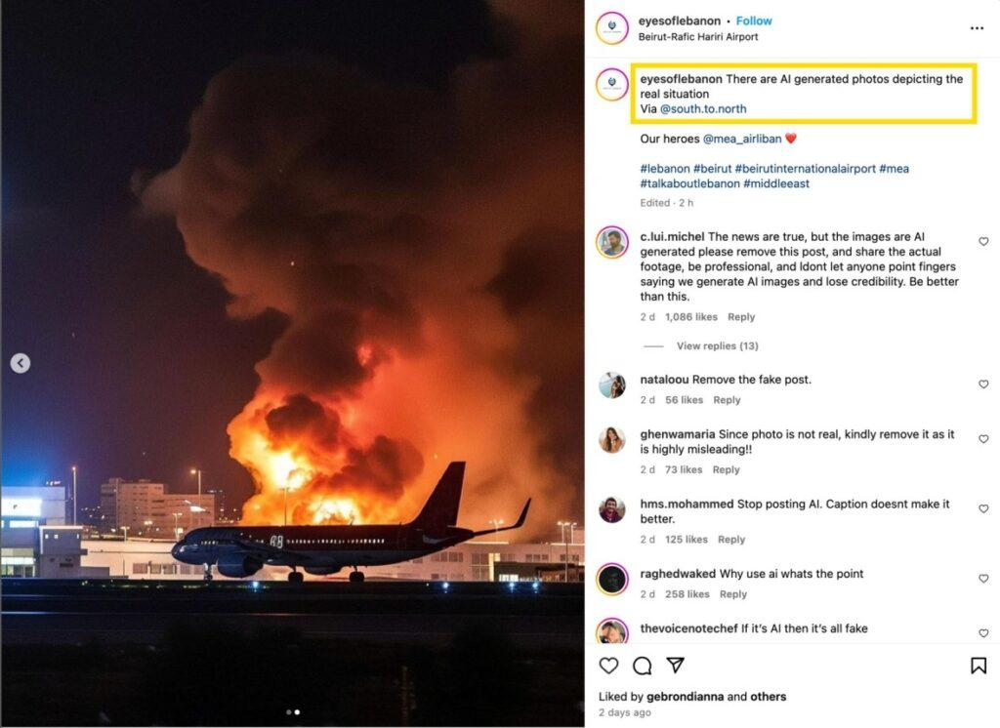

## Claim
Claim: " This is an authentic image of Israel bombing Beirut's International Airport in October 2024."

## Actions
```
reverse_search()
image_search("Beirut airport bombing")
```

## Evidence
### Evidence from `reverse_search`
The image  is AI-generated and does not depict a real event. According to [India Today](https://www.indiatoday.in/fact-check/story/fact-check-photo-middle-east-airlines-flight-israel-airstrikes-beirut-lebanon-ai-generated-2622766-2024-10-24), the image was fact-checked on October 24, 2024, and is AI-generated.

Factly.in ([https://factly.in/an-ai-generated-image-of-a-plane-landing-at-beirut-international-airport-surrounded-by-fire-and-smoke-is-falsely-shared-as-real/](https://factly.in/an-ai-generated-image-of-a-plane-landing-at-beirut-international-airport-surrounded-by-fire-and-smoke-is-falsely-shared-as-real/)) also confirms the image is AI-generated, and was posted on Instagram on October 21, 2024, with a caption confirming it as AI-generated. The article includes images , , , , and .


### Evidence from `image_search`
Al Jazeera reports on Israel bombing Beirut airport. () The Guardian published an article on July 14, 2006, with an image of a fire in Beirut. ()

The ABC News website published an article on July 14, 2006, about Israel bombing Beirut airport, including an image of a plane in front of a fire. ()


## Elaboration
The image is AI-generated and does not depict a real event. Multiple sources confirm that the image was created using AI and was shared on social media with a caption acknowledging it as AI-generated. The image was fact-checked on October 24, 2024.


## Final Judgement
The claim is demonstrably false. The image is AI-generated and does not depict a real event. Multiple sources confirm the image's AI origin. `false`

### Verdict: FALSE

### Justification
The image is AI-generated, as confirmed by multiple sources, including [India Today](https://www.indiatoday.in/fact-check/story/fact-check-photo-middle-east-airlines-flight-israel-airstrikes-beirut-lebanon-ai-generated-2622766-2024-10-24) and [Factly.in](https://factly.in/an-ai-generated-image-of-a-plane-landing-at-beirut-international-airport-surrounded-by-fire-and-smoke-is-falsely-shared-as-real/), which state the image was created using AI and falsely presented as a real event.
