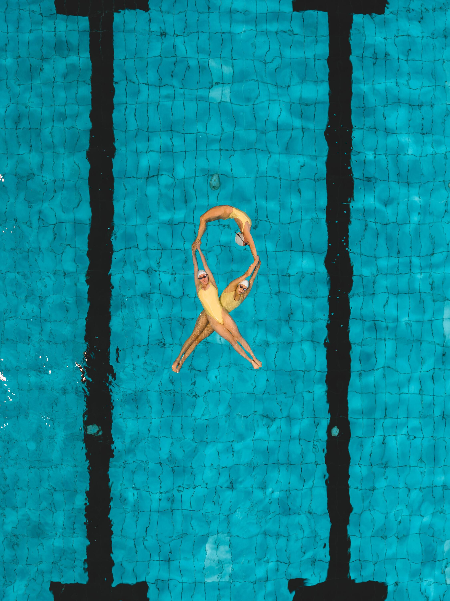
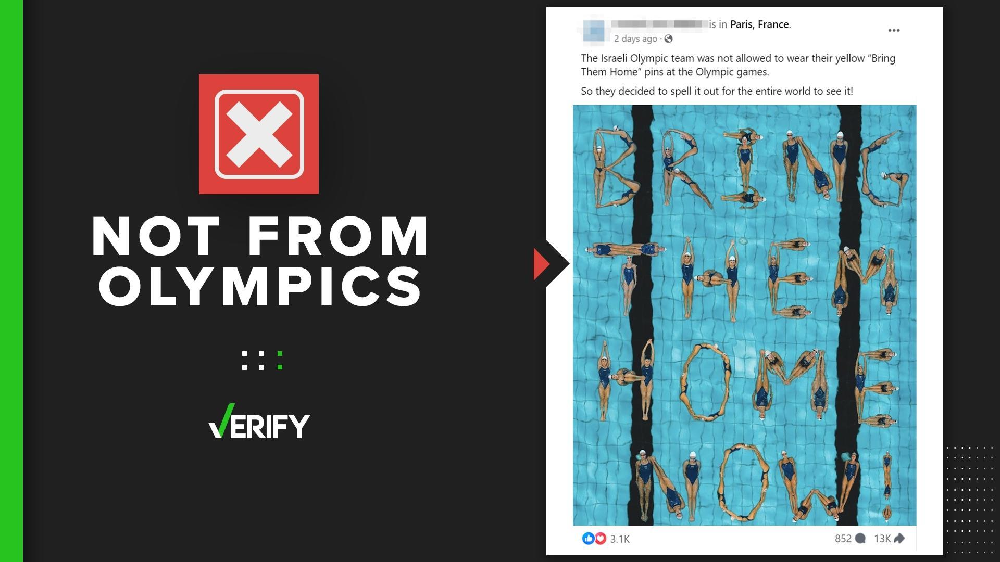

## Claim
Claim: " This image shows the Israeli Olympic team spelling out 'Bring Them Home' at the 2024 Olympic games because they were not allowed to wear their yellow 'Bring Them Home' pins."

## Actions
```
image_search("Israeli Olympic team Bring Them Home")
```

## Evidence
### Evidence from `image_search`
From [Source](https://www.ynetnews.com/culture/article/skmg5e5ma): 
Content: The search result from Ynetnews.com contains an image of synchronized swimmers. 


## Elaboration
The evidence shows an image of synchronized swimmers, which aligns with the image in the claim. However, the evidence does not confirm that the image depicts the Israeli Olympic team spelling out "Bring Them Home" at the 2024 Olympic games. The evidence also does not mention anything about the team not being allowed to wear yellow pins.

The claim's veracity cannot be determined with the available information. More information is needed to verify the context of the image and the team's actions.


## Actions
```
image_search("Israeli synchronized swimmers Bring Them Home pins")
```

## Evidence
### Evidence from `image_search`
From [Source](https://www.thv11.com/article/news/verify/olympics-verify/image-israeli-swimmers-bring-them-home-not-from-paris-2024-olympics/536-5f25fcff-c857-495b-8eba-3d6c5fb46ce9): 
Content: The search result from THV11.com contains an image of synchronized swimmers spelling out "Bring Them Home".  The article states that the image is not from the 2024 Olympics and that the Israeli Olympic team was not allowed to wear their yellow "Bring Them Home" pins at the Olympic games.


## Elaboration
The evidence confirms that the image depicts synchronized swimmers spelling out "Bring Them Home." The evidence also states that the image is not from the 2024 Olympics and that the Israeli Olympic team was not allowed to wear their yellow "Bring Them Home" pins at the Olympic games.

The claim is therefore partially false. The image does show the phrase "Bring Them Home" spelled out by synchronized swimmers, but it is not from the 2024 Olympics.


## Final Judgement
The image does show synchronized swimmers spelling out "Bring Them Home," but it is not from the 2024 Olympics. The Israeli Olympic team was not allowed to wear their yellow "Bring Them Home" pins at the Olympic games.

`false`

### Verdict: FALSE

### Justification
The image does depict synchronized swimmers spelling out "Bring Them Home," but it is not from the 2024 Olympics, as confirmed by a fact-check from [THV11.com](https://www.thv11.com/article/news/verify/olympics-verify/image-israeli-swimmers-bring-them-home-not-from-paris-2024-olympics/536-5f25fcff-c857-495b-8eba-3d6c5fb46ce9). The Israeli Olympic team was also not allowed to wear their yellow "Bring Them Home" pins at the Olympic games.
