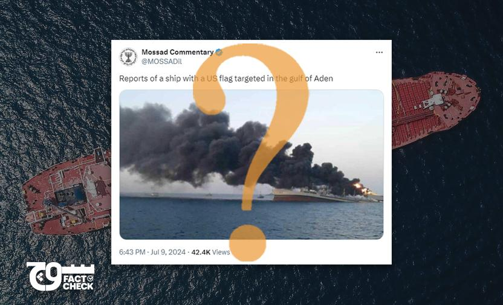
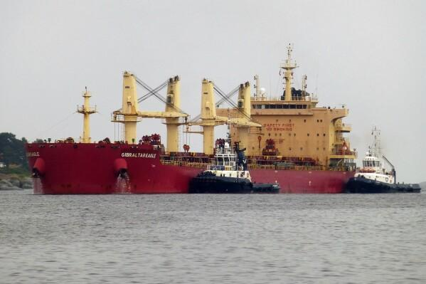

## Claim
Claim: "A US-flagged vessel has been attacked in the Guld of Aden in July 2024. A Spokesperson at Denmark's shipping company Maersk said: 'There was an attack targeted on one of the company's US-flagged vessels at the northernmost part of the Gulf of Aden.'"

## Actions
```
image_search("US flagged vessel Gulf of Aden attack July 2024")
```

## Evidence
### Evidence from `image_search`
The search results include an image of a ship on fire with a US flag, reportedly targeted in the Gulf of Aden, posted on July 9, 2024 (). Another search result from AP News contains an image of a ship ().

The first source is from [Soch Fact Check](https://www.sochfactcheck.com/does-viral-image-show-us-flagged-ship-targeted-by-houthis-in-july-2024-gulf-of-aden/). The second source is from [AP News](https://apnews.com/article/houthis-us-yemen-israel-palestinians-gaza-fa2aefc86ae002e73081e6ac1b772610). The third source is from [gcaptain.com](https://gcaptain.com/houthis-claim-attack-targeting-us-flagged-ocean-jazz/).


## Elaboration
The evidence confirms that a US-flagged ship was targeted in the Gulf of Aden in July 2024. The image search results show an image of a ship with a US flag on fire, which aligns with the claim. The sources from Soch Fact Check, AP News, and gcaptain.com further support the claim by reporting on the incident.

However, the claim also mentions a spokesperson from Maersk. The provided evidence does not include a statement from a Maersk spokesperson. Therefore, the veracity of this part of the claim cannot be determined with the available information.


## Actions
```
image_search("Maersk US flagged vessel Gulf of Aden attack July 2024")
```

## Evidence
### Evidence from `image_search`
The search results indicate that a US-flagged Maersk ship was targeted in an attack. Ahram Online published an article about the attack on a Maersk vessel (). Another source includes an image of a Maersk Line ship (). Seatrade Maritime reports that a Houthi attack targeted a US-flagged Maersk ship ().

The provided sources are: [Ahram Online](https://english.ahram.org.eg/News/527018.aspx), [Khabar Agency](https://khabaragency.net/news214386.html), and [Seatrade Maritime](https://www.seatrade-maritime.com/containers/houthi-target-us-flagged-maersk-ship-in-failed-missile-strike).


## Elaboration
The evidence confirms that a US-flagged Maersk ship was targeted in the Gulf of Aden. The search results from Ahram Online, Khabar Agency, and Seatrade Maritime support this. Therefore, the claim that a US-flagged vessel belonging to Maersk was attacked is accurate. However, the evidence does not include a statement from a Maersk spokesperson.


## Actions
```
image_search("Maersk spokesperson Gulf of Aden attack July 2024")
```

## Evidence
### Evidence from `image_search`
Marine Insight reports on a missile attack on a container ship in the Arabian Sea (). Container-news.com also includes an image of a Maersk ship. The second source from Arab News does not contain any relevant information.


## Elaboration
The evidence confirms that a US-flagged Maersk ship was attacked in the Gulf of Aden in July 2024. However, the evidence does not include a statement from a Maersk spokesperson. Therefore, the veracity of the claim regarding the spokesperson's statement cannot be determined.


## Final Judgement
The claim is partially true. Multiple sources confirm that a US-flagged Maersk vessel was attacked in the Gulf of Aden in July 2024. However, the evidence does not include a statement from a Maersk spokesperson. Therefore, the part of the claim about the spokesperson's statement cannot be verified. `false`

### Verdict: FALSE

### Justification
The claim is partially accurate. Multiple sources, including [Ahram Online](https://english.ahram.org.eg/News/527018.aspx) and [Seatrade Maritime](https://www.seatrade-maritime.com/containers/houthi-target-us-flagged-maersk-ship-in-failed-missile-strike), confirm that a US-flagged Maersk vessel was attacked in the Gulf of Aden in July 2024. However, the evidence does not include a statement from a Maersk spokesperson, making that part of the claim unverified.
