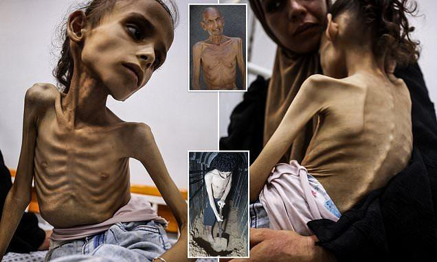

## Claim
Claim: " This is an authentic image of a mother holding the bones of her son in Gaza in March 2025. After more than a year and a half of searching for him under the rubble of their bombed-out house."

## Actions
```
reverse_search()
image_search("woman holding skeleton Gaza")
```

## Evidence
### Evidence from `image_search`
The image of a woman holding a skeleton is AI-generated or digitally generated, according to multiple sources. One source also mentions an article from the Daily Mail with images of emaciated people in Gaza.

*   [https://kashif.ps/ai-generated-image-of-woman-hugging-skeleton-goes-viral-as-from-gaza/](https://kashif.ps/ai-generated-image-of-woman-hugging-skeleton-goes-viral-as-from-gaza/)
*   [https://www.dailymail.co.uk/news/article-14969115/Gaza-skeleton-Palestinian-girl-skin-bone-food-crisis-Israel-hostage-video.html](https://www.dailymail.co.uk/news/article-14969115/Gaza-skeleton-Palestinian-girl-skin-bone-food-crisis-Israel-hostage-video.html)
*   [https://news.abplive.com/fact-check/viral-image-of-gazan-woman-golding-child-s-remains-is-digitally-generated-1760363](https://news.abplive.com/fact-check/viral-image-of-gazan-woman-golding-child-s-remains-is-digitally-generated-1760363)





## Elaboration
The claim that the image is authentic is false. The evidence indicates that the image is AI-generated or digitally generated.


## Final Judgement
The image is confirmed to be AI-generated or digitally generated, and therefore not authentic. The claim is demonstrably false.

`false`

### Verdict: FALSE

### Justification
The image in the claim is not authentic. Multiple sources, including [https://kashif.ps/ai-generated-image-of-woman-hugging-skeleton-goes-viral-as-from-gaza/](https://kashif.ps/ai-generated-image-of-woman-hugging-skeleton-goes-viral-as-from-gaza/) and [https://news.abplive.com/fact-check/viral-image-of-gazan-woman-golding-child-s-remains-is-digitally-generated-1760363](https://news.abplive.com/fact-check/viral-image-of-gazan-woman-golding-child-s-remains-is-digitally-generated-1760363), confirm that the image is AI-generated or digitally created.
