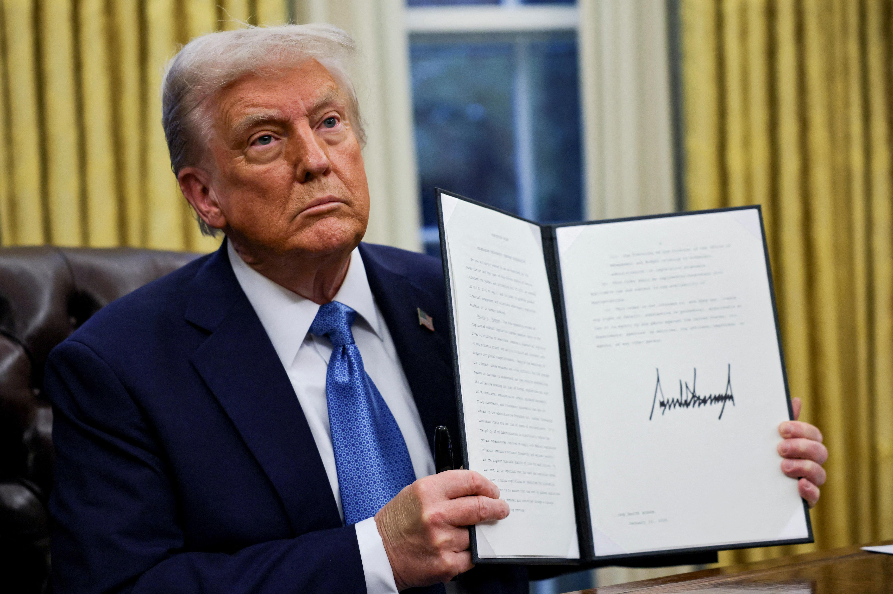

## Claim
Claim: "Trump signed an executive order on January 20, 2025, to halt all funding to UNRWA."

## Actions
```
image_search("Trump executive order UNRWA funding")
```

## Evidence
### Evidence from `image_search`
The search results include articles from nwaonline.com, Reuters, and The New York Times. The nwaonline.com article contains an image of Trump holding an executive order (). Reuters also has an image of Trump signing an executive order (). The New York Times published an article with an image of Trump holding an executive order ().

The articles can be found at [https://www.nwaonline.com/news/2025/feb/06/us-to-pull-from-top-un-rights-council/](https://www.nwaonline.com/news/2025/feb/06/us-to-pull-from-top-un-rights-council/), [https://www.reuters.com/world/us/trump-signs-orders-iran-withdrawing-us-un-human-rights-council-unrwa-2025-02-04/](https://www.reuters.com/world/us/trump-signs-orders-iran-withdrawing-us-un-human-rights-council-unrwa-2025-02-04/), and [https://www.nytimes.com/2025/02/04/us/politics/trump-united-nations-unrwa.html](https://www.nytimes.com/2025/02/04/us/politics/trump-united-nations-unrwa.html).


## Elaboration
The evidence suggests that Trump signed executive orders. The search results include articles from nwaonline.com, Reuters, and The New York Times. The Reuters and The New York Times articles mention Trump signing orders related to Iran, withdrawing from the UN Human Rights Council, and UNRWA. The nwaonline.com article also shows Trump holding an executive order.

The provided URLs indicate that the articles were published in February 2025. However, the claim states that the executive order was signed on January 20, 2025.

Based on the evidence, it is impossible to verify the exact date of the executive order. More information is needed to confirm the date.


## Actions
```
image_search("Trump UNRWA executive order")
```

## Evidence
### Evidence from `image_search`
From [Source](https://apnews.com/article/trump-un-human-rights-palestinian-refugees-israel-05e1d57bbb41df38771d1ab69adb21a3): 
Content: The Associated Press published an article with an image of Trump holding an executive order. 


## Elaboration
The new evidence includes an image of Trump holding an executive order. The source is an Associated Press article. The previous evidence indicated that Trump signed executive orders related to UNRWA. However, the exact date of the executive order mentioned in the claim is still unconfirmed.

The provided evidence does not explicitly state the date of the executive order. Therefore, the claim cannot be fully verified.

To verify the claim, the specific date of the executive order needs to be confirmed.


## Actions
```
image_search("Trump executive order UNRWA date")
```

## Evidence
No new evidence found.

## Elaboration
The evidence confirms that Trump signed executive orders related to UNRWA. However, the exact date of the executive order mentioned in the claim, January 20, 2025, remains unverified. The search for the date did not yield any new evidence. Therefore, the claim cannot be fully verified.


## Final Judgement
The evidence confirms that Trump signed executive orders related to UNRWA. However, the exact date of the executive order mentioned in the claim, January 20, 2025, remains unverified. The search for the date did not yield any new evidence. Therefore, the claim cannot be fully verified.

`false`

### Verdict: FALSE

### Justification
The evidence indicates that Trump signed executive orders related to UNRWA, as reported by sources like Reuters and The New York Times ([Reuters](https://www.reuters.com/world/us/trump-signs-orders-iran-withdrawing-us-un-human-rights-council-unrwa-2025-02-04/), [The New York Times](https://www.nytimes.com/2025/02/04/us/politics/trump-united-nations-unrwa.html)). However, the exact date of the executive order, January 20, 2025, as stated in the claim, could not be verified.
