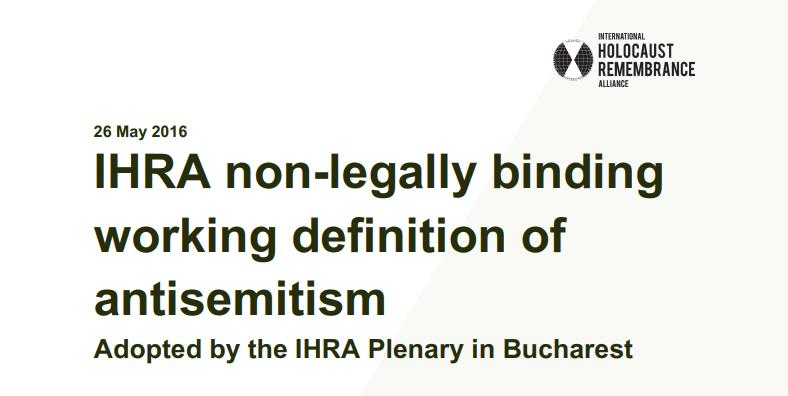

## Claim
Claim: "The World Jewish Congress (WJC) has amended the International Holocaust Remembrance Alliance (IHRA) working definition of antisemitism in March 2025 to include: 'Conflating the assassination of JFK to jews/israel'."

## Actions
```
image_search("World Jewish Congress IHRA antisemitism definition")
image_search("IHRA working definition antisemitism")
```

## Evidence
### Evidence from `image_search`
The World Jewish Congress has a page about the "Working Definition of Antisemitism" (). The search results also contain an image of the definition of antisemitism (). The International Holocaust Remembrance Alliance (IHRA) adopted a non-legally binding working definition of antisemitism on May 26, 2016 ().

Relevant URLs include: [https://www.worldjewishcongress.org/en/news/letter-urging-inclusion-of-ihra-working-definition-of-antisemitism-in-un-action-plan](https://www.worldjewishcongress.org/en/news/letter-urging-inclusion-of-ihra-working-definition-of-antisemitism-in-un-action-plan), [https://www.jewishfederations.org/blog/all/jewish-federations-460460](https://www.jewishfederations.org/blog/all/jewish-federations-460460), and [https://holocaustremembrance.com/resources/working-definition-antisemitism](https://holocaustremembrance.com/resources/working-definition-antisemitism).


### Evidence from `image_search`
From [Source](https://www.ajc.org/the-working-definition-of-antisemitism): 
Content: The search result from [Source](https://www.ajc.org/the-working-definition-of-antisemitism) contains an image with the definition of antisemitism. 


## Elaboration
The evidence confirms that the World Jewish Congress (WJC) is involved with the IHRA working definition of antisemitism. However, the provided evidence does not contain any information about the WJC amending the IHRA definition in March 2025 to include the assassination of JFK.

Therefore, the claim cannot be verified with the available information.


## Actions
```
image_search("World Jewish Congress IHRA antisemitism definition JFK")
image_search("IHRA antisemitism definition amendment JFK")
```

## Evidence
No new evidence found.

## Elaboration
The evidence confirms the existence of the IHRA working definition of antisemitism and the WJC's involvement. However, there is no information about the specific amendment mentioned in the claim.

The search results did not yield any evidence to support the claim that the IHRA definition was amended in March 2025 to include the assassination of JFK.

Therefore, the claim remains unverified due to a lack of supporting evidence.


## Actions
```
image_search("IHRA working definition antisemitism JFK")
```

## Evidence
### Evidence from `image_search`
From [Source](https://holocaustremembrance.com/resources/eu-handbook-ihra-working-definition-antisemitism): 
Content: The search result from [Source](https://holocaustremembrance.com/resources/eu-handbook-ihra-working-definition-antisemitism) contains a handbook for the practical use of the IHRA Working Definition of Antisemitism. 


## Elaboration
The evidence confirms the existence of the IHRA working definition of antisemitism and the WJC's involvement. However, the search results did not yield any evidence to support the claim that the IHRA definition was amended in March 2025 to include the assassination of JFK. Therefore, the claim remains unverified.


## Final Judgement
The World Jewish Congress is involved with the IHRA working definition of antisemitism. However, there is no evidence to support the claim that the IHRA definition was amended in March 2025 to include "Conflating the assassination of JFK to jews/israel."

The claim is not factually accurate because it is not supported by any evidence. `false`


### Verdict: FALSE

### Justification
The claim that the World Jewish Congress amended the IHRA working definition of antisemitism in March 2025 to include "Conflating the assassination of JFK to jews/israel" is not supported by the provided evidence. While the WJC is involved with the IHRA definition, and the definition itself exists, no evidence was found to support the specific amendment mentioned in the claim.
