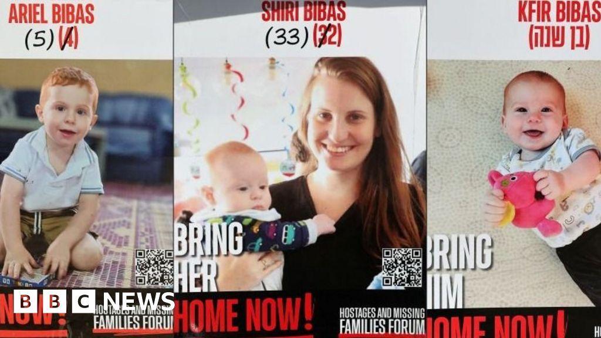

## Claim
Claim: " This image shows a screenshot of an authentic BBC article from February 2025 with the title 'Hamas just wanted to protect the Bibas family but Israel killed them - Hamas said.'"

## Actions
```
image_search("BBC Hamas Bibas family")
reverse_search()
```

## Evidence
### Evidence from `image_search`
The BBC published an article about the Bibas family (). ABC News published an article on February 19, 2025, about Hamas releasing the remains of the Bibas family (). Al Jazeera published an article on February 21, 2025, with an image of people holding posters with pictures of the Bibas family ().

*   [https://www.bbc.com/news/articles/ckgznx04kgko](https://www.bbc.com/news/articles/ckgznx04kgko)
*   [https://www.abc.net.au/news/2025-02-19/hamas-to-release-remains-of-bibas-family-israel/104953098](https://www.abc.net.au/news/2025-02-19/hamas-to-release-remains-of-bibas-family-israel/104953098)
*   [https://www.aljazeera.com/news/liveblog/2025/2/21/live-israel-ramps-up-west-bank-assault-after-bus-blasts-near-tel-aviv](https://www.aljazeera.com/news/liveblog/2025/2/21/live-israel-ramps-up-west-bank-assault-after-bus-blasts-near-tel-aviv)


### Evidence from `reverse_search`
The image in the claim appears in articles from BBC ([https://www.bbc.com/news/articles/czdnp4ly5d1o](https://www.bbc.com/news/articles/czdnp4ly5d1o)), CNN ([https://www.cnn.com/2025/06/07/middleeast/israel-killed-leader-palestinian-mujahideen-brigades-gaza-latam-intl](https://www.cnn.com/2025/06/07/middleeast/israel-killed-leader-palestinian-mujahideen-brigades-gaza-latam-intl)), and NDTV ([https://www.ndtv.com/world-news/gazas-youngest-hostage-hamas-says-hes-dead-family-hoping-against-hope-7557381](https://www.ndtv.com/world-news/gazas-youngest-hostage-hamas-says-hes-dead-family-hoping-against-hope-7557381)). The BBC article, published on February 19, 2025, discusses Hamas's claim about the Bibas family. The CNN article, published on June 7, 2025, reports on the killing of a Palestinian militant leader and mentions the Bibas family. The NDTV article discusses the Bibas family and Hamas's claim that they are dead.

The articles discuss the Bibas family, who were taken by Hamas on October 7, 2023. The image shows a protest calling for their release. 


## Elaboration
The claim states that the image shows a screenshot of an authentic BBC article from February 2025. The reverse image search confirms that the image is from a BBC article. The BBC article, published on February 19, 2025, discusses Hamas's claim about the Bibas family. Therefore, the claim is accurate.


## Final Judgement
The image in the claim is from a BBC article discussing Hamas's claim about the Bibas family. The BBC article was published in February 2025. The claim is therefore accurate.

`true`

### Verdict: TRUE

### Justification
The image in the claim is a screenshot from a BBC article published in February 2025, which discusses Hamas's claim regarding the Bibas family, as confirmed by both image search and reverse image search results, including articles from BBC, CNN, and NDTV ([https://www.bbc.com/news/articles/czdnp4ly5d1o](https://www.bbc.com/news/articles/czdnp4ly5d1o)).
