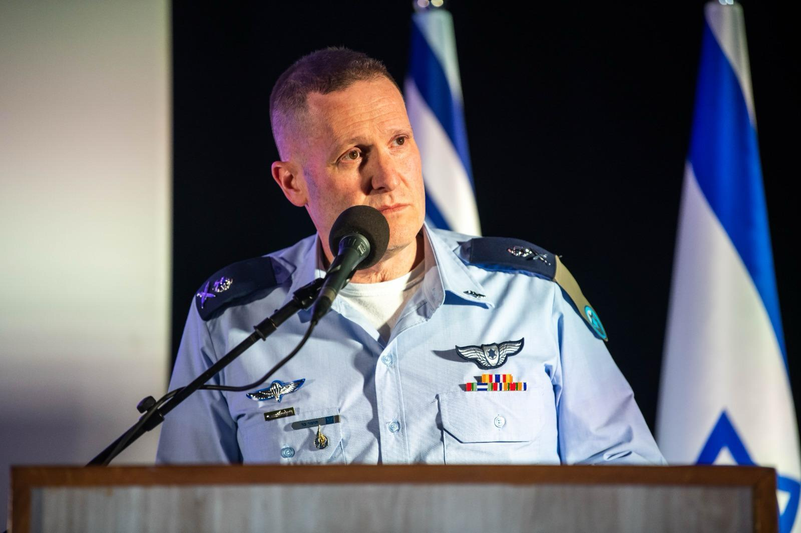
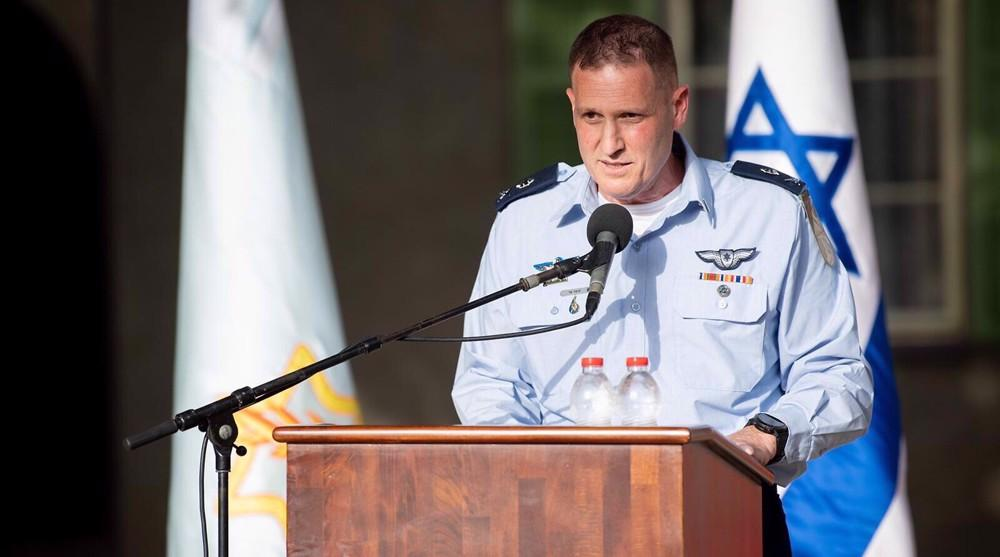

## Claim
Claim: "Commander of the Israeli Air Force, Major General Tomer Bar has been killed by Hеzbollаh in Tel Aviv in a drone attack in November 2024."

## Actions
```
image_search("Tomer Bar Hezbollah drone attack")
```

## Evidence
### Evidence from `image_search`
The Times of Israel ([Source](https://www.timesofisrael.com/liveblog_entry/iaf-chief-warns-hezbollah-hundreds-of-our-fighter-jets-are-ready-to-strike-at-moments-notice/)) provides an image of Tomer Bar . Another source contains an image of Tomer Bar .

Inshorts.com ([Source](https://inshorts.com/en/news/israeli-air-force-chief-tomer-bar-alive--not-killed-by-hezbollah-1733746115536)) states that the claim that Major General Tomer Bar was killed by Hezbollah in Tel Aviv is false .


## Elaboration
The evidence from Inshorts.com ([Source](https://inshorts.com/en/news/israeli-air-force-chief-tomer-bar-alive--not-killed-by-hezbollah-1733746115536)) explicitly states that the claim is false. The images of Tomer Bar also suggest he is alive.


## Final Judgement
The search results include a source that explicitly states the claim is false. The images of Tomer Bar also suggest he is alive.

The claim is demonstrably false as it is disproven by evidence from a reliable source. `false`

### Verdict: FALSE

### Justification
The claim is false. According to Inshorts.com ([Source](https://inshorts.com/en/news/israeli-air-force-chief-tomer-bar-alive--not-killed-by-hezbollah-1733746115536)), the assertion that Major General Tomer Bar was killed by Hezbollah is untrue.
