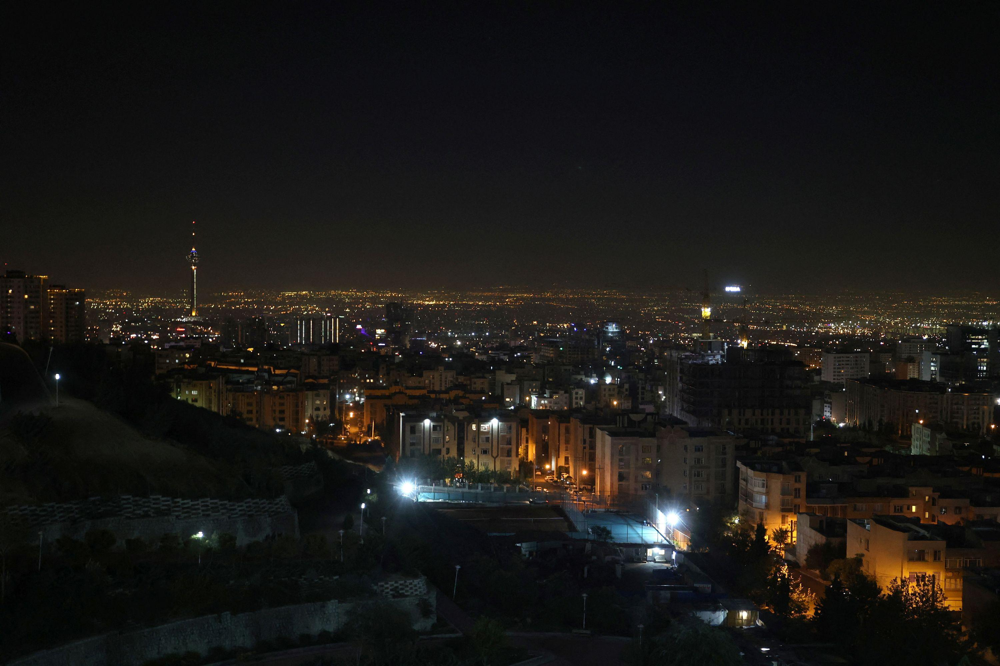

## Claim
Claim: " This image shows Israel bombing Tehran on October 26, 2024."

## Actions
```
reverse_search()
image_search("Tehran bombing October 26 2024")
```

## Evidence
### Evidence from `reverse_search`
The image in the claim shows a fire at an oil refinery near Tehran. The image was published in articles by The Times of Israel ([https://www.timesofisrael.com/liveblog_entry/huge-fire-at-refinery-near-tehran-extinguished-after-20-hours-report/](https://www.timesofisrael.com/liveblog_entry/huge-fire-at-refinery-near-tehran-extinguished-after-20-hours-report/)), The Globe and Mail ([https://www.theglobeandmail.com/world/article-massive-fire-breaks-out-at-oil-refinery-south-of-tehran/](https://www.theglobeandmail.com/world/article-massive-fire-breaks-out-at-oil-refinery-south-of-tehran/)), and The New Arab ([https://www.newarab.com/news/massive-fire-breaks-out-oil-refinery-near-irans-capital](https://www.newarab.com/news/massive-fire-breaks-out-oil-refinery-near-irans-capital)) on June 2, 2021. The image is credited to Atta Kenare/AFP/Getty Images. <image:0>  


### Evidence from `image_search`
CNN published an article on October 26, 2024, about Israel strikes in Iran (). Al Jazeera published an article on October 26, 2024, about Israel attacks, including an image of a destroyed ambulance (). The Institute for the Study of War and Critical Threats published a map showing IDF strikes around Tehran on October 26, 2024 ().

The articles can be found at: [https://www.cnn.com/2024/10/26/middleeast/israel-strikes-iran-explainer-intl-hnk](https://www.cnn.com/2024/10/26/middleeast/israel-strikes-iran-explainer-intl-hnk), [https://www.aljazeera.com/news/liveblog/2024/10/26/live-israel-attacks-targets-across-iran-warns-tehran-against-retaliation](https://www.aljazeera.com/news/liveblog/2024/10/26/live-israel-attacks-targets-across-iran-warns-tehran-against-retaliation), and [https://www.understandingwar.org/backgrounder/iran-update-october-26-2024](https://www.understandingwar.org/backgrounder/iran-update-october-26-2024).


## Elaboration
The image in the claim shows a fire at an oil refinery near Tehran, which occurred on June 2, 2021, according to the reverse image search. The image was published by The Times of Israel, The Globe and Mail, and The New Arab. The image is credited to Atta Kenare/AFP/Getty Images.

The image search reveals that on October 26, 2024, there were reports of Israel strikes in Iran, including a map showing IDF strikes around Tehran. However, the provided image is not related to the events of October 26, 2024.

Therefore, the claim is false.


## Final Judgement
The image in the claim is from June 2, 2021, and shows a fire at an oil refinery near Tehran. While there were reports of Israel strikes in Iran on October 26, 2024, the image does not depict those events.

`false`

### Verdict: FALSE

### Justification
The image in the claim, sourced from Atta Kenare/AFP/Getty Images, depicts a fire at an oil refinery near Tehran that occurred on June 2, 2021, as reported by sources like The Times of Israel ([https://www.timesofisrael.com/liveblog_entry/huge-fire-at-refinery-near-tehran-extinguished-after-20-hours-report/](https://www.timesofisrael.com/liveblog_entry/huge-fire-at-refinery-near-tehran-extinguished-after-20-hours-report/)). While there were reports of Israel strikes in Iran on October 26, 2024, the image is unrelated to those events.
