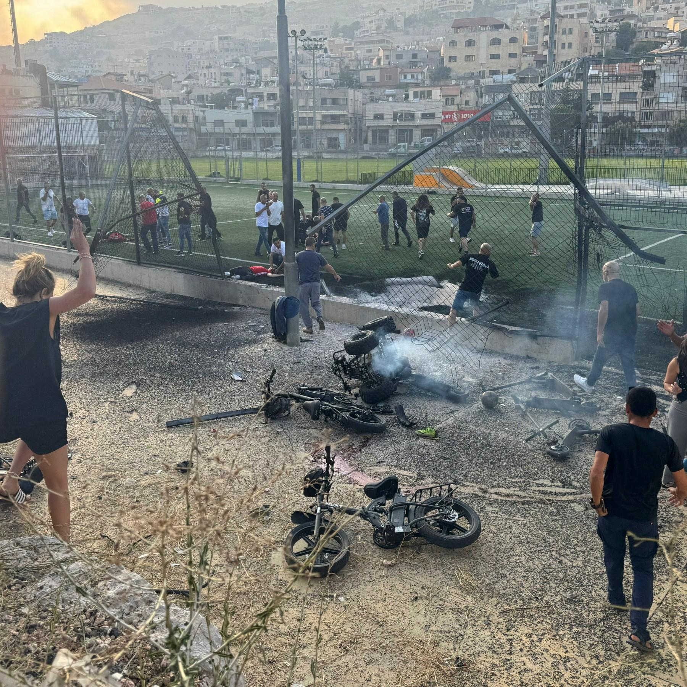
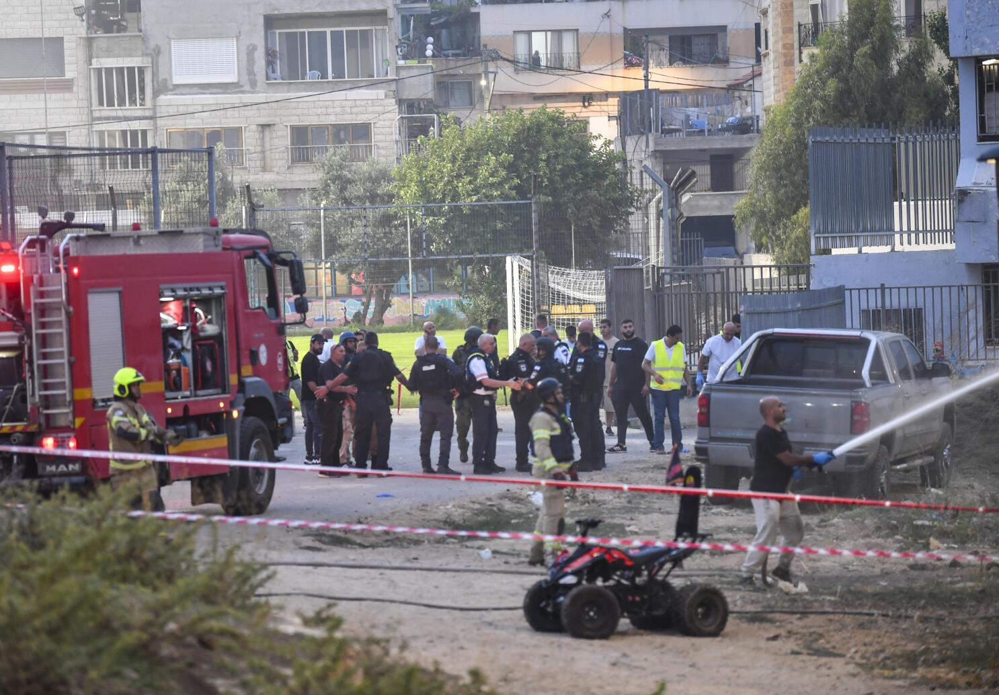
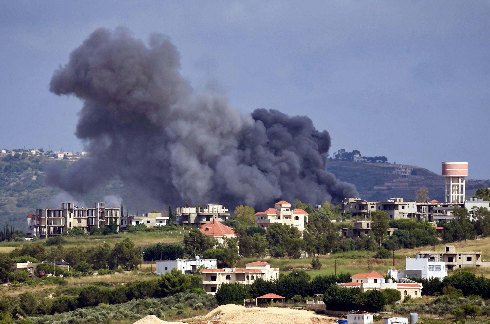
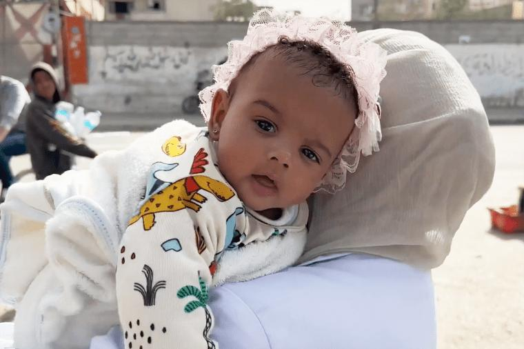

## Claim
Claim: " This image shows the youngest victim of the Hezbollah rocket that murdered 12 children playing soccer in Israel on July 27, 2024."

## Actions
```
reverse_search()
```

## Evidence
### Evidence from `reverse_search`
Anadolu Agency (AA) fact-checked the claim that the image 

## Elaboration
The Anadolu Agency (AA) fact-checked the claim. The evidence does not provide the result of the fact-check.

Insufficient information to verify the claim.


## Actions
```
image_search("Hezbollah rocket Israel July 27 2024")
```

## Evidence
### Evidence from `image_search`
Al Jazeera published an article about Israel bombing Hezbollah sites, including an image of a soccer field (). The Los Angeles Times reported on a rocket attack on July 27, 2024, in the Israeli-controlled Golan Heights, which killed at least 10 people ().

CNN published an article about the conflict between Israel and Lebanon, including an image ().


## Elaboration
The Los Angeles Times reported a rocket attack on July 27, 2024, in the Israeli-controlled Golan Heights, which killed at least 10 people. The claim states that the image shows the youngest victim of a Hezbollah rocket that murdered 12 children playing soccer in Israel on July 27, 2024. The evidence does not mention the image in the claim.

Insufficient information to verify the claim.


## Actions
```
image_search("Malak baby strawberry field")
```

## Evidence
### Evidence from `image_search`
From [Source](https://www.nbcnews.com/news/world/israel-hamas-war-gaza-rafah-baby-unknown-al-shifa-incubator-malak-rcna146150): 
Content: NBC News published an article about the Israel-Hamas war, including an image of a baby named Malak. 


## Elaboration
The evidence includes an image of a baby named Malak. The claim states that the image shows the youngest victim of a Hezbollah rocket. The evidence does not provide any information about the image in the claim.

Insufficient information to verify the claim.


## Final Judgement
The claim is not factually accurate. The image in the claim is of a baby named Malak, but there is no evidence to support the claim that the image is of the youngest victim of a Hezbollah rocket. The evidence does not provide any information about the image in the claim.
`false`

### Verdict: FALSE

### Justification
The claim is false. While the image features a baby named Malak, there is no evidence to support the assertion that the image depicts the youngest victim of a Hezbollah rocket attack, as the provided evidence does not corroborate this information.
