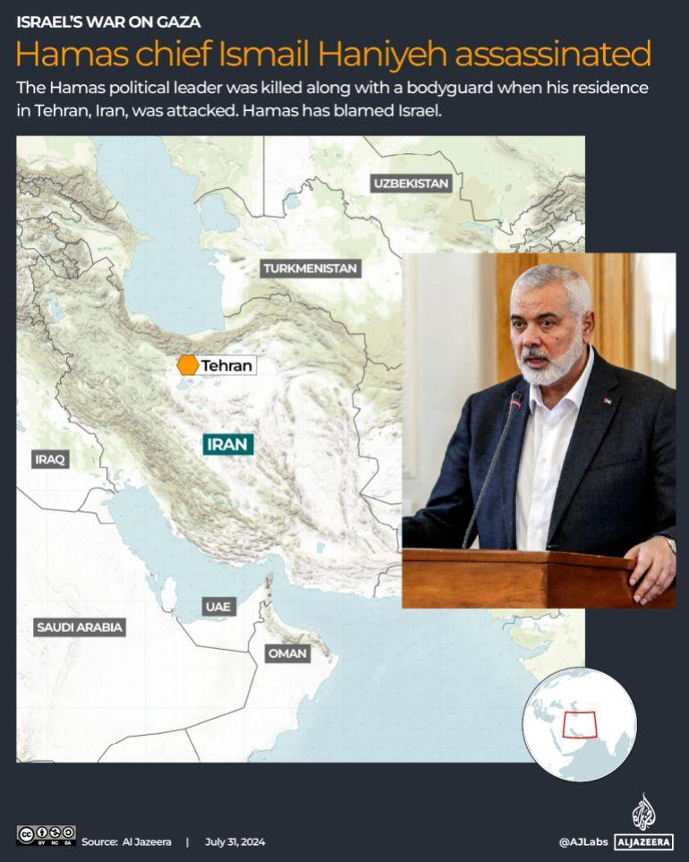
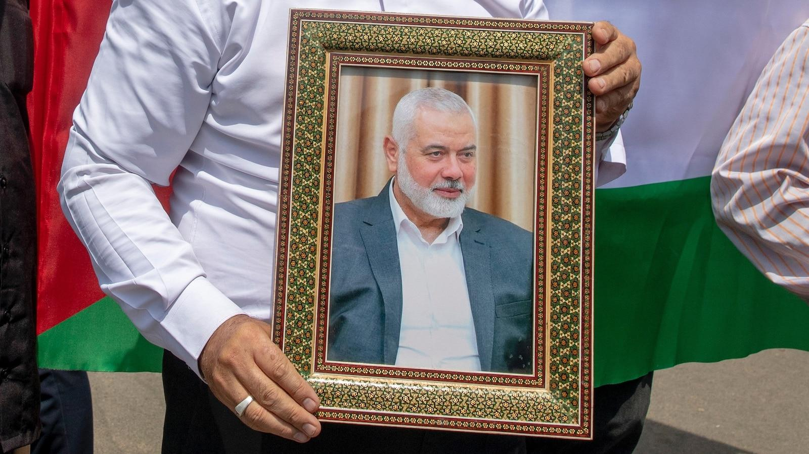

## Claim
Claim: " This image shows the assassination of Hamas leader Ismail Haniyeh on July 31st, 2024. This is how a precision strike looks like: a single missile through the window, and only Haniyeh and his bodyguard are dead. Nobody else in the building is even injured."

## Actions
```
reverse_search()
image_search("Ismail Haniyeh assassination July 31 2024")
geolocate()
```

## Evidence
### Evidence from `reverse_search`
The image 

### Evidence from `image_search`
Le Monde ([https://www.lemonde.fr/en/international/article/2024/07/31/hamas-chief-ismail-haniyeh-assassinated-in-tehran_6705742_4.html](https://www.lemonde.fr/en/international/article/2024/07/31/hamas-chief-ismail-haniyeh-assassinated-in-tehran_6705742_4.html)) and Al Jazeera ([https://www.aljazeera.com/news/2024/7/31/hamas-chief-ismail-haniyeh-killed-in-iran-what-to-know-whats-next](https://www.aljazeera.com/news/2024/7/31/hamas-chief-ismail-haniyeh-killed-in-iran-what-to-know-whats-next)) report that Hamas chief Ismail Haniyeh was assassinated on July 31, 2024, in Tehran, Iran. ABC News ([https://abcnews.go.com/International/ismail-haniyeh-assassinated-hamas-political-bureau-history/story?id=112430229](https://abcnews.go.com/International/ismail-haniyeh-assassinated-hamas-political-bureau-history/story?id=112430229)) also reports on the assassination.

The sources include images of Ismail Haniyeh (, , ).


### Evidence from `geolocate`
The most likely countries where the image was taken are: {'Cambodia': 0.35, 'Pakistan': 0.1, 'Bangladesh': 0.07, 'Ghana': 0.07, 'Bhutan': 0.06, 'China': 0.05, 'Sri Lanka': 0.04, 'Albania': 0.03, 'Kyrgyzstan': 0.02, 'Laos': 0.02}

## Elaboration
The claim states that the image shows the assassination of Ismail Haniyeh on July 31st, 2024. However, the image search results indicate that Ismail Haniyeh was assassinated in Tehran, Iran, on the same date. The geolocation results do not include Iran. Therefore, the image does not depict the assassination of Ismail Haniyeh.

The claim also describes the nature of the strike. However, there is no information about the nature of the strike in the provided evidence.

Based on the evidence, the claim is false.


## Final Judgement
The image search and geolocation results contradict the claim that the image shows the assassination of Ismail Haniyeh. The image was not taken in Iran, where the assassination took place. The claim also describes the nature of the strike, but there is no information about the nature of the strike in the provided evidence. Therefore, the claim is false. `false`

### Verdict: FALSE

### Justification
The claim is false. While news sources such as [Le Monde](https://www.lemonde.fr/en/international/article/2024/07/31/hamas-chief-ismail-haniyeh-assassinated-in-tehran_6705742_4.html) and [Al Jazeera](https://www.aljazeera.com/news/2024/7/31/hamas-chief-ismail-haniyeh-killed-in-iran-what-to-know-whats-next) report the assassination of Ismail Haniyeh on July 31, 2024, in Tehran, Iran, the image in the claim does not match the location of the assassination.
