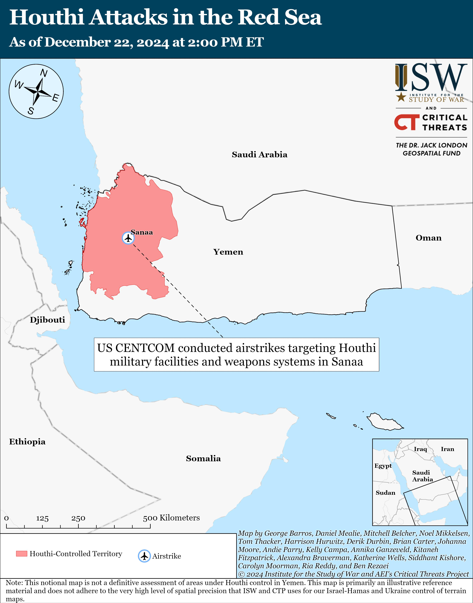
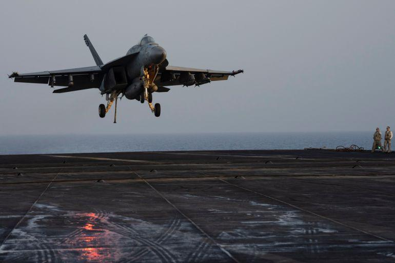

## Claim
Claim: " This image shows the U.S. bombarding Yemen on December 22, 2024 in reprisal after Yemen launched an attack on Israel's capital."

## Actions
```
reverse_search()
image_search("bombing in Yemen December 22 2024")
geolocate()
```

## Evidence
### Evidence from `reverse_search`
The image 

### Evidence from `image_search`
On December 22, 2024, the U.S. CENTCOM conducted airstrikes targeting Houthi military facilities and weapons systems in Sanaa, Yemen, according to the Institute for the Study of War and Critical Threats Project ([https://www.understandingwar.org/backgrounder/iran-update-december-22-2024](https://www.understandingwar.org/backgrounder/iran-update-december-22-2024)). Al Jazeera reported that the U.S. Army said two Navy pilots were shot down over the Red Sea in friendly fire ([https://www.aljazeera.com/news/2024/12/22/us-army-says-two-navy-pilots-shot-down-over-red-sea-in-friendly-fire](https://www.aljazeera.com/news/2024/12/22/us-army-says-two-navy-pilots-shot-down-over-red-sea-in-friendly-fire)).

The provided sources do not contain information about the image or the reason for the airstrikes.  


### Evidence from `geolocate`
The most likely countries where the image was taken are: {'Palestine': 0.55, 'Israel': 0.3, 'United Arab Emirates': 0.1, 'Jordan': 0.02, 'Albania': 0.0, 'Andorra': 0.0, 'Argentina': 0.0, 'Australia': 0.0, 'Austria': 0.0, 'Bangladesh': 0.0}

## Elaboration
The image search confirms that the U.S. conducted airstrikes in Sanaa, Yemen, on December 22, 2024. However, the provided sources do not contain information about the image or the reason for the airstrikes. The geolocation search suggests that the image was most likely taken in Palestine or Israel.

The claim that the image shows the U.S. bombarding Yemen on December 22, 2024, is partially supported by the evidence. However, the evidence does not confirm that the image is from Yemen. The claim also states that the airstrikes were in reprisal for an attack on Israel's capital, which is not mentioned in the evidence.

Therefore, the claim is **partially false**.


## Final Judgement
The image search confirms that the U.S. conducted airstrikes in Sanaa, Yemen, on December 22, 2024. However, the evidence does not confirm that the image is from Yemen. The claim also states that the airstrikes were in reprisal for an attack on Israel's capital, which is not mentioned in the evidence.

The claim is `false`.

### Verdict: FALSE

### Justification
The image search confirms that the U.S. conducted airstrikes in Sanaa, Yemen, on December 22, 2024, as reported by the Institute for the Study of War and Critical Threats Project ([https://www.understandingwar.org/backgrounder/iran-update-december-22-2024](https://www.understandingwar.org/backgrounder/iran-update-december-22-2024)) and Al Jazeera ([https://www.aljazeera.com/news/2024/12/22/us-army-says-two-navy-pilots-shot-down-over-red-sea-in-friendly-fire](https://www.aljazeera.com/news/2024/12/22/us-army-says-two-navy-pilots-shot-down-over-red-sea-in-friendly-fire)). However, the evidence does not confirm that the image is from Yemen, and the claim's assertion about the reason for the airstrikes is not supported by the provided sources.
