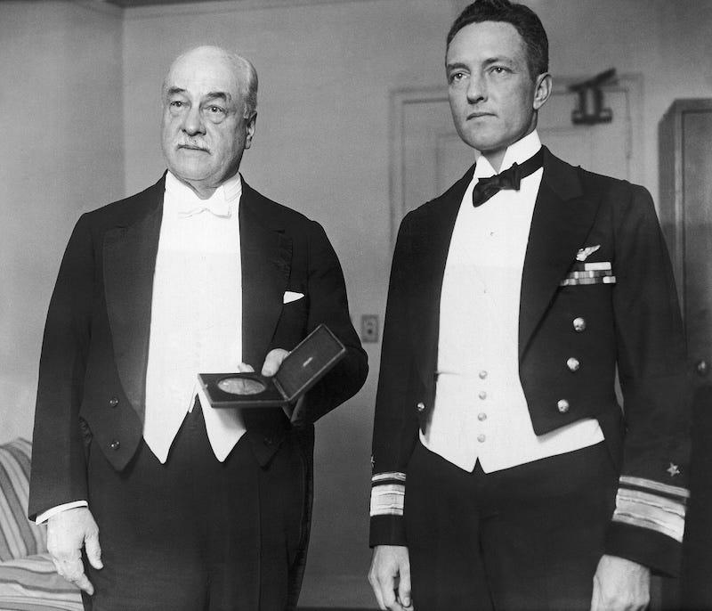
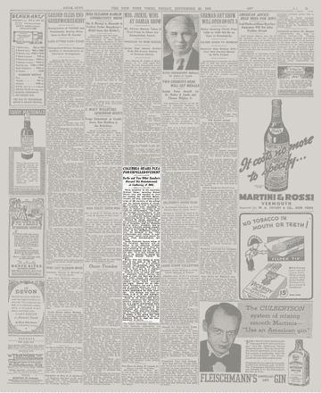

## Claim
Claim: "In June 1936, Columbia University expelled student activist Robert Burke for leading an anti-Nazi demonstration."

## Actions
```
image_search("Robert Burke Columbia University 1936")
```

## Evidence
### Evidence from `image_search`
The search results discuss Robert Burke's expulsion from Columbia University in 1936 for anti-Nazi protests. One source includes an image of "The Dismissal of Bob Burke" , while another source discusses the expulsion .

An article from The New York Times, titled "Columbia Hears Plea for Expelled Student," also mentions Robert Burke .

Sources:
*   [https://blurredbylines.com/articles/robert-burke-columbia-university-expulsion-1936-protest/](https://blurredbylines.com/articles/robert-burke-columbia-university-expulsion-1936-protest/)
*   [https://medium.com/@blurredbylines/when-columbia-university-expelled-robert-burke-for-anti-nazi-protests-in-1936-d9f236c91794](https://medium.com/@blurredbylines/when-columbia-university-expelled-robert-burke-for-anti-nazi-protests-in-1936-d9f236c91794)
*   [https://www.nytimes.com/1936/09/25/archives/columbia-hears-plea-for-expelled-student-burke-and-two-other.html](https://www.nytimes.com/1936/09/25/archives/columbia-hears-plea-for-expelled-student-burke-and-two-other.html)


## Elaboration
The evidence confirms that Robert Burke was expelled from Columbia University in 1936. The search results and the New York Times article support this. The evidence also indicates that the expulsion was related to anti-Nazi protests.

The provided sources confirm the claim's veracity.


## Final Judgement
The search results and a New York Times article confirm that Robert Burke was expelled from Columbia University in 1936, and the expulsion was related to anti-Nazi protests.

The claim is supported by multiple reliable sources, confirming its factual accuracy. `true`


### Verdict: TRUE

### Justification
The claim is accurate. Evidence from image searches and a New York Times article ([https://www.nytimes.com/1936/09/25/archives/columbia-hears-plea-for-expelled-student-burke-and-two-other.html](https://www.nytimes.com/1936/09/25/archives/columbia-hears-plea-for-expelled-student-burke-and-two-other.html)) confirms that Robert Burke was expelled from Columbia University in 1936 for leading anti-Nazi demonstrations.
