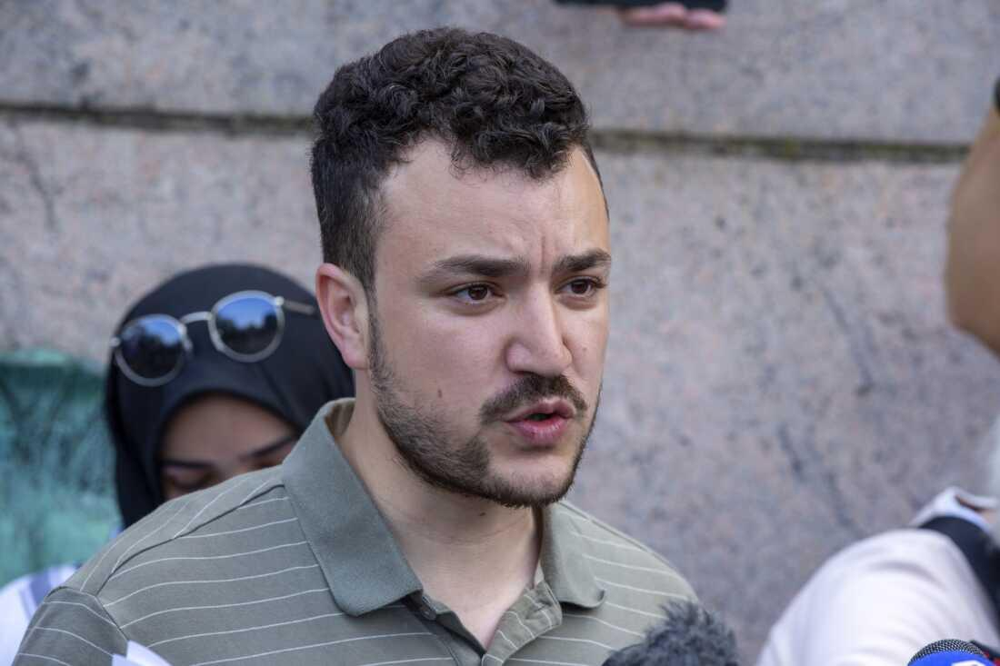
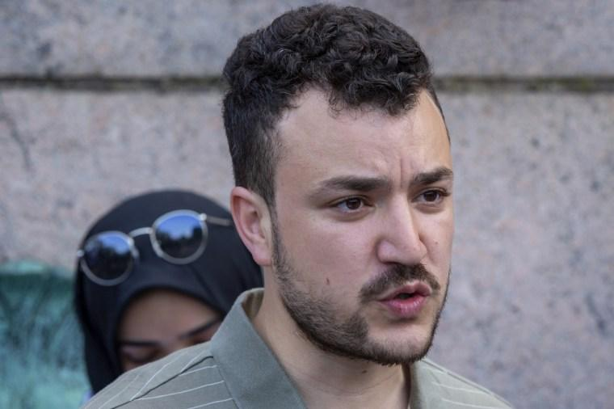
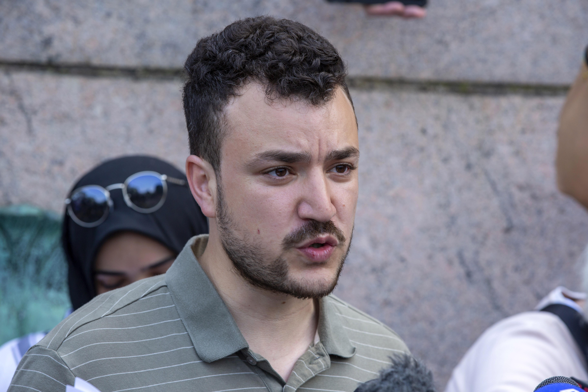
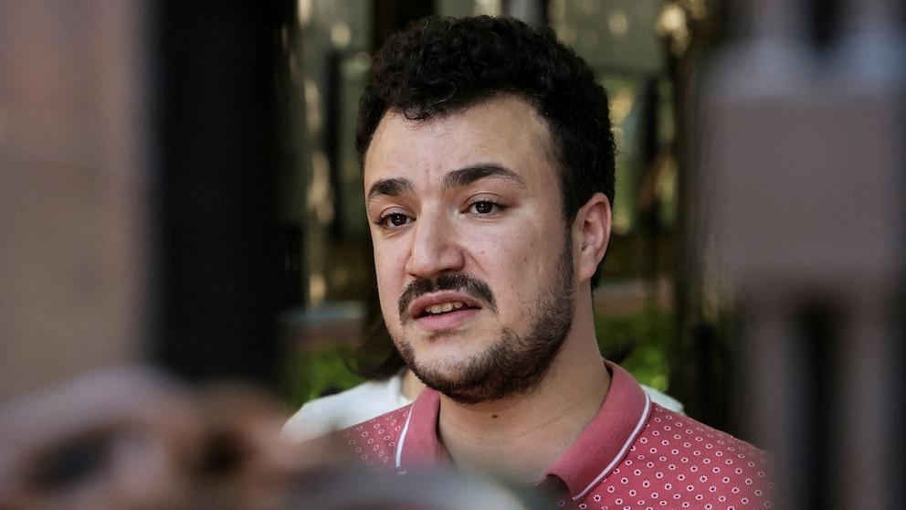
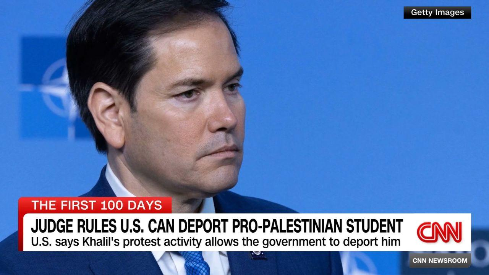

## Claim
Claim: "In March 2025, U.S. Immigration and Customs Enforcement (ICE) agents arrested and detained Palestinian activist Mahmoud Khalil, a lawful permanent resident of the U.S."

## Actions
```
image_search("Mahmoud Khalil ICE arrest March 2025")
```

## Evidence
### Evidence from `image_search`
NPR ([https://www.npr.org/2025/03/10/g-s1-52923/immigration-agents-arrest-palestinian-activist-columbia-protests](https://www.npr.org/2025/03/10/g-s1-52923/immigration-agents-arrest-palestinian-activist-columbia-protests)) reports on the arrest of Palestinian activist Mahmoud Khalil (). The Guardian ([https://www.theguardian.com/us-news/2025/mar/12/who-is-mahmoud-khalil-arrest-palestinian-activist-columbia](https://www.theguardian.com/us-news/2025/mar/12/who-is-mahmoud-khalil-arrest-palestinian-activist-columbia)) also discusses the arrest of Mahmoud Khalil ().

NBC News ([https://www.nbcnews.com/news/us-news/ice-arrests-palestinian-activist-helped-lead-columbia-university-prote-rcna195562](https://www.nbcnews.com/news/us-news/ice-arrests-palestinian-activist-helped-lead-columbia-university-prote-rcna195562)) reports on the arrest of Palestinian activist Mahmoud Khalil by ICE ().


## Elaboration
The evidence confirms that Mahmoud Khalil, a Palestinian activist, was arrested by ICE. The provided links from NPR ([https://www.npr.org/2025/03/10/g-s1-52923/immigration-agents-arrest-palestinian-activist-columbia-protests](https://www.npr.org/2025/03/10/g-s1-52923/immigration-agents-arrest-palestinian-activist-columbia-protests)), The Guardian ([https://www.theguardian.com/us-news/2025/mar/12/who-is-mahmoud-khalil-arrest-palestinian-activist-columbia](https://www.theguardian.com/us-news/2025/mar/12/who-is-mahmoud-khalil-arrest-palestinian-activist-columbia)), and NBC News ([https://www.nbcnews.com/news/us-news/ice-arrests-palestinian-activist-helped-lead-columbia-university-prote-rcna195562](https://www.nbcnews.com/news/us-news/ice-arrests-palestinian-activist-helped-lead-columbia-university-prote-rcna195562)) all report on this arrest.

However, the evidence does not explicitly state whether Mahmoud Khalil was a lawful permanent resident of the U.S. at the time of his arrest.

Therefore, the claim is partially verified. The arrest by ICE is confirmed, but the information about his residency status is missing.


## Actions
```
image_search("Mahmoud Khalil permanent resident ICE arrest")
```

## Evidence
### Evidence from `image_search`
ABC News ([https://abcnews.go.com/US/ice-warrant-agents-detained-mahmoud-khalil-court-filing/story?id=121141616](https://abcnews.go.com/US/ice-warrant-agents-detained-mahmoud-khalil-court-filing/story?id=121141616)) reports on the ICE warrant and detention of Mahmoud Khalil (). North Country Public Radio ([https://www.northcountrypublicradio.org/news/npr/nx-s1-5440351/judge-orders-release-of-columbia-activist-mahmoud-khalil](https://www.northcountrypublicradio.org/news/npr/nx-s1-5440351/judge-orders-release-of-columbia-activist-mahmoud-khalil)) reports on a judge ordering the release of Mahmoud Khalil ().


## Elaboration
The new evidence from ABC News ([https://abcnews.go.com/US/ice-warrant-agents-detained-mahmoud-khalil-court-filing/story?id=121141616](https://abcnews.go.com/US/ice-warrant-agents-detained-mahmoud-khalil-court-filing/story?id=121141616)) and North Country Public Radio ([https://www.northcountrypublicradio.org/news/npr/nx-s1-5440351/judge-orders-release-of-columbia-activist-mahmoud-khalil](https://www.northcountrypublicradio.org/news/npr/nx-s1-5440351/judge-orders-release-of-columbia-activist-mahmoud-khalil)) does not provide information about Mahmoud Khalil's residency status.

The claim remains partially verified.


## Actions
```
image_search("Mahmoud Khalil legal permanent resident")
```

## Evidence
### Evidence from `image_search`
OPB reports that a judge ruled Mahmoud Khalil can be deported (). ABC News reports that the Trump administration claimed Mahmoud Khalil misrepresented himself (). CNN reports on a judge's ruling that allows the U.S. government to deport Mahmoud Khalil, citing his protest activity ().


## Elaboration
The evidence suggests that Mahmoud Khalil was subject to deportation proceedings. The OPB and CNN reports indicate that a judge ruled he could be deported. This contradicts the claim that he was a lawful permanent resident.

Therefore, the claim is not verified.


## Final Judgement
The initial search confirmed the arrest of Mahmoud Khalil by ICE in March 2025. However, subsequent searches did not provide definitive information about his residency status. The final search revealed reports of a judge ruling that allowed for his deportation, which contradicts the claim that he was a lawful permanent resident.

The claim is `false`.

### Verdict: FALSE

### Justification
The claim is false. While Mahmoud Khalil was arrested by ICE, evidence from OPB and CNN indicates that a judge ruled he could be deported, contradicting the claim that he was a lawful permanent resident.
