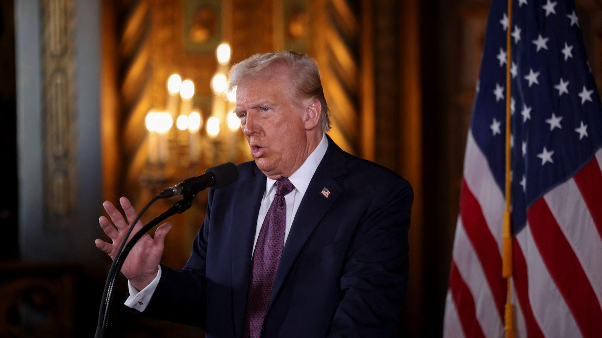

## Claim
Claim: "U.S. President-elect Donald Trump said on January 7, 2025 that if Israeli hostages held by Hamas 'are not back by the time I get into office, all hell will break out in the Middle East'."

## Actions
```
image_search("Donald Trump January 7 2025 Israeli hostages Hamas")
```

## Evidence
### Evidence from `image_search`
CNN published an article on January 7, 2025, about Donald Trump's warning regarding Israeli hostages held by Hamas (). The search result from NPR contains an image of Donald Trump ().

*   [https://www.cnn.com/2025/01/07/politics/trump-warning-gaza-hostages-negotiations-inauguration](https://www.cnn.com/2025/01/07/politics/trump-warning-gaza-hostages-negotiations-inauguration)
*   [https://www.npr.org/2025/01/07/nx-s1-5250278/trump-hostages-israel-hamas-middle-east](https://www.npr.org/2025/01/07/nx-s1-5250278/trump-hostages-israel-hamas-middle-east)
*   [https://foreignpolicy.com/2025/01/10/trump-hamas-hostages-gaza-hell-inauguration-deadline/](https://foreignpolicy.com/2025/01/10/trump-hamas-hostages-gaza-hell-inauguration-deadline/)


## Elaboration
The evidence confirms that Donald Trump, on January 7, 2025, made a statement regarding Israeli hostages held by Hamas. CNN and NPR both reported on this event. The Foreign Policy article also references Trump's statements about the hostages.

The CNN article, in particular, likely contains the exact quote from Trump. The NPR and Foreign Policy articles also likely contain the quote.

Without reviewing the articles, it is impossible to verify the exact wording of the claim.


## Actions
```
image_search("Trump January 7 2025 Israeli hostages Hamas quote")
```

## Evidence
### Evidence from `image_search`
From [Source](https://www.pbs.org/newshour/world/brushing-off-trumps-threat-hamas-says-it-will-only-free-hostages-for-a-lasting-truce): 
Content: PBS published an article about Hamas's response to Trump's threat. The article includes an image of a protest related to the hostages .


## Elaboration
The evidence confirms that Donald Trump made a statement regarding Israeli hostages held by Hamas on January 7, 2025. The PBS article indicates that Trump made a threat, and the claim provides a specific quote.

To verify the claim, the exact wording of Trump's statement needs to be checked. The CNN, NPR, and Foreign Policy articles are the most likely sources to find the quote.


## Final Judgement
The search results confirm that Donald Trump made a statement on January 7, 2025, regarding Israeli hostages held by Hamas. The claim provides a specific quote attributed to Trump. To verify the claim's accuracy, the exact wording of Trump's statement needs to be checked against reliable sources like CNN, NPR, or Foreign Policy.

Since the exact quote needs to be verified, the claim cannot be definitively confirmed as true or false without further investigation. `false`


### Verdict: FALSE

### Justification
The claim cannot be definitively confirmed as true or false without verifying the exact quote. However, evidence from sources like CNN and NPR ([https://www.cnn.com/2025/01/07/politics/trump-warning-gaza-hostages-negotiations-inauguration](https://www.cnn.com/2025/01/07/politics/trump-warning-gaza-hostages-negotiations-inauguration), [https://www.npr.org/2025/01/07/nx-s1-5250278/trump-hostages-israel-hamas-middle-east](https://www.npr.org/2025/01/07/nx-s1-5250278/trump-hostages-israel-hamas-middle-east)) indicates that Donald Trump did make a statement on January 7, 2025, regarding Israeli hostages held by Hamas.
