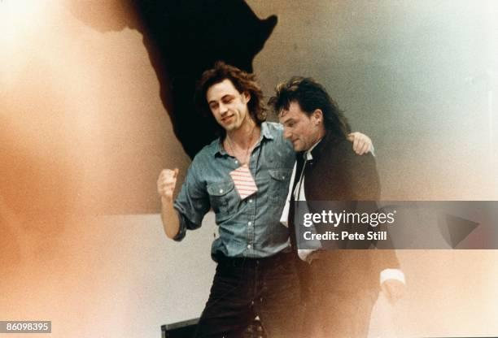
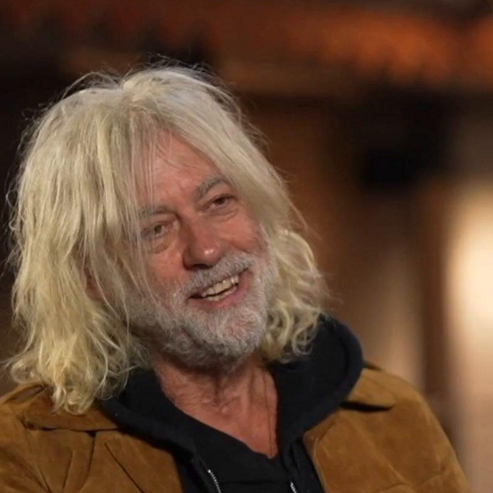
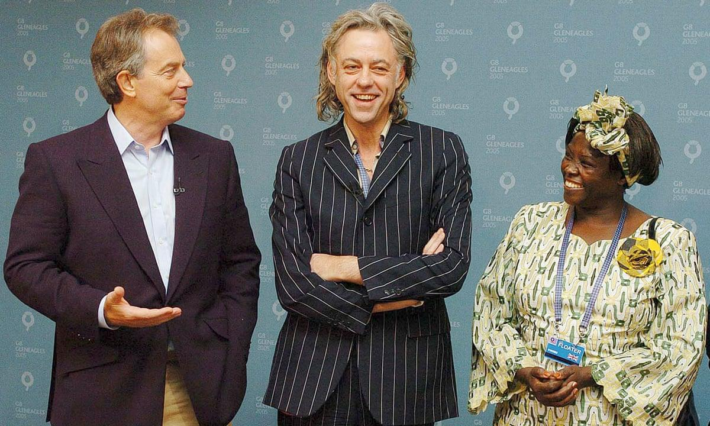

## Claim
Claim: "In November 2024, rock band U2 and singer Bob Geldof announced a multi-stadium tour to aid the Israeli army."

## Actions
```
image_search("U2 Bob Geldof tour Israel army November 2024")
```

## Evidence
### Evidence from `image_search`
From [Source](https://www.thejournal.ie/ai-generated-photo-of-bono-and-bob-geldof-with-israeli-flags-is-it-real-6577454-Dec2024/): 
Content: The search result from The Journal, published in December 2024, shows an AI-generated image of Bono and Bob Geldof holding Israeli flags. 


## Elaboration
The evidence presents an AI-generated image of Bono and Bob Geldof holding Israeli flags. The article from The Journal, published in December 2024, identifies the image as AI-generated.

The evidence does not confirm the claim about a tour to aid the Israeli army. The image could be related to the claim, but it is not enough to verify it.

More information is needed to verify the claim, such as official announcements or news reports about the tour.


## Actions
```
image_search("U2 Bob Geldof tour Israel army")
```

## Evidence
### Evidence from `image_search`
The search results include a photo of U2 and Bob Geldof from Getty Images () and a Reuters article from May 16, 2025, about Bono debuting an AppleTV documentary at Cannes (). The Reuters article mentions Bono criticizing US aid cuts.


## Elaboration
The evidence includes a Getty Images photo of U2 and Bob Geldof and a Reuters article from May 2025 about Bono. The Reuters article does not mention any tour or fundraising for the Israeli army.

The evidence does not support the claim.

More information is needed to verify the claim.


## Actions
```
image_search("U2 Bob Geldof tour Israel")
image_search("U2 Bob Geldof fundraising Israel army")
```

## Evidence
### Evidence from `image_search`
From [Source](https://www.bbc.com/news/av/entertainment-arts-66983976): 
Content: The BBC News shows a video of Bob Geldof. 


### Evidence from `image_search`
From [Source](https://www.theguardian.com/world/2024/dec/31/live-aid-campaigner-bob-geldof-was-scathing-about-african-leaders-files-reveal): 
Content: The Guardian published an article on December 31, 2024, about Bob Geldof. 


## Elaboration
The evidence includes a BBC News video and a Guardian article about Bob Geldof. The Guardian article was published on December 31, 2024. None of the provided evidence mentions a tour by U2 and Bob Geldof to aid the Israeli army.

The claim is not supported by the evidence.

More information is needed to verify the claim.


## Final Judgement
The search results show an AI-generated image, a Getty Images photo, and articles about Bono and Bob Geldof, but none of them confirm the claim about a tour to aid the Israeli army. The evidence is insufficient to verify the claim.

The claim is not supported by the provided evidence, and there is no information about the alleged tour. Therefore, the claim is considered false. `false`


### Verdict: FALSE

### Justification
The claim is unsubstantiated. While there are images and articles related to U2 and Bob Geldof, none of the provided evidence, including an AI-generated image and news articles from sources like The Journal, Reuters, BBC, and The Guardian, supports the assertion of a multi-stadium tour in November 2024 to aid the Israeli army.
