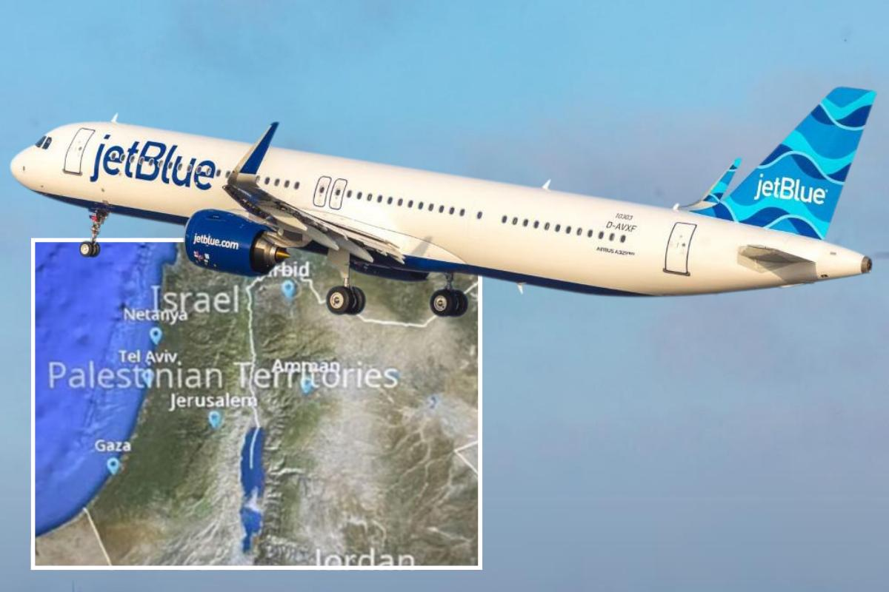

## Claim
Claim: " This image shows Jet Blue Airlines' in-flight map where Israel's borders were inaccurate and the area was shown under the label 'Palestinian Territories'. The indicent occured in September 2024."

## Actions
```
image_search("JetBlue in-flight map Israel Palestinian Territories")
reverse_search()
```

## Evidence
### Evidence from `image_search`
Ynetnews.com published an article about JetBlue's in-flight map, which inaccurately labeled Israel as "Palestinian Territories" (). The article from paddleyourownkanoo.com discusses the controversy surrounding JetBlue's in-flight map, which inaccurately depicted Israel's borders and labeled the area as "Palestinian Territories" (). The incident occurred in September 2024.

The sources are: [https://www.ynetnews.com/travel/article/skawilphc](https://www.ynetnews.com/travel/article/skawilphc) and [https://www.paddleyourownkanoo.com/2024/09/09/jetblue-forced-to-change-inflight-maps-after-palestinian-territories-controversy/](https://www.paddleyourownkanoo.com/2024/09/09/jetblue-forced-to-change-inflight-maps-after-palestinian-territories-controversy/).


### Evidence from `reverse_search`
From [Source](https://www.ynetnews.com/travel/article/bjgp0065hc): Found exact image on website with title: JetBlue issues apology after calling Israel 'Palestinian Territories' on ...
Content: The search result from Ynetnews.com discusses JetBlue's apology for labeling Israel as "Palestinian Territories" on its in-flight map. The article mentions that the airline is changing its onboard maps to comply with U.S. guidelines and that the map app was provided by a third-party company. The incident occurred in September 2024. , , . The article also includes the image .


## Elaboration
The claim is accurate. Multiple sources confirm that JetBlue's in-flight map inaccurately labeled Israel as "Palestinian Territories." The incident occurred in September 2024, as stated in the claim. The evidence includes articles from Ynetnews.com and paddleyourownkanoo.com, which discuss the controversy and JetBlue's subsequent apology.


## Final Judgement
The evidence confirms that JetBlue's in-flight map inaccurately labeled Israel as "Palestinian Territories" in September 2024. This is supported by multiple sources, including Ynetnews.com and paddleyourownkanoo.com.

`true`

### Verdict: TRUE

### Justification
The claim is accurate. In September 2024, JetBlue's in-flight map incorrectly labeled Israel as "Palestinian Territories," as reported by sources like [Ynetnews.com](https://www.ynetnews.com/travel/article/skawilphc) and paddleyourownkanoo.com.
