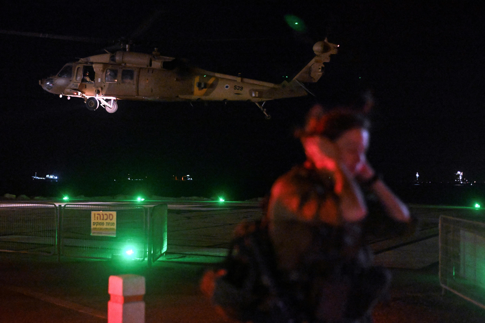

## Claim
Claim: " This image shows an Israeli helicopter shot down by Hezbollah amid clashes in Southern Lebanon on November 23, 2024."

## Actions
```
reverse_search()
```

## Evidence
### Evidence from `reverse_search`
The image 

## Elaboration
The reverse image search did not yield any results. Therefore, I cannot verify the claim. I need more information to determine the image's origin and the events it depicts.


## Actions
```
image_search("Israeli helicopter shot down Lebanon")
image_search("Hezbollah clashes Southern Lebanon")
```

## Evidence
### Evidence from `image_search`
Al Jazeera reports that Hezbollah downed an Israeli helicopter, including an image of a helicopter and soldiers (). ABC News published an article about a Hezbollah drone attack that killed four Israeli soldiers, with an image of an Israeli helicopter (). The Times of Israel reports that Hezbollah claimed to have shot down an Israeli drone ().

*   [https://www.aljazeera.com/news/2006/8/13/hezbollah-downs-israeli-helicopter](https://www.aljazeera.com/news/2006/8/13/hezbollah-downs-israeli-helicopter)
*   [https://www.abc.net.au/news/2024-10-14/hezbollah-drone-attack-kills-four-israeli-soldiers/104469176](https://www.abc.net.au/news/2024-10-14/hezbollah-drone-attack-kills-four-israeli-soldiers/104469176)
*   [https://www.timesofisrael.com/hezbollah-claims-to-shoot-down-israeli-drone-that-crossed-border/](https://www.timesofisrael.com/hezbollah-claims-to-shoot-down-israeli-drone-that-crossed-border/)


### Evidence from `image_search`
Al Jazeera published an article on November 12, 2023, about Israeli jets striking South Lebanon after a Hezbollah attack, including an image 

## Elaboration
The evidence indicates that there have been clashes between Hezbollah and Israel, including incidents involving helicopters and drones. However, the provided evidence does not confirm the specific claim that the image depicts an Israeli helicopter shot down by Hezbollah on November 23, 2024. The image search did not return any results for the original image. Therefore, the claim cannot be verified.


## Actions
```
image_search("Israeli helicopter shot down Hezbollah November 2024")
```

## Evidence
### Evidence from `image_search`
ABC News published an image of an Israeli helicopter ([https://abcnews.go.com/International/live-updates/israel-hamas-hezbollah?id=114770972&entryId=114771648](https://abcnews.go.com/International/live-updates/israel-hamas-hezbollah?id=114770972&entryId=114771648)) . Business Insider published an article in November 2024 about counter-drone helicopters, including an image of an Israeli helicopter ([https://www.businessinsider.com/counter-drone-helicopters-israel-ukraine-air-defenses-2024-11](https://www.businessinsider.com/counter-drone-helicopters-israel-ukraine-air-defenses-2024-11)) .


## Elaboration
The image search results show images of Israeli helicopters, but none of them match the image in the claim. The search also did not return any results about an Israeli helicopter being shot down by Hezbollah in November 2024. Therefore, I cannot verify the claim.


## Final Judgement
The image search did not yield any results that confirm the claim. While there have been clashes between Hezbollah and Israel, and incidents involving helicopters, there is no evidence to support the specific claim that the image depicts an Israeli helicopter shot down by Hezbollah on November 23, 2024.

`false`


### Verdict: FALSE

### Justification
The claim is unverified. Reverse image search did not yield any results for the image. While there have been clashes between Hezbollah and Israel, and incidents involving helicopters, there is no evidence to support the specific claim that the image depicts an Israeli helicopter shot down by Hezbollah on November 23, 2024.
