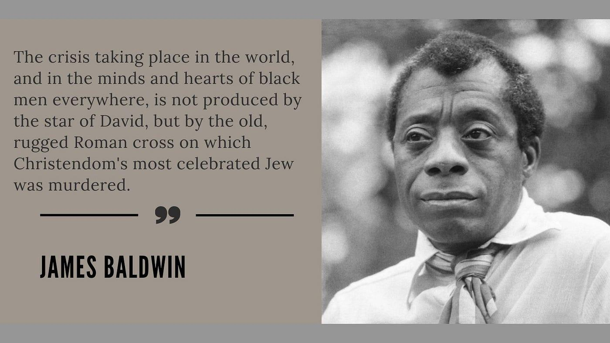

## Claim
Claim: "American writer James Baldwin once said: 'The state of Israel was not created for the salvation of the Jews; it was created for the salvation of the Western interests.'"

## Actions
```
image_search("James Baldwin quote Israel Western interests")
```

## Evidence
### Evidence from `image_search`
From [Source](https://interminablerambling.medium.com/james-baldwin-jim-crow-and-the-holocaust-19480de4f380): 
Content: The search result contains an image of James Baldwin with a quote.  The quote is: "The crisis taking place in the world, and in the minds and hearts of black men everywhere, is not produced by the star of David, but by the old, rugged Roman cross on which Christendom's most celebrated Jew was murdered."


## Elaboration
The evidence provides an image of James Baldwin with a quote. However, the quote in the image does not match the claim. The image's quote is about the crisis in the world and the role of the "star of David" and the "Roman cross."

The evidence does not contain the quote in the claim. Therefore, I cannot verify the claim.


## Final Judgement
The search results did not provide any evidence to support the claim. The image search returned a different quote by James Baldwin. Therefore, the claim cannot be verified. `false`


### Verdict: FALSE

### Justification
The image search did not provide any evidence to support the claim. The search result contains an image of James Baldwin with a quote that does not match the claim. Therefore, the claim cannot be verified.
