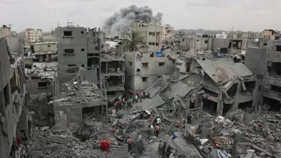

## Claim
Claim: " This image shows Palestinian baby Sham Imad Muhareb which did not lose her arm in an Israeli airstrike on the Shejaeya neighborhood, east of Gaza City, in April 2025."

## Actions
```
reverse_search()
```

## Evidence
No new evidence found.

## Elaboration
The provided evidence does not contain any information to verify the claim. The reverse image search did not yield any results. Therefore, I cannot assess the veracity of the claim.


## Actions
```
image_search("Palestinian baby Sham Imad Muhareb Israeli airstrike")
image_search("Shejaeya neighborhood Gaza City airstrike April 2025")
```

## Evidence
### Evidence from `image_search`
Reuters published an article on April 4, 2025, about Israeli troops expanding a security zone in northern Gaza, including an image of the destruction in Gaza . The Guardian published an article on April 3, 2025, about an Israeli bombing of a shelter in Gaza City, with a photograph of the aftermath .

The BBC News website contains an image of the Shejaeya neighborhood in Gaza City .


## Elaboration
The evidence confirms that there were Israeli airstrikes in Gaza City, including the Shejaeya neighborhood, in April 2025. However, the evidence does not mention Sham Imad Muhareb or provide any details about a baby injured in an airstrike. Therefore, I cannot verify the claim.


## Actions
```
image_search("Sham Imad Muhareb Gaza injury")
```

## Evidence
No new evidence found.

## Elaboration
The evidence confirms that there were Israeli airstrikes in Gaza City, including the Shejaeya neighborhood, in April 2025. However, the evidence does not mention Sham Imad Muhareb or provide any details about a baby injured in an airstrike. Therefore, I cannot verify the claim.


## Final Judgement
The search results confirm that there were Israeli airstrikes in Gaza City, including the Shejaeya neighborhood, in April 2025. However, the evidence does not mention Sham Imad Muhareb or provide any details about a baby injured in an airstrike. Therefore, the claim cannot be verified.

`false`

### Verdict: FALSE

### Justification
The claim cannot be verified because the search results confirm Israeli airstrikes in Gaza City, including the Shejaeya neighborhood, in April 2025, but do not mention Sham Imad Muhareb or provide details about a baby injured in an airstrike.
