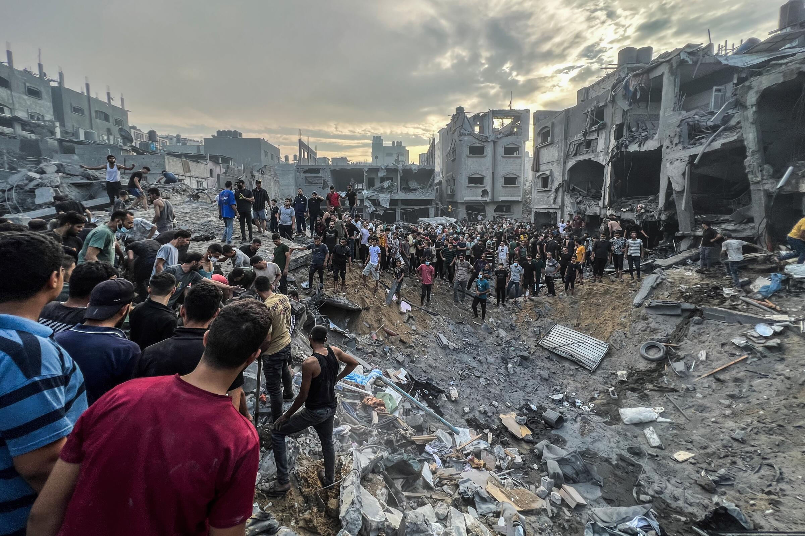
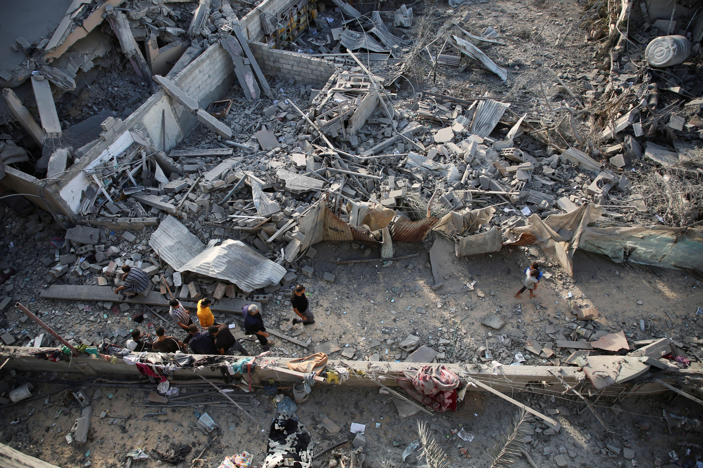

## Claim
Claim: " This image shows an Israeli tank unit near Jabalia camp in northern Gaza that was successfully ambushed by Hamas fighters, destroying multiple vehicles and injuring or killing their crews in October 2024."

## Actions
```
reverse_search()
image_search("Israeli tank destroyed Jabalia camp October 2024")
```

## Evidence
### Evidence from `reverse_search`
The image 

### Evidence from `image_search`
Reuters published an article on October 18, 2024, about Israel sending more troops into northern Gaza, including an image of the destruction in Gaza (). Le Monde published an article on October 27, 2024, about the Jabalia refugee camp, including an image of the camp (). The Los Angeles Times published an article on October 31, 2023, about an Israeli strike on a Gaza refugee camp ().

The articles can be found at the following URLs: [https://www.reuters.com/world/middle-east/israel-sends-more-troops-into-north-gaza-deepens-raid-2024-10-18/](https://www.reuters.com/world/middle-east/israel-sends-more-troops-into-north-gaza-deepens-raid-2024-10-18/), [https://www.lemonde.fr/en/international/article/2024/10/27/in-gaza-survivors-flee-from-jabalia-refugee-camp_6730618_4.html](https://www.lemonde.fr/en/international/article/2024/10/27/in-gaza-survivors-flee-from-jabalia-refugee-camp_6730618_4.html), and [https://www.latimes.com/world-nation/story/2023-10-31/israel-says-strike-on-gaza-refugee-camp-kills-hamas-commander-but-civilians-die-as-well](https://www.latimes.com/world-nation/story/2023-10-31/israel-says-strike-on-gaza-refugee-camp-kills-hamas-commander-but-civilians-die-as-well).


## Elaboration
The evidence confirms that there was fighting in Gaza in October 2024, and that Jabalia camp was a location of conflict. However, the provided evidence does not confirm the details of the claim, such as the destruction of the tank by Hamas fighters. The image search results do not provide any information about the image in the claim.

More information is needed to verify the claim.


## Actions
```
geolocate()
```

## Evidence
### Evidence from `geolocate`
The most likely countries where the image was taken are: {'Pakistan': 0.11, 'Palestine': 0.11, 'Israel': 0.1, 'Tunisia': 0.09, 'Mexico': 0.06, 'Colombia': 0.05, 'Chile': 0.04, 'Sweden': 0.03, 'Argentina': 0.02, 'Denmark': 0.02}

## Elaboration
The geolocation data suggests that the image could have been taken in Palestine or Israel. However, the evidence does not confirm the claim that the tank was destroyed by Hamas fighters near Jabalia camp.


## Actions
```
image_search("Israeli tank destroyed Gaza October 2024")
```

## Evidence
### Evidence from `image_search`
Al Jazeera published an article on October 7, 2024, about the war on Gaza, including an image of a destroyed tank . Business Insider published an article in July 2024 about Israeli troops in Gaza, including an image of a tank in a destroyed area . Reuters published an article on October 2, 2024, about Israel sending tanks into southern areas of Gaza, including an image of the destruction in Gaza .

The articles can be found at the following URLs: [https://www.aljazeera.com/gallery/2024/10/7/a-year-of-israels-devastating-war-on-gaza](https://www.aljazeera.com/gallery/2024/10/7/a-year-of-israels-devastating-war-on-gaza), [https://www.businessinsider.com/israeli-troops-struggled-to-fight-through-gaza-sections-reduced-rubble-2024-7](https://www.businessinsider.com/israeli-troops-struggled-to-fight-through-gaza-sections-reduced-rubble-2024-7), and [https://www.reuters.com/world/middle-east/israel-kills-dozens-gaza-sends-tanks-into-southern-areas-medics-say-2024-10-02/](https://www.reuters.com/world/middle-east/israel-kills-dozens-gaza-sends-tanks-into-southern-areas-medics-say-2024-10-02/).


## Elaboration
The evidence confirms that there was fighting in Gaza in October 2024 and that Israeli tanks were involved. However, the evidence does not confirm that the tank in the image was destroyed by Hamas fighters near Jabalia camp. The image search results show other images of destroyed tanks and destruction in Gaza, but none of them match the image in the claim.

More information is needed to verify the claim.


## Final Judgement
The evidence indicates that there was conflict in Gaza involving Israeli tanks in October 2024, but it does not confirm the specific details of the claim, such as the tank being destroyed by Hamas fighters near Jabalia camp. The image search results do not provide any information about the image in the claim.

Therefore, the most appropriate decision option is `false`.

### Verdict: FALSE

### Justification
The claim cannot be verified. While evidence confirms fighting in Gaza involving Israeli tanks in October 2024, it doesn't corroborate the specific details of the tank's destruction by Hamas fighters near Jabalia camp. The image search results do not provide any information about the image in the claim.
