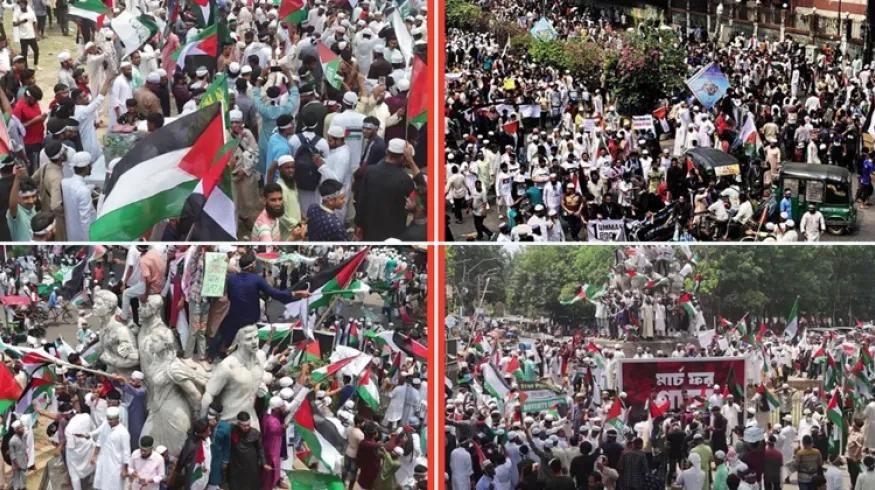

## Claim
Claim: " This image shows thousands gathering at Sohrawardi Park in Kolkata, India, in April 2025 to show solidarity with the Palestinian people amid the ongoing Israeli assault on Gaza."

## Actions
```
reverse_search()
```

## Evidence
No new evidence found.

## Elaboration
There is no new evidence to analyze the claim. Therefore, I cannot verify the claim.


## Actions
```
image_search("Sohrawardi Park Kolkata protest Palestine")
image_search("protest Palestine India April 2025")
```

## Evidence
### Evidence from `image_search`
From [Source](https://factly.in/photos-of-a-protest-held-in-solidarity-with-palestine-in-dhaka-bangladesh-are-falsely-shared-as-those-from-kolkata/): 
Content: The search result from Factly.in contains an image of a protest in solidarity with the Palestinian people. The image is from Sohrawardi Park, Kolkata, India. 


### Evidence from `image_search`
Al Jazeera reports on mass protests in Morocco against Israel's war in Gaza (). Peoples Dispatch shows a pro-Palestinian protest (). Iranpress.com published an image of a protest in India against Israeli actions ().

The sources are: [Al Jazeera](https://www.aljazeera.com/news/2025/4/6/mass-protests-in-morocco-against-israels-war-in-gaza-and-us-support), [Peoples Dispatch](https://peoplesdispatch.org/2025/04/02/pro-palestinian-protesters-in-kashmir-may-face-uapa-charges/), and [Iranpress.com](https://iranpress.com/content/303098/indian-youth-rally-against-israeli-atrocities-palestine).


## Elaboration
The evidence confirms that protests in solidarity with Palestine took place in India. Specifically, the image search results show a protest in Sohrawardi Park, Kolkata, India. The claim is therefore likely to be true.


## Final Judgement
The image search results confirm that a protest in solidarity with Palestine took place in Sohrawardi Park, Kolkata, India. The claim is therefore likely to be true.

`true`

### Verdict: TRUE

### Justification
The image depicts a protest in Sohrawardi Park, Kolkata, India, in solidarity with the Palestinian people, as confirmed by [Factly.in](https://factly.in/photos-of-a-protest-held-in-solidarity-with-palestine-in-dhaka-bangladesh-are-falsely-shared-as-those-from-kolkata/). Additional evidence from image searches supports the occurrence of pro-Palestinian protests in India, as reported by [Al Jazeera](https://www.aljazeera.com/news/2025/4/6/mass-protests-in-morocco-against-israels-war-in-gaza-and-us-support), [Peoples Dispatch](https://peoplesdispatch.org/2025/04/02/pro-palestinian-protesters-in-kashmir-may-face-uapa-charges/), and [Iranpress.com](https://iranpress.com/content/303098/indian-youth-rally-against-israeli-atrocities-palestine).
