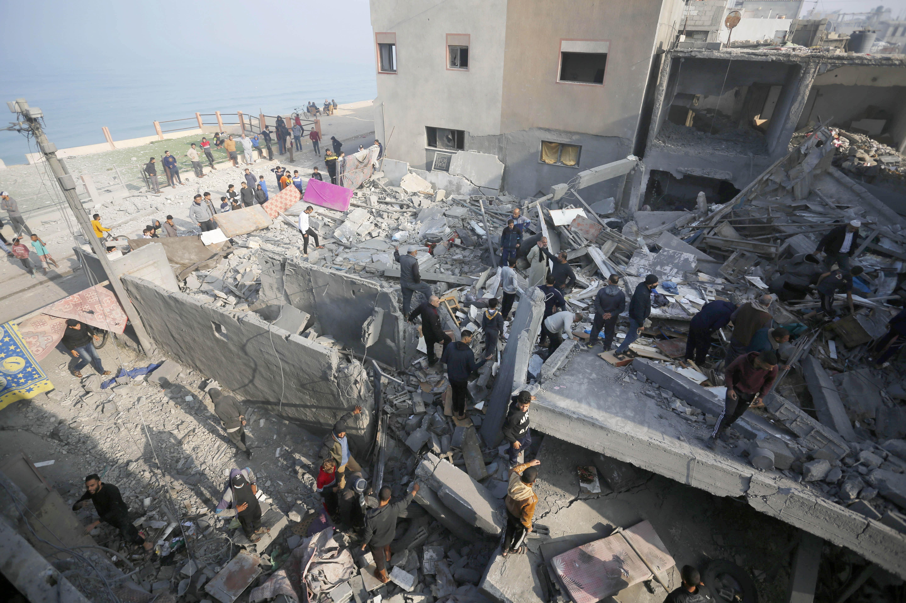

## Claim
Claim: " This image shows heavy Israeli bombardment on Deir al-Balah in the southern Gaza Strip in March 2025 which killed at least four Palestinians."

## Actions
```
reverse_search()
image_search("Deir al-Balah bombardment March 2025")
```

## Evidence
### Evidence from `reverse_search`
The image () appears in an article from L'Orient Today, which reports on an Israeli strike on Nabatieh, Lebanon, on June 26, 2024, which injured nine people. The image is also found in an article from bhol.co.il, which discusses the ongoing conflict between Israel and Hezbollah and mentions an attack in Nabatieh, Lebanon.

*   [Source](https://today.lorientlejour.com/article/1418485/israeli-strike-on-nabatieh-at-least-7-injured-and-14-suffocated.html)
*   [Source](https://www.bhol.co.il/news/1666411)


### Evidence from `image_search`
CNN published an article on July 21, 2025, about the Israeli military in Deir al-Balah, Gaza, including an image of smoke rising over the city (). The Guardian also published an image of a bombardment ().

Al Jazeera published an article about the Israeli strikes on Deir al-Balah in central Gaza, which contains an image of the aftermath of the bombardment ().


## Elaboration
The image (

## Final Judgement
The image in the claim has been identified in articles about an Israeli strike on Nabatieh, Lebanon, in June 2024, not in Deir al-Balah, Gaza, in March 2025. The image search also shows other images related to the conflict in Gaza, but none of them match the image in the claim.

The claim is demonstrably false because the image is misrepresented. `false`

### Verdict: FALSE

### Justification
The image in the claim is from an Israeli strike on Nabatieh, Lebanon, in June 2024, as reported by [L'Orient Today](https://today.lorientlejour.com/article/1418485/israeli-strike-on-nabatieh-at-least-7-injured-and-14-suffocated.html) and [bhol.co.il](https://www.bhol.co.il/news/1666411), not from Deir al-Balah, Gaza, in March 2025.
