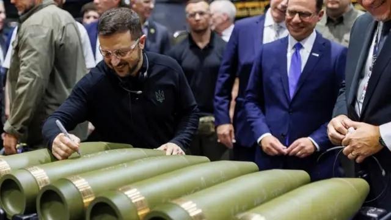

## Claim
Claim: " This image shows Ukrainian President Volodymyr Zelenskyy in March 2025 signing Israeli bombs intended for use against Palestinians in Gaza."

## Actions
```
reverse_search()
image_search("Zelenskyy signing bombs")
```

## Evidence
### Evidence from `reverse_search`
The image shows Ukrainian President Volodymyr Zelenskyy signing ammunition at the Scranton Army Ammunition Plant on September 23, 2024, as reported by the BBC ([https://www.bbc.co.uk/news/articles/c80rkv0k4j8o](https://www.bbc.co.uk/news/articles/c80rkv0k4j8o), [https://www.bbc.com/news/articles/c80rkv0k4j8o](https://www.bbc.com/news/articles/c80rkv0k4j8o)). The Associated Press also reported on the event, mentioning the visit to the ammunition factory in Pennsylvania ([https://apnews.com/article/zelenskyy-johnson-ambassador-ukraine-biden-harris-trump-d81b0a055d99cfd4804b3f2c00915d09](https://apnews.com/article/zelenskyy-johnson-ambassador-ukraine-biden-harris-trump-d81b0a055d99cfd4804b3f2c00915d09)).

The articles do not mention Israeli bombs or Gaza.   


### Evidence from `image_search`
The Guardian published an image of Volodymyr Zelenskyy signing a bomb (), and the BBC published an image of Volodymyr Zelenskyy signing artillery shells (). The Penn Capital-Star published an article about Volodymyr Zelenskyy's visit to an ammunition factory ().


## Elaboration
The claim is demonstrably false. The image shows Volodymyr Zelenskyy signing ammunition at the Scranton Army Ammunition Plant on September 23, 2024, not in March 2025. The evidence does not mention Israeli bombs or their intended use against Palestinians in Gaza.


## Final Judgement
The image shows Volodymyr Zelenskyy signing ammunition at a US ammunition plant in September 2024, not Israeli bombs in March 2025. The claim misrepresents the context of the image.

`false`

### Verdict: FALSE

### Justification
The image depicts Ukrainian President Volodymyr Zelenskyy signing ammunition at the Scranton Army Ammunition Plant in September 2024, as reported by the BBC ([https://www.bbc.co.uk/news/articles/c80rkv0k4j8o](https://www.bbc.co.uk/news/articles/c80rkv0k4j8o)) and the Associated Press ([https://apnews.com/article/zelenskyy-johnson-ambassador-ukraine-biden-harris-trump-d81b0a055d99cfd4804b3f2c00915d09](https://apnews.com/article/zelenskyy-johnson-ambassador-ukraine-biden-harris-trump-d81b0a055d99cfd4804b3f2c00915d09)). The claim that the image shows Israeli bombs intended for use against Palestinians in Gaza is false.
