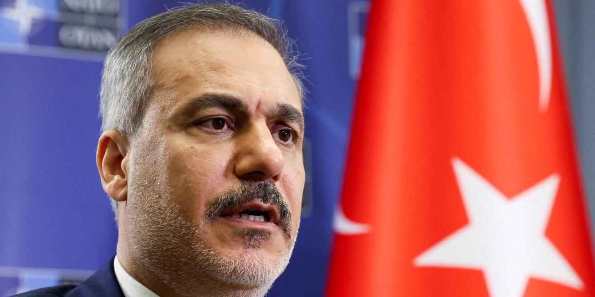

## Claim
Claim: "Turkey's President urged the U.S. in March 2025 to control its ally Israel over its intervention in southern Syria in February 2025."

## Actions
```
image_search("Turkey President Israel Syria March 2025")
```

## Evidence
### Evidence from `image_search`
The Times of Israel published an article that contains an image of a meeting between Turkish and Syrian officials. [Source](https://www.timesofisrael.com/turkey-and-syria-accuse-israel-of-fostering-chaos-in-syria/)  The New Arab published an article about Israel and Turkey, which includes an image of the leaders of Turkey and Israel, Erdogan and Netanyahu, respectively, with the flags of Turkey, Syria, and Israel in the background. [Source](https://www.newarab.com/analysis/israel-and-turkey-showdown-could-shape-syrias-future)  AP News contains an image of Turkey's President. [Source](https://apnews.com/article/turkey-israel-rising-tensions-syria-1e9f9e9d27517162a6559b1313bcb4e6) 


## Elaboration
The evidence includes images of meetings between Turkish and Syrian officials, as well as images of Turkish and Israeli leaders. However, none of the provided sources mention the U.S. or any specific actions taken by Turkey's President in March 2025 regarding Israel's intervention in southern Syria in February 2025.

Therefore, the claim cannot be verified with the available information.


## Actions
```
image_search("Turkey President US Israel Syria March 2025")
```

## Evidence
### Evidence from `image_search`
The Washington Institute published an image of Turkey's President (). Al Jazeera published an article that contains an image of a portrait of Turkey's President (). Le Monde published an article about Turkey holding technical talks with Israel to avoid clashes in Syria ().


## Elaboration
The new evidence provides additional images of Turkey's President and mentions technical talks between Turkey and Israel to avoid clashes in Syria. However, it still does not contain any information about the U.S. being urged by Turkey in March 2025 to control Israel regarding its intervention in southern Syria in February 2025.

Therefore, the claim remains unverified.


## Actions
```
image_search("Turkey President Syria Israel US intervention February 2025")
```

## Evidence
### Evidence from `image_search`
From [Source](https://www.nytimes.com/2025/02/04/world/middleeast/syria-turkey-al-shara-erdogan.html): 
Content: The New York Times published an article that contains an image of Turkey's President. 


## Elaboration
The latest search result from The New York Times includes an image of Turkey's President. However, the article does not provide any information about the U.S. being urged by Turkey in March 2025 to control Israel regarding its intervention in southern Syria in February 2025.

The claim remains unverified due to the lack of supporting evidence.


## Final Judgement
The search results provide images of Turkey's President and articles discussing Turkey's relations with Syria and Israel. However, none of the sources mention the U.S. being urged by Turkey in March 2025 to control Israel over its intervention in southern Syria in February 2025. Therefore, the claim cannot be verified. `false`


### Verdict: FALSE

### Justification
The fact-check, based on multiple image searches and articles from sources like The Times of Israel, The New Arab, AP News, and The New York Times, found no evidence to support the claim that Turkey's President urged the U.S. in March 2025 to control Israel regarding its intervention in southern Syria in February 2025. The search results primarily focused on Turkey's relations with Syria and Israel, but did not mention any such request to the U.S. Therefore, the claim is unverified.
