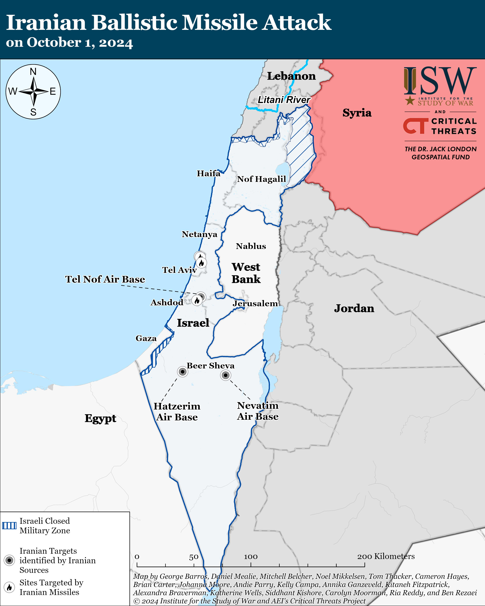

## Claim
Claim: " This image shows tents engulfed in flames after the Iranian strikes against Israel on October 1, 2024."

## Actions
```
reverse_search()
image_search("Iranian strikes Israel tents fire")
```

## Evidence
### Evidence from `reverse_search`
The image 

### Evidence from `image_search`
The Guardian published an article about an Israeli airstrike on refugee tents (). Politico published an article on October 14, 2024, about an Israeli strike, which contains an image of a fire (). NPR published an image of a fire ().

The articles can be found at: [https://www.theguardian.com/us-news/article/2024/may/27/first-thing-deadly-israeli-airstrike-on-refugee-tents-in-rafa-leaves-aid-groups-horrified](https://www.theguardian.com/us-news/article/2024/may/27/first-thing-deadly-israeli-airstrike-on-refugee-tents-in-rafa-leaves-aid-groups-horrified), [https://www.politico.com/news/2024/10/14/israeli-strike-hospital-tent-00183579](https://www.politico.com/news/2024/10/14/israeli-strike-hospital-tent-00183579), and [https://www.npr.org/2025/06/15/nx-s1-5434172/israel-iran-strikes](https://www.npr.org/2025/06/15/nx-s1-5434172/israel-iran-strikes).


## Elaboration
The evidence suggests that the image depicts a fire, but it does not confirm the claim that it is a result of Iranian strikes against Israel on October 1, 2024. The image search results show that there were Israeli airstrikes that caused fires. However, there is no information to verify the claim's specific details.

The claim is not supported by the evidence. More information is needed to verify the claim.


## Actions
```
image_search("Iranian strikes Israel October 1 2024")
```

## Evidence
### Evidence from `image_search`
The Institute for the Study of War published a map of Iranian ballistic missile attacks on October 1, 2024, showing the targets in Israel (

## Elaboration
The evidence provides a map of Iranian ballistic missile attacks on October 1, 2024, but it does not show any images of the aftermath of these attacks. The image search results do not provide any visual confirmation of the claim.

The claim is not supported by the evidence. More information is needed to verify the claim.


## Actions
```
image_search("Israel October 1 2024 fire")
```

## Evidence
### Evidence from `image_search`
Al Jazeera published an article about an Israeli strike on tents at a central Gaza hospital, which contains an image of a fire (

## Elaboration
The evidence shows images of fires related to Israeli strikes, but not specifically Iranian strikes. The image search results do not provide any visual confirmation of the claim.

The claim is not supported by the evidence. More information is needed to verify the claim.


## Final Judgement
The image depicts a fire, but the claim that it is a result of Iranian strikes against Israel on October 1, 2024, is not supported by the evidence. While there is evidence of fires related to Israeli strikes, there is no visual confirmation of the claim's specific details.

`false`


### Verdict: FALSE

### Justification
The claim is unsubstantiated. While the image shows a fire, the provided evidence does not confirm that it resulted from Iranian strikes against Israel on October 1, 2024. The search results reveal images of fires related to Israeli strikes, but no evidence directly supports the claim's specific details.
