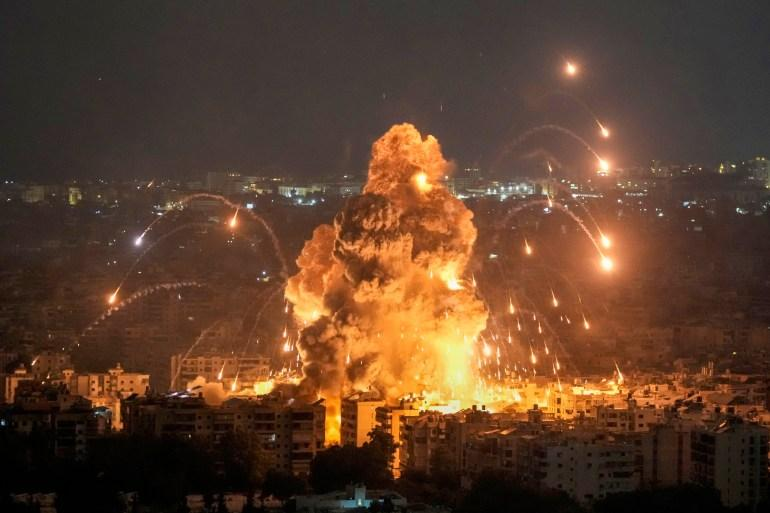
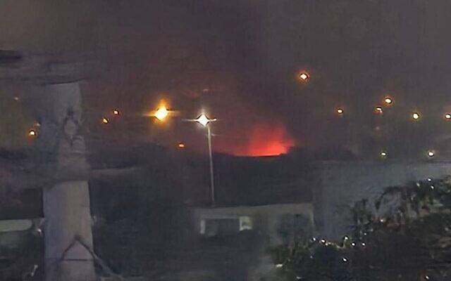
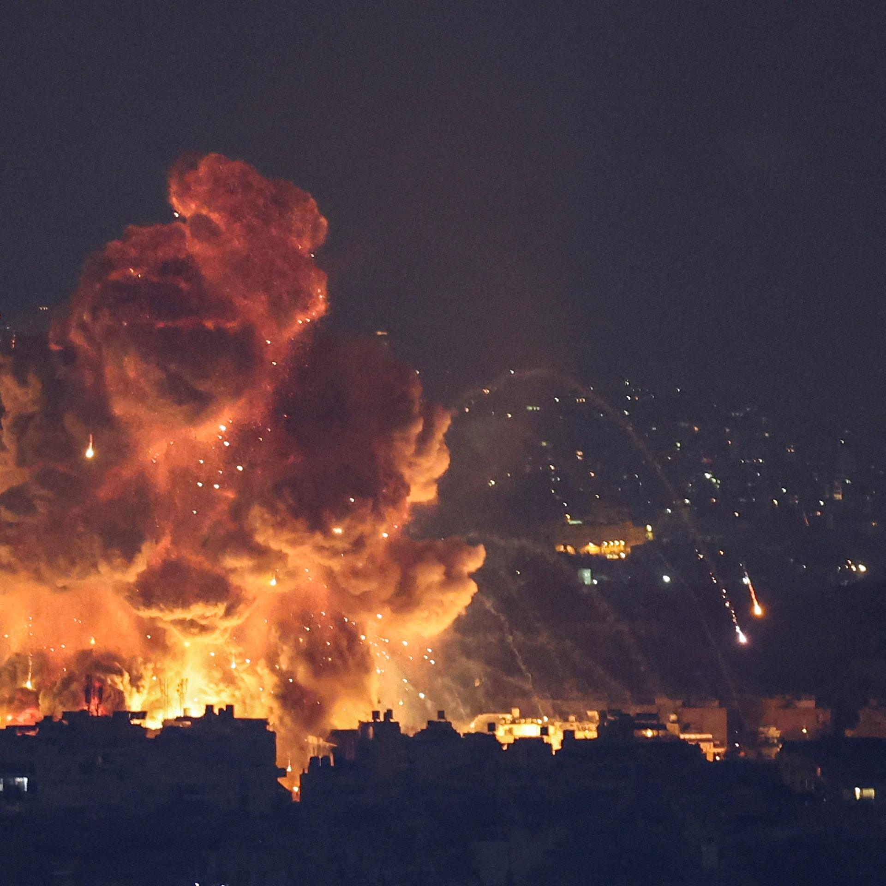

## Claim
Claim: " This image shows Israel launching several waves of revengeful attacks on Iranian military targets on October 26, 2024."

## Actions
```
reverse_search()
geolocate()
image_search("Israel attacks Iranian military targets October 26 2024")
```

## Evidence
### Evidence from `reverse_search`
The image () appears in articles discussing the conflict in the Middle East, specifically the Israeli assault on Gaza and the role of Iran. One source, Syria Live Map, uses the image to depict an explosion over a city at night, dated October 22, 2024, and describes it as a raid on the Al-Laylaki area. Another source, Harapan Daily, uses the image () in an article about the conflict, mentioning an Iranian drone and missile operation targeting Israeli military installations in April 2024. The image also appears on News Live - Oregon () and is described as "a picture of the raid that targeted the Al-Laylaki area a short while ago".


### Evidence from `geolocate`
The most likely countries where the image was taken are: {'Palestine': 0.4, 'Israel': 0.3, 'Bangladesh': 0.04, 'Taiwan': 0.04, 'Ukraine': 0.04, 'China': 0.02, 'Pakistan': 0.02, 'Bulgaria': 0.01, 'Jordan': 0.01, 'Malta': 0.01}

### Evidence from `image_search`
The Institute for the Study of War and AEI's Critical Threats Project published a map showing confirmed IDF strikes in Iran as of October 28, 2024, at 2:00 PM ET. The IDF launched three waves of strikes targeting around 20 locations around Tehran and western Iran on October 25. CNN reports on Israeli strikes in Iran on October 26, 2024. Al Jazeera reports that Israel carried out overnight strikes on military targets in Iran on October 26, 2024.

The sources are: [https://www.understandingwar.org/backgrounder/iran-update-october-28-2024](https://www.understandingwar.org/backgrounder/iran-update-october-28-2024), [https://www.cnn.com/2024/10/26/middleeast/israel-strikes-iran-explainer-intl-hnk](https://www.cnn.com/2024/10/26/middleeast/israel-strikes-iran-explainer-intl-hnk), and [https://www.aljazeera.com/news/2024/10/26/condemnation-calls-for-restraint-world-reacts-to-israeli-strikes-on-iran](https://www.aljazeera.com/news/2024/10/26/condemnation-calls-for-restraint-world-reacts-to-israeli-strikes-on-iran).   


## Elaboration
The claim that the image shows Israel launching attacks on Iranian military targets on October 26, 2024, is partially supported by the evidence. The image search results confirm that Israel did launch strikes on Iranian military targets on October 26, 2024. However, the reverse image search indicates that the image has been used in different contexts, including depicting events on October 22, 2024, and an Iranian drone and missile operation in April 2024. The geolocation data does not provide conclusive evidence about the image's origin.

Therefore, while the date of the attacks aligns with the claim, the image's provenance is uncertain. It is possible that the image is related to the events described in the claim, but further verification is needed to confirm its specific context.


## Actions
```
image_search("Israel strikes Iran October 26 2024 image")
```

## Evidence
### Evidence from `image_search`
From [Source](https://www.understandingwar.org/backgrounder/iran-update-october-26-2024): 
Content: The Institute for the Study of War and AEI's Critical Threats Project published a map showing confirmed IDF strikes around Tehran on October 26, 2024. 


## Elaboration
The additional evidence confirms that Israel launched strikes around Tehran on October 26, 2024. However, the image search did not return the original image. Therefore, the claim's veracity remains uncertain, as the image's specific context cannot be confirmed.


## Actions
```
image_search("explosion over city night October 26 2024")
```

## Evidence
### Evidence from `image_search`
Al Jazeera and The Times of Israel both published articles about explosions over cities at night, with Al Jazeera's article mentioning the date of October 26, 2024. Reuters also published an article with a similar image, but the date was October 5, 2024. (, , )


## Elaboration
The evidence suggests that the claim is likely false. While there were indeed Israeli strikes on Iran on October 26, 2024, the image in question has been used in different contexts, including events on other dates. The image search for explosions on that date did not return the original image. Therefore, there is no direct evidence to confirm that the image depicts the specific events described in the claim.


## Final Judgement
The claim is likely false. While there is evidence of Israeli strikes on Iran on October 26, 2024, the image's origin and context are uncertain. The image has been used in different contexts, and the image search did not return the original image. `false`

### Verdict: FALSE

### Justification
The claim is likely false. While Israel did launch strikes on Iran on October 26, 2024, the image's context is uncertain, as it has been used in different contexts, including events on other dates. The image search for explosions on that date did not return the original image. Therefore, there is no direct evidence to confirm that the image depicts the specific events described in the claim.
