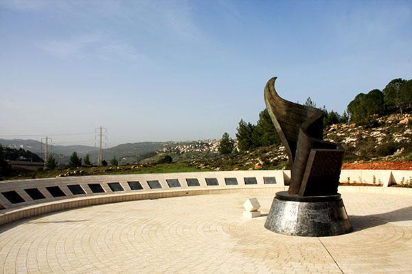

## Claim
Claim: " This image shows Israel's 9/11 memorial which is the only one outside the US."

## Actions
```
reverse_search()
image_search("Israel 9/11 memorial")
```

## Evidence
### Evidence from `reverse_search`
The image shows the 9/11 Living Memorial Plaza in Jerusalem, Israel, which is the only monument outside the US that lists the names of the nearly 3,000 victims. The memorial is a 30-foot high bronze sculpture of a waving American flag transforming into a flame and includes a piece from the Twin Towers. It was dedicated on November 12, 2009.

The memorial is also discussed in an article from IsraelPharm.com, which states that it is the only memorial outside the US that lists all the victims of the attacks.


### Evidence from `image_search`
From [Source](https://www.kkl-jnf.org/tourism-and-recreation/scenic-lookouts/center/twin-towers-living-memorial-jerusalem-park.aspx): 
Content: The search result from KKL-JNF.org shows the Twin Towers Living Memorial in Jerusalem Park, Israel. 


## Elaboration
The evidence confirms that the image depicts the 9/11 Living Memorial in Jerusalem, Israel. The memorial is the only one outside the US that lists the names of the nearly 3,000 victims.


## Final Judgement
The image shows the 9/11 Living Memorial in Jerusalem, Israel, which is the only monument outside the US that lists the names of the nearly 3,000 victims. The memorial is a 30-foot high bronze sculpture of a waving American flag transforming into a flame and includes a piece from the Twin Towers.

The claim is supported by the evidence, which confirms that the memorial in the image is the only one outside the US that lists all the victims of the attacks. `true`


### Verdict: TRUE

### Justification
The image depicts the 9/11 Living Memorial in Jerusalem, Israel, which is the only memorial outside the US that lists the names of the nearly 3,000 victims, as confirmed by reverse image search results and information from KKL-JNF.org ([Source](https://www.kkl-jnf.org/tourism-and-recreation/scenic-lookouts/center/twin-towers-living-memorial-jerusalem-park.aspx)).
