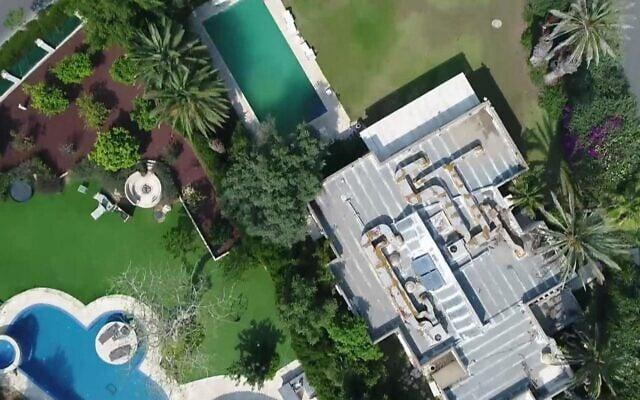
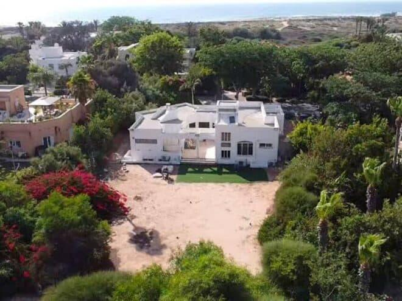
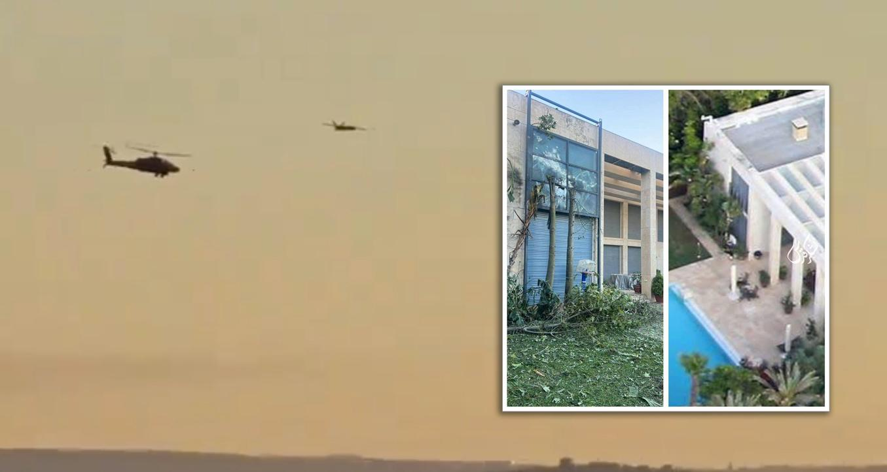

## Claim
Claim: " This image shows Israeli PM Benjamin Netanyahu's house taken by a Hezbollah drone in August 2024."

## Actions
```
reverse_search()
image_search("Benjamin Netanyahu house aerial view")
geolocate()
```

## Evidence
### Evidence from `reverse_search`
The image () is of Benjamin Netanyahu's private residence in Caesarea. It was taken in 2019 and featured in a June 25, 2020 article by _Times of Israel_. The image is attributed to _Kan_ public broadcaster.

The image was also found on the website "Beyond Highbrow" by Robert Lindsay. An article in _Times of Israel_ from October 21, 2024, discusses a drone explosion near Netanyahu's house in Caesarea, but does not include the image.


### Evidence from `image_search`
Haaretz published an article about the detailed plans of Netanyahu's Jerusalem residence (). Siasat.com discusses a report about a Hezbollah drone filming Netanyahu's residence (). The Aviationist reports on an alleged drone attack on Benjamin Netanyahu's house ().


### Evidence from `geolocate`
The most likely countries where the image was taken are: {'Israel': 0.17, 'Mexico': 0.15, 'Tunisia': 0.11, 'Malta': 0.1, 'Palestine': 0.07, 'Bermuda': 0.05, 'Jordan': 0.05, 'United Arab Emirates': 0.04, 'Dominican Republic': 0.03, 'Pakistan': 0.03}

## Elaboration
The image () is of Benjamin Netanyahu's private residence in Caesarea, Israel, and was taken in 2019. The claim states that the image was taken by a Hezbollah drone in August 2024. This is inconsistent with the evidence, which indicates the image's origin predates the claimed event.

The evidence also mentions a drone explosion near Netanyahu's house in October 2024, but this event is not directly linked to the image in question. Additionally, the image search results show other images related to Netanyahu's residences, including one that may have been taken by a drone.

Therefore, the claim is false because the image was taken in 2019, not in August 2024.


## Final Judgement
The image is of Benjamin Netanyahu's house, but it was taken in 2019, not in August 2024 as the claim states. The claim also attributes the image to a Hezbollah drone, which is not supported by the evidence.

`false`

### Verdict: FALSE

### Justification
The image in question, which depicts Benjamin Netanyahu's house, was taken in 2019 and published in a _Times of Israel_ article in 2020, not in August 2024 as the claim suggests. The claim also incorrectly attributes the image to a Hezbollah drone.
