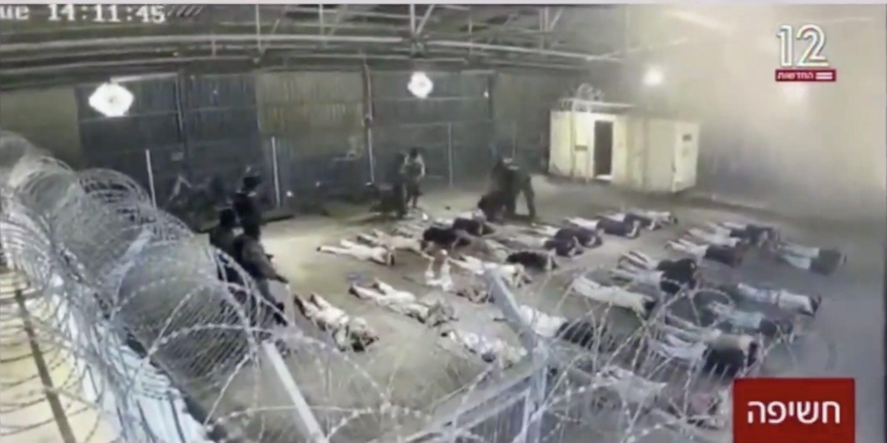

## Claim
Claim: " The image shows a screenshot of an authentic question from Israel's Channel 12 public opinion poll: 'Do you agree with the claim that a solder is allowed to rape a prisoner with his hands tied?'"

## Actions
```
image_search("Channel 12 Israel poll soldier rape prisoner")
```

## Evidence
### Evidence from `image_search`
The image in the claim is doctored, according to cedmohub.eu ([https://cedmohub.eu/posts-share-doctored-prisoner-abuse-poll-from-israeli-tv-channel/](https://cedmohub.eu/posts-share-doctored-prisoner-abuse-poll-from-israeli-tv-channel/)). 

The Intercept ([https://theintercept.com/2024/08/09/israel-prison-sde-teiman-palestinian-abuse-torture/](https://theintercept.com/2024/08/09/israel-prison-sde-teiman-palestinian-abuse-torture/)) published an article that includes an image with the Channel 12 logo.  Al Jazeera ([https://www.aljazeera.com/video/newsfeed/2024/8/9/israeli-soldier-accused-of-involvement-in-prisoner-rape-speaks-out](https://www.aljazeera.com/video/newsfeed/2024/8/9/israeli-soldier-accused-of-involvement-in-prisoner-rape-speaks-out)) contains an image of a TV show. 


## Elaboration
The evidence indicates that the image in the claim is doctored. The website cedmohub.eu states that the image is not authentic ([https://cedmohub.eu/posts-share-doctored-prisoner-abuse-poll-from-israeli-tv-channel/](https://cedmohub.eu/posts-share-doctored-prisoner-abuse-poll-from-israeli-tv-channel/)).


## Final Judgement
The image in the claim is a doctored screenshot of a poll from Israel's Channel 12. The original image has been altered to include a fabricated question about a soldier being allowed to rape a prisoner.

`false`

### Verdict: FALSE

### Justification
The image in the claim is a doctored screenshot, as confirmed by cedmohub.eu ([https://cedmohub.eu/posts-share-doctored-prisoner-abuse-poll-from-israeli-tv-channel/](https://cedmohub.eu/posts-share-doctored-prisoner-abuse-poll-from-israeli-tv-channel/)). The original image has been altered to include a fabricated question.
