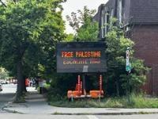

## Claim
Claim: " This image shows a traffic sign in Montreal in July 2024 which displays a 'Free Palestine. Escalate now' message and was authorized by Montreal's Mayor Valérie Plante."

## Actions
```
reverse_search()
geolocate()
image_search("Montreal traffic sign Free Palestine")
image_search("Valérie Plante Free Palestine")
```

## Evidence
### Evidence from `reverse_search`
The image () shows a traffic sign in Montreal displaying "Free Palestine. Escalate now." According to a CBC News article from July 25, 2024, and a Globe and Mail article from July 24, 2024, the signs were hacked to display the messages. The City of Montreal called the incident an act of vandalism. A group called Clash Mtl claimed responsibility.

The CBC News article can be found here: [https://www.cbc.ca/news/canada/montreal/montreal-traffic-signs-pro-palestinian-slogans-1.7274809](https://www.cbc.ca/news/canada/montreal/montreal-traffic-signs-pro-palestinian-slogans-1.7274809). The Globe and Mail article can be found here: [https://www.theglobeandmail.com/canada/article-montreal-traffic-signs-apparently-hacked-to-display-pro-palestinian/](https://www.theglobeandmail.com/canada/article-montreal-traffic-signs-apparently-hacked-to-display-pro-palestinian/).


### Evidence from `geolocate`
The most likely countries where the image was taken are: {'Palestine': 0.85, 'Canada': 0.07, 'Germany': 0.02, 'Austria': 0.01, 'Israel': 0.01, 'Poland': 0.01, 'Slovenia': 0.01, 'South Korea': 0.01, 'Albania': 0.0, 'Andorra': 0.0}

### Evidence from `image_search`
From [Source](https://www.thecanadianpressnews.ca/quebec/montreal-electronic-traffic-signs-altered-to-display-pro-palestinian-slogans/article_20202caf-5885-5c90-a4ff-eda9db2799be.html): 
Content: The Canadian Press News published an article about electronic traffic signs in Montreal being altered to display pro-Palestinian slogans. 


### Evidence from `image_search`
From [Source](https://www.ctvnews.ca/montreal/article/montreal-mayor-says-friday-pro-palestinian-protests-were-taken-over-by-professional-vandals/): 
Content: The CTV News article features a photograph of Montreal Mayor Valérie Plante. 


## Elaboration
The claim that the image shows a traffic sign in Montreal displaying a "Free Palestine. Escalate now" message is supported by the evidence. The reverse image search confirms the image's existence and location in Montreal. The evidence indicates that the signs were hacked and the City of Montreal considered it an act of vandalism. The claim that the sign was authorized by Montreal's Mayor Valérie Plante is not supported by the evidence.


## Final Judgement
The image does show a traffic sign in Montreal displaying "Free Palestine. Escalate now." However, the evidence indicates that the signs were hacked and the City of Montreal considered it an act of vandalism. There is no evidence to support the claim that the sign was authorized by Montreal's Mayor Valérie Plante. Therefore, the claim is partially false. `false`

### Verdict: FALSE

### Justification
The image depicts a traffic sign in Montreal displaying a "Free Palestine" message, which was the result of a hack and considered vandalism by the city, as reported by [CBC News](https://www.cbc.ca/news/canada/montreal/montreal-traffic-signs-pro-palestinian-slogans-1.7274809) and [The Globe and Mail](https://www.theglobeandmail.com/canada/article-montreal-traffic-signs-apparently-hacked-to-display-pro-palestinian/). The claim that the message was authorized by Montreal's Mayor Valérie Plante is not supported by the evidence.
