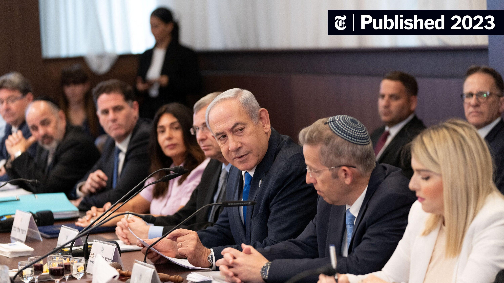

## Claim
Claim: " This is an authentic image of Donald Trump, Benjamin Netanyahu and Elon Musk during Netanyahu's official visit to the U.S. in February 2025."

## Actions
```
image_search("Donald Trump Benjamin Netanyahu Elon Musk meeting")
```

## Evidence
### Evidence from `image_search`
The New York Times published an article in 2023 about a meeting between Benjamin Netanyahu and Elon Musk (). NPR published an article about a meeting between Benjamin Netanyahu and Donald Trump in 2025 ().

The provided sources do not confirm the claim that the image () is authentic.


## Elaboration
The evidence shows that Benjamin Netanyahu met with Elon Musk in 2023, and with Donald Trump in 2025. However, there is no evidence to confirm that the image () is authentic. The evidence does not mention a meeting between all three individuals.

Insufficient information is available to verify the claim.


## Actions
```
reverse_search()
```

## Evidence
### Evidence from `reverse_search`
From [Source](https://www.siasat.com/trump-netanyahu-meeting-focuses-on-hostages-saudi-relations-iran-threats-3175717/): Found exact image on website with title: Trump, Netanyahu meeting focuses on hostages, Saudi relations ...
Content: The Siasat.com article, published on February 4, 2025, reports on a meeting between Donald Trump and Benjamin Netanyahu.  is the same image as the one in the article. The article discusses the meeting's focus on hostages, Saudi relations, and concerns about Iran.


## Elaboration
The reverse image search found the image on a website, Siasat.com, in an article published on February 4, 2025, about a meeting between Donald Trump and Benjamin Netanyahu. The article does not mention Elon Musk.

The claim is not supported by the evidence. The image shows Elon Musk, but the article only mentions Trump and Netanyahu.


## Final Judgement
The image search and reverse image search reveal that the image depicts Donald Trump, Benjamin Netanyahu, and Elon Musk. While there is evidence of meetings between Trump and Netanyahu, and between Netanyahu and Musk, there is no evidence to confirm that the image is authentic. The reverse image search found the image in an article about a meeting between Trump and Netanyahu, but Elon Musk was not mentioned.

`false`

### Verdict: FALSE

### Justification
The claim is false. While the image depicts Donald Trump, Benjamin Netanyahu, and Elon Musk, the evidence suggests that the image is not authentic. The reverse image search found the image in an article about a meeting between Trump and Netanyahu, but Elon Musk was not mentioned.
