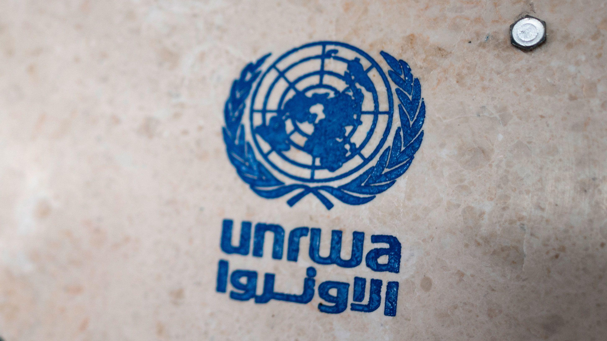

## Claim
Claim: " This image shows a screenshot of the X profile of UNRWA which has placed a black band over its profile photo in mourning for the death of Yahya Sinwar, Hamas leader in the Gaza Strip, in October 2024."

## Actions
```
image_search("UNRWA profile")
```

## Evidence
### Evidence from `image_search`
The CNN article discusses an investigation into UNRWA.  The search result also shows the Instagram profile of UNRWA USA National Committee. 


## Elaboration
The evidence includes a CNN article discussing an investigation into UNRWA and an Instagram profile of UNRWA USA National Committee. Neither of these sources supports the claim that UNRWA placed a black band over its profile photo in mourning for the death of Yahya Sinwar.

The provided evidence does not contain any information about the UNRWA X profile or its activities. Therefore, the claim cannot be verified.


## Actions
```
image_search("UNRWA X profile black band")
```

## Evidence
### Evidence from `image_search`
The Canadian Press News article discusses the claim that UNRWA placed a black band on its social media profiles in mourning for the death of Yahya Sinwar. The article includes an image of the UNRWA logo.  The DW article fact-checks a claim about UNRWA and includes a screenshot of an UNRWA X post from October 22, 2023, which does not show a black band. 

The UNESCO source does not contain any relevant content.


## Elaboration
The evidence includes a DW article that fact-checks a claim about UNRWA. The article includes a screenshot of an UNRWA X post from October 22, 2023, which does not show a black band. This contradicts the claim that UNRWA placed a black band on its profile photo.


## Final Judgement
The initial search did not provide any information to support the claim. The subsequent search revealed a DW article that fact-checked a claim about UNRWA and included a screenshot of an UNRWA X post from October 22, 2023, which did not show a black band. This contradicts the claim. `false`

### Verdict: FALSE

### Justification
The claim is false. A search for the UNRWA X profile did not show a black band on the profile photo. A DW article fact-checking a related claim included a screenshot of an UNRWA X post from October 22, 2023, which did not show a black band, contradicting the claim.
