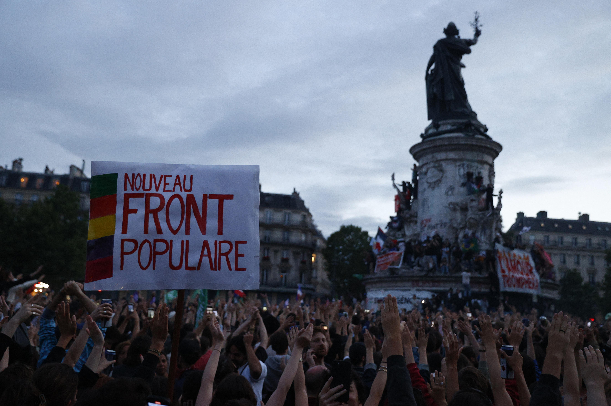

## Claim
Claim: " This image shows the 'French' Left who is rioting against Le Pen's victory in the first round of the French parliamentary elections in 2024."

## Actions
```
reverse_search()
image_search("French protest Le Pen victory 2024")
```

## Evidence
### Evidence from `reverse_search`
The image in the claim () appears in a Vanity Fair article discussing anti-Semitism in France, specifically a 2014 pro-Palestinian demonstration in Paris where a swastika was painted on a statue. The article is available at [https://www.vanityfair.com/news/2015/07/anti-semitism-france-hostage-hyper-cacher-kosher-market](https://www.vanityfair.com/news/2015/07/anti-semitism-france-hostage-hyper-cacher-kosher-market).

The same image () is also found in an article on the World Jewish Congress website about a German TV documentary on European anti-Semitism, published on June 19, 2017, and in an article by Adam Milstein in The Jerusalem Post on July 27, 2023, discussing antisemitism in Europe.


### Evidence from `image_search`
Al Jazeera ([https://www.aljazeera.com/news/2024/7/6/france-braces-for-high-drama-run-offs-as-le-pens-far-right-eyes-power](https://www.aljazeera.com/news/2024/7/6/france-braces-for-high-drama-run-offs-as-le-pens-far-right-eyes-power)) published an article on the French parliamentary elections in 2024, including a photograph of a protest . Bloomberg ([https://www.bloomberg.com/news/articles/2024-06-10/french-far-right-parties-edge-toward-coalition-against-macron](https://www.bloomberg.com/news/articles/2024-06-10/french-far-right-parties-edge-toward-coalition-against-macron)) reports on the French far-right parties and their coalition against Macron, featuring an image of Marine Le Pen .

Reuters ([https://www.reuters.com/world/europe/france-shifts-left-risk-policy-paralysis-looms-2024-07-08/](https://www.reuters.com/world/europe/france-shifts-left-risk-policy-paralysis-looms-2024-07-08/)) also published an article about the French parliamentary elections in 2024, including an image of a protest .


## Elaboration
The image in the claim (

## Final Judgement
The image in the claim is from a 2014 pro-Palestinian demonstration in Paris, not a 2024 protest against Le Pen's victory. The image has been taken out of context and misrepresented.

`false`

### Verdict: FALSE

### Justification
The image in the claim is from a 2014 pro-Palestinian demonstration in Paris, as evidenced by a Vanity Fair article ([https://www.vanityfair.com/news/2015/07/anti-semitism-france-hostage-hyper-cacher-kosher-market](https://www.vanityfair.com/news/2015/07/anti-semitism-france-hostage-hyper-cacher-kosher-market)). This contradicts the claim that it depicts a 2024 protest against Le Pen's victory.
