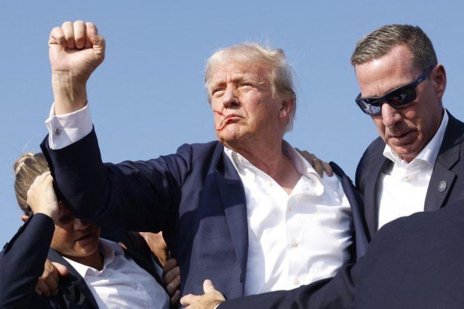
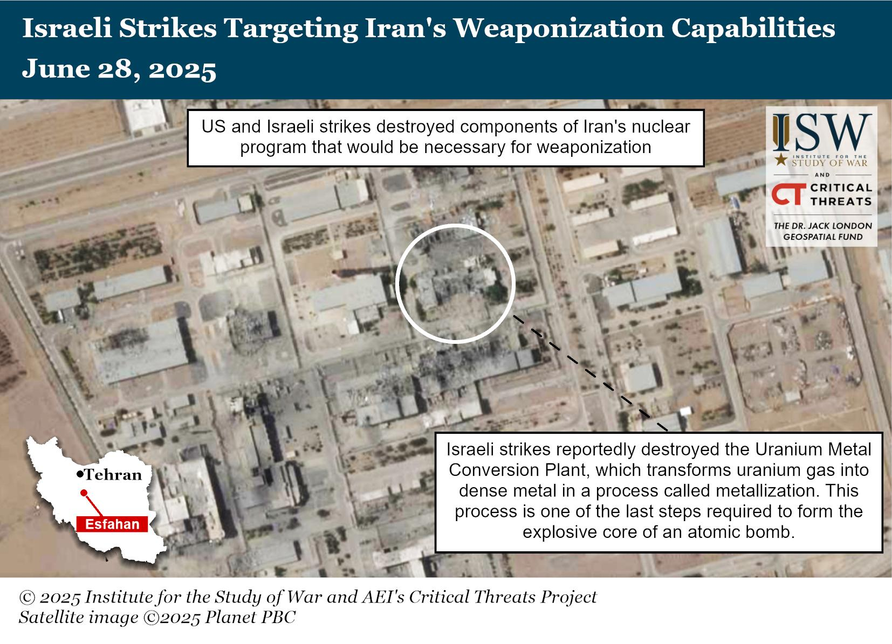
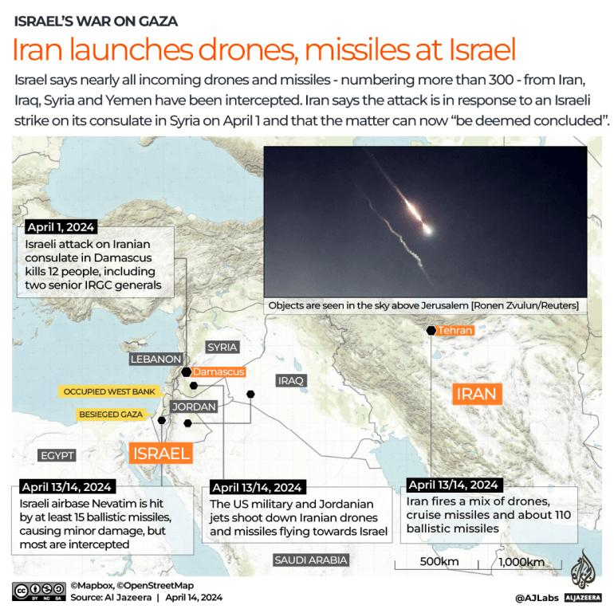
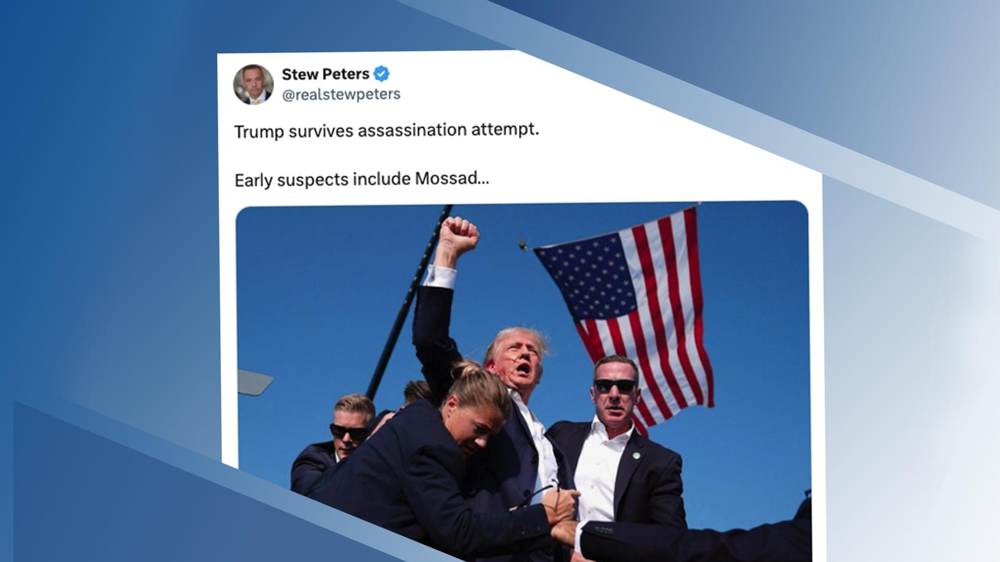
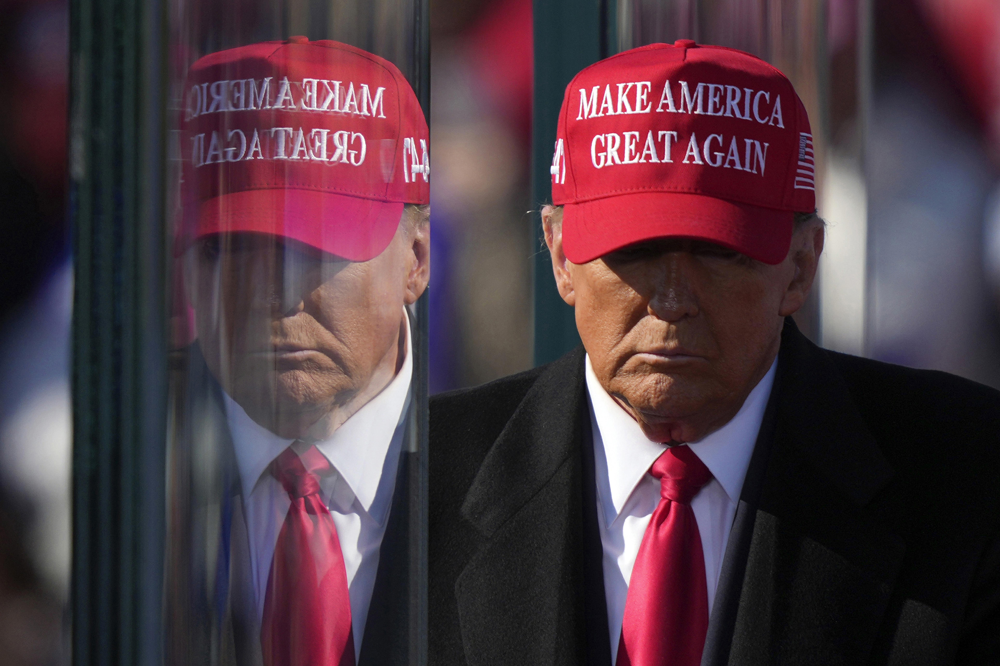
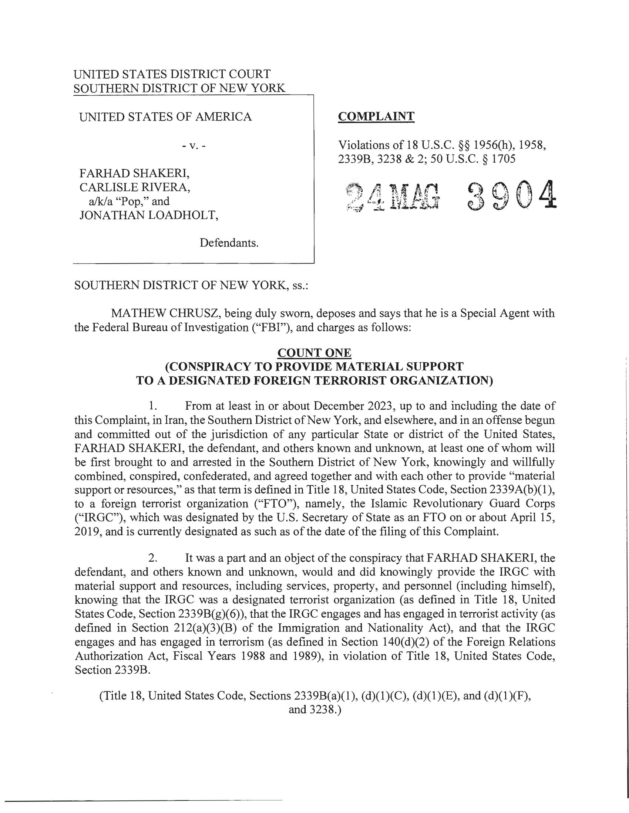

## Claim
Claim: "The assassination plot to kill Donald Trump in 2024 was orchestrated by two Jewish Americans. Israel wants war with Iran but wants American money to fund it and American servicemen to fight it."

## Actions
```
image_search("Donald Trump assassination plot 2024")
image_search("Israel Iran war funding")
```

## Evidence
### Evidence from `image_search`
The BBC News search result contains an image of Donald Trump . An Amazon search result shows a TIME Magazine cover with the date August 5, 2024, with an image of Donald Trump and the title "Attack On Trump" . Al Jazeera published an article on July 14, 2024, discussing a Trump assassination attempt, including an image of Donald Trump with a wound on his face .

The sources are: [Source](https://www.bbc.com/news/articles/cd172rp02e0o), [Source](https://www.amazon.com/TIME-Magazine-Assassination-Pennsylvania-Republican/dp/B0DB6K7F64), and [Source](https://www.aljazeera.com/opinions/2024/7/14/the-trump-assassination-attempt-a-race-reset-and-more-polarisation).


### Evidence from `image_search`
The provided web sources discuss the conflict between Iran and Israel. One source from Chatham House includes an image of a building being demolished  ([Source](https://www.chathamhouse.org/2025/06/iran-israel-conflict-iran-has-run-out-good-options)). Another source from the Institute for the Study of War and AEI's Critical Threats Project details Israeli strikes targeting Iran's weaponization capabilities, including an image of the destruction of the Uranium Metal Conversion Plant  ([Source](https://www.understandingwar.org/backgrounder/iran-update-june-28-2025)).

Al Jazeera published an article on April 14, 2024, about Iran launching drones and missiles at Israel, referencing an Israeli attack on an Iranian consulate in Damascus  ([Source](https://www.aljazeera.com/news/2024/4/15/us-will-not-take-part-in-any-israeli-retaliatory-action-against-iran)).


## Elaboration
The evidence indicates that there was an assassination attempt on Donald Trump in 2024. However, the evidence does not mention who orchestrated the assassination plot.

The evidence also shows that there is a conflict between Iran and Israel, with both sides attacking each other. However, the evidence does not mention whether Israel wants American money or servicemen to fight Iran.

Therefore, the claim cannot be verified due to a lack of information.


## Actions
```
image_search("Jewish Americans Donald Trump assassination plot")
image_search("Israel Iran war American funding")
image_search("Israel Iran war American servicemen")
```

## Evidence
### Evidence from `image_search`
The ADL published an article discussing antisemitic conspiracy theories related to the Trump assassination attempt, including an image of Donald Trump . NPR published an article on November 8, 2024, about an Iran-related murder-for-hire plot against Donald Trump . The New York Times published a document from the United States District Court Southern District of New York, which includes a complaint against Farhad Shakeri, Carlisle Rivera, and Jonathan Loadholt .

The sources are: [Source](https://www.adl.org/resources/article/trump-assassination-attempt-sparks-antisemitic-conspiracy-theories-and-violent), [Source](https://www.npr.org/2024/11/08/nx-s1-5184549/iran-donald-trump-murder-for-hire-plot-justice-department), and [Source](https://www.nytimes.com/interactive/2024/11/08/nyregion/us-v-shakeri-et-al-complaint.html).


### Evidence from `image_search`
The provided web sources discuss the financial aid the United States has given to Israel over the years, including an image of American and Israeli soldiers (). One source, from India Today, discusses how the United States has financed Israel over the years (). Another source, from Geopolitical Economy, discusses how Trump helps Israel wage war on Iran ().

*   [https://www.indiatoday.in/india/story/israel-iran-conflict-how-has-united-states-financed-israel-over-the-years-dollars-all-the-way-2743451-2025-06-20](https://www.indiatoday.in/india/story/israel-iran-conflict-how-has-united-states-financed-israel-over-the-years-dollars-all-the-way-2743451-2025-06-20)
*   [https://www.cfr.org/article/us-aid-israel-four-charts](https://www.cfr.org/article/us-aid-israel-four-charts)
*   [https://geopoliticaleconomy.com/2025/06/14/israel-war-iran-us-trump-support/](https://geopoliticaleconomy.com/2025/06/14/israel-war-iran-us-trump-support/)


### Evidence from `image_search`
The search results did not provide any information about Jewish Americans orchestrating an assassination plot against Donald Trump. The Council on Foreign Relations published an article with an image of Israeli soldiers . Le Monde published an article discussing the Israel-Iran conflict and the prospect of US military intervention, including an image of Donald Trump with US servicemen . The NPR search result did not contain any content.


## Elaboration
The evidence indicates that there was an assassination attempt on Donald Trump, and that antisemitic conspiracy theories have emerged. However, the evidence does not support the claim that the plot was orchestrated by Jewish Americans.

The evidence also shows that the United States has provided financial aid to Israel. Additionally, the evidence suggests that the US may be involved in the conflict between Israel and Iran. However, the evidence does not explicitly state that Israel wants American servicemen to fight Iran.

Therefore, the claim is not supported by the evidence.


## Final Judgement
The fact-check reveals that there was an assassination attempt on Donald Trump, and that antisemitic conspiracy theories have emerged. The United States has provided financial aid to Israel, and the US may be involved in the conflict between Israel and Iran. However, the evidence does not support the claim that the plot was orchestrated by Jewish Americans, nor does it explicitly state that Israel wants American servicemen to fight Iran. `false`

### Verdict: FALSE

### Justification
The claim is **false**. While there is evidence of an assassination attempt on Donald Trump and the US provides financial aid to Israel, there is no evidence to support the claim that Jewish Americans orchestrated the assassination plot or that Israel wants American servicemen to fight Iran.
