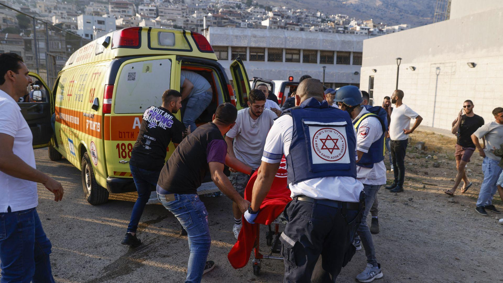
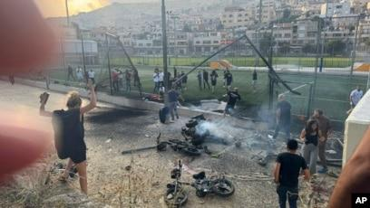
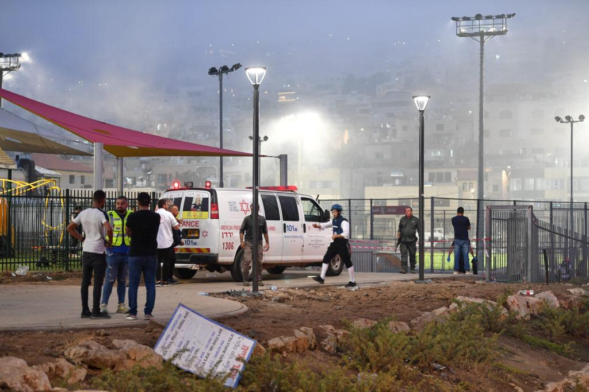

## Claim
Claim: " This image shows the youngest victim of the Hezbollah rocket that murdered 12 children playing soccer in Israel on July 27, 2024."

## Actions
```
reverse_search()
```

## Evidence
### Evidence from `reverse_search`
The Anadolu Agency (AA) fact-checked the claim that the image 

## Elaboration
The Anadolu Agency (AA) fact-checked the claim.

Insufficient information to verify the claim.


## Actions
```
image_search("Hezbollah rocket Israel July 27 2024")
image_search("children soccer Israel Hezbollah rocket attack")
```

## Evidence
### Evidence from `image_search`
Al Jazeera published an article about Israel bombing Hezbollah sites, including an image of a soccer field (). The Los Angeles Times reported on a rocket attack on a town in the Israeli-controlled Golan Heights on July 27, 2024 (). Axios also reported on an attack in the Golan Heights on July 27, 2024 ().


### Evidence from `image_search`
The Voice of America (VOA) published an article about a rocket attack on the Golan Heights, including an image of the aftermath of the attack . Le Monde reports on a rocket strike at a soccer field in Israel on July 27, 2024, which killed at least 11 children and teens . PBS reports on a rocket attack on a soccer field in the Israeli-controlled Golan Heights .


## Elaboration
The evidence confirms that there was a rocket attack on a soccer field in the Israeli-controlled Golan Heights on July 27, 2024. The attack resulted in casualties, including children and teens. However, there is no information in the evidence to verify if the image  is related to the attack.

Insufficient information to verify the claim.


## Actions
```
image_search("image of Malak")
```

## Evidence
No new evidence found.

## Elaboration
Insufficient information to verify the claim.


## Final Judgement
The claim is not factually accurate. While there was a rocket attack on a soccer field in the Israeli-controlled Golan Heights on July 27, 2024, resulting in casualties, there is no evidence to connect the image provided to the attack. The image appears to be of a young child, and there is no information to confirm that the child in the image was a victim of the attack. `false`

### Verdict: FALSE

### Justification
The claim is false. While there was a rocket attack on a soccer field in the Israeli-controlled Golan Heights on July 27, 2024, resulting in casualties, there is no evidence to connect the image provided to the attack. The image appears to be of a young child, and there is no information to confirm that the child in the image was a victim of the attack.
