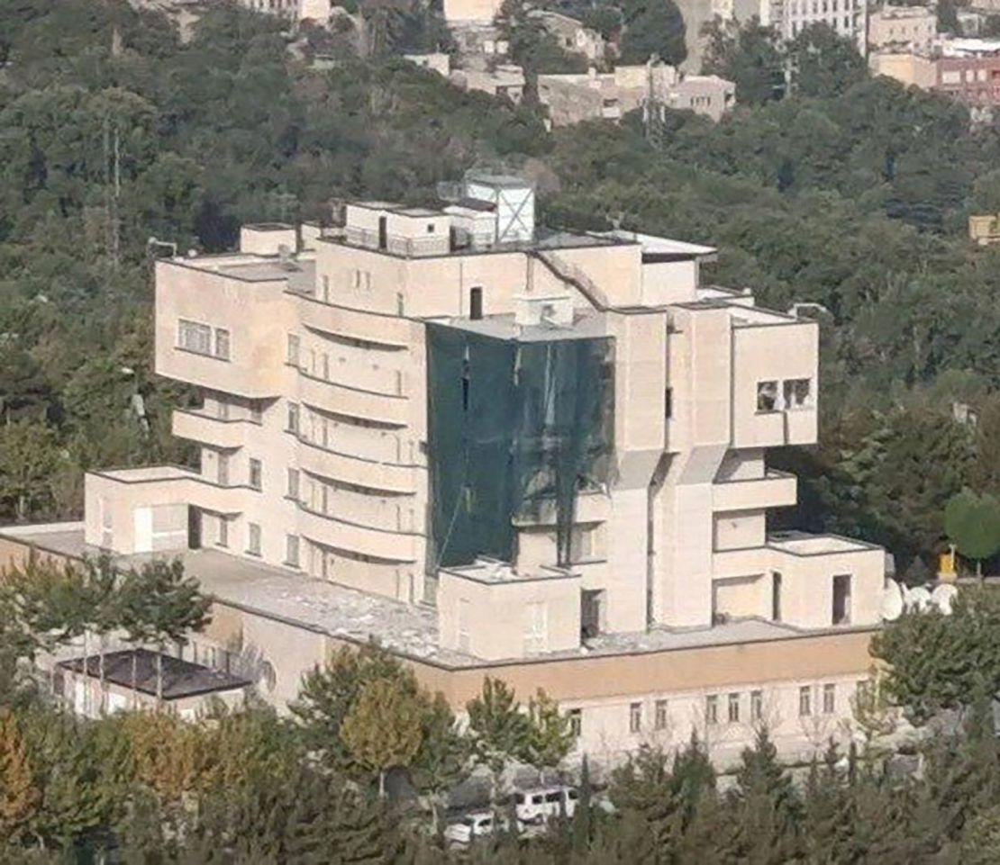
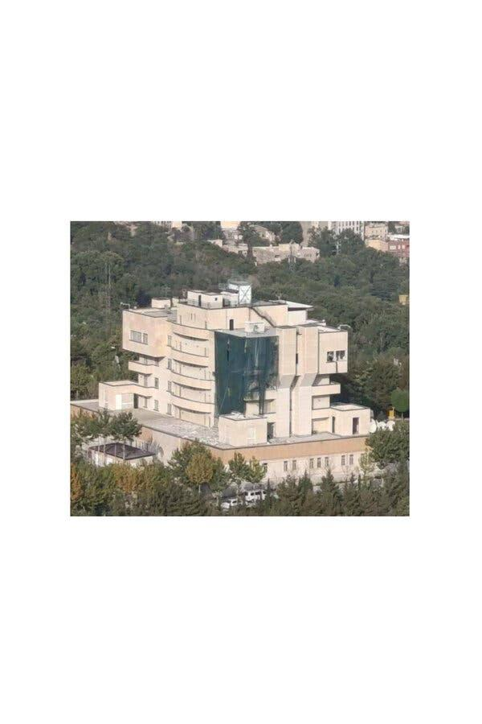

## Claim
Claim: " This image shows the assassination of Hamas leader Ismail Haniyeh on July 31st, 2024. This is how a precision strike looks like: a single missile through the window, and only Haniyeh and his bodyguard are dead. Nobody else in the building is even injured."

## Actions
```
reverse_search()
geolocate()
image_search("Ismail Haniyeh assassination building")
```

## Evidence
### Evidence from `reverse_search`
The image () appears in multiple sources related to the killing of al-Qaeda leader Ayman al-Zawahiri in Kabul, Afghanistan, on July 31, 2022. The New York Post ([https://nypost.com/2022/08/01/biden-to-speak-after-us-takes-out-al-qaeda-target-in-afghanistan/](https://nypost.com/2022/08/01/biden-to-speak-after-us-takes-out-al-qaeda-target-in-afghanistan/)) and News18.com ([https://www.news18.com/news/world/al-zawahiri-liked-sitting-outside-on-his-balcony-the-cia-watched-for-months-before-killing-him-5671915.html](https://www.news18.com/news/world/al-zawahiri-liked-sitting-outside-on-his-balcony-the-cia-watched-for-months-before-killing-him-5671915.html)) both use the image to illustrate the building that was hit.

The News18.com article also mentions the CIA's monitoring of al-Zawahiri and the use of Hellfire missiles in the strike. Kyle Orton's article ([https://www.kyleorton.com/p/ayman-al-zawahiri-life-in-jihad](https://www.kyleorton.com/p/ayman-al-zawahiri-life-in-jihad)) also uses the image and mentions the location of the strike in the Sherpur area of Kabul. The image is also accompanied by other images (, , , ).


### Evidence from `geolocate`
The most likely countries where the image was taken are: {'Cambodia': 0.35, 'Pakistan': 0.1, 'Bangladesh': 0.07, 'Ghana': 0.07, 'Bhutan': 0.06, 'China': 0.05, 'Sri Lanka': 0.04, 'Albania': 0.03, 'Kyrgyzstan': 0.02, 'Laos': 0.02}

### Evidence from `image_search`
CNN published an article about an explosion in a building in Iran, including an image of the building (). The New York Times published an article on August 1, 2024, about the assassination of Hamas leader Ismail Haniyeh, including an image of a building ().
The other source provided no content.


## Elaboration
The claim is demonstrably false. The image (

## Final Judgement
The image provided in the claim is associated with the killing of al-Qaeda leader Ayman al-Zawahiri in Kabul, Afghanistan, on July 31, 2022, not the assassination of Hamas leader Ismail Haniyeh. The image has been used in multiple news articles to illustrate the building that was hit in the strike.

`false`

### Verdict: FALSE

### Justification
The image in the claim is misattributed. Reverse image searches reveal that the image depicts the building targeted in the U.S. drone strike that killed al-Qaeda leader Ayman al-Zawahiri in Kabul, Afghanistan, on July 31, 2022, as reported by sources like the New York Post ([https://nypost.com/2022/08/01/biden-to-speak-after-us-takes-out-al-qaeda-target-in-afghanistan/](https://nypost.com/2022/08/01/biden-to-speak-after-us-takes-out-al-qaeda-target-in-afghanistan/)) and News18.com ([https://www.news18.com/news/world/al-zawahiri-liked-sitting-outside-on-his-balcony-the-cia-watched-for-months-before-killing-him-5671915.html](https://www.news18.com/news/world/al-zawahiri-liked-sitting-outside-on-his-balcony-the-cia-watched-for-months-before-killing-him-5671915.html)).
