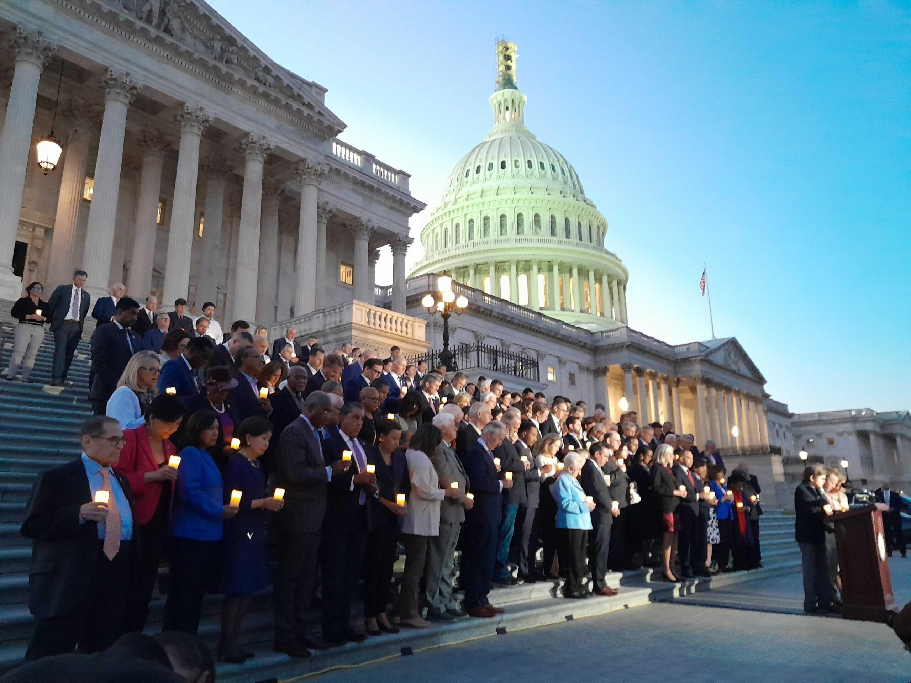

## Claim
Claim: "As the tensions between Israel and Hezbollah escalate in October, 2024, the U.S. government is offering Americans loans to pay for flights out of Lebanon while they have been flying Israeli citizens out of Israel on chartered flights for a year 'on US taxpayers' dime."

## Actions
```
image_search("US government loans Americans flights Lebanon October 2024")
image_search("US chartered flights Israeli citizens October 2023 - October 2024")
```

## Evidence
### Evidence from `image_search`
From [Source](https://www.foxbusiness.com/lifestyle/us-embassy-lebanon-urges-americans-book-any-ticket-available-few-remaining-departing-flights): 
Content: The Fox Business article includes an image of people with luggage. 


### Evidence from `image_search`
The Alaska Beacon ([Source](https://alaskabeacon.com/2023/10/12/with-violence-raging-in-israel-u-s-citizens-to-be-flown-out-on-charters/)) and the Idaho Capital Sun ([Source](https://idahocapitalsun.com/2023/10/12/with-violence-raging-in-israel-u-s-citizens-to-be-flown-out-on-charters/)) both reported on October 12, 2023, that the U.S. government was flying U.S. citizens out of Israel on chartered flights. , 

Reuters ([Source](https://www.reuters.com/world/first-us-charter-flight-out-israel-lands-athens-official-says-2023-10-13/)) reported on October 13, 2023, that the first U.S. charter flight out of Israel landed in Athens. 


## Elaboration
The evidence confirms that the U.S. government organized chartered flights to evacuate U.S. citizens from Israel in October 2023. However, the provided sources do not mention any U.S. government loans for flights out of Lebanon in October 2024. The Fox Business article shows an image of people with luggage, which may suggest that there were departing flights from Lebanon.

The claim's assertion about the U.S. government offering loans to Americans for flights out of Lebanon and flying Israeli citizens out of Israel for a year requires further verification. The evidence only supports the evacuation of U.S. citizens from Israel in October 2023.


## Final Judgement
The evidence indicates that the U.S. government organized chartered flights to evacuate U.S. citizens from Israel in October 2023. However, there is no evidence to support the claim that the U.S. government is offering loans to Americans for flights out of Lebanon in October 2024, nor is there evidence of flying Israeli citizens out of Israel for a year.

`false`

### Verdict: FALSE

### Justification
The U.S. government organized chartered flights to evacuate U.S. citizens from Israel in October 2023, as reported by the [Alaska Beacon](https://alaskabeacon.com/2023/10/12/with-violence-raging-in-israel-u-s-citizens-to-be-flown-out-on-charters/) and the [Idaho Capital Sun](https://idahocapitalsun.com/2023/10/12/with-violence-raging-in-israel-u-s-citizens-to-be-flown-out-on-charters/). However, there is no evidence to support the claim that the U.S. government is offering loans to Americans for flights out of Lebanon in October 2024, nor is there evidence of flying Israeli citizens out of Israel for a year.
