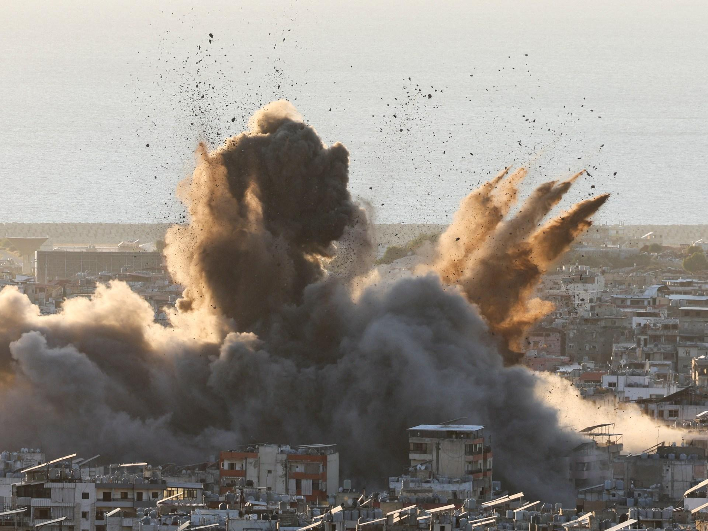

## Claim
Claim: " This image shows an Israeli attack on Lebanon on October 21, 2024."

## Actions
```
reverse_search()
```

## Evidence
### Evidence from `reverse_search`
The image 

## Elaboration
The image's metadata indicates it was taken by Mahmud Hams. The reverse image search did not provide any additional information to verify the claim.

The claim states the image depicts an Israeli attack on Lebanon on October 21, 2024. Without further information, it is impossible to verify the claim.

I need more information to verify the claim, such as the location of the image and the context of the event.


## Actions
```
image_search("Israeli attack Lebanon October 21 2024")
geolocate()
```

## Evidence
### Evidence from `image_search`
Al Jazeera published an article on October 21, 2024, about the US seeking an end to the war in Lebanon, including an image 

### Evidence from `geolocate`
The most likely countries where the image was taken are: {'Palestine': 0.66, 'Israel': 0.22, 'United Arab Emirates': 0.08, 'Jordan': 0.01, 'Albania': 0.0, 'Andorra': 0.0, 'Argentina': 0.0, 'Australia': 0.0, 'Austria': 0.0, 'Bangladesh': 0.0}

## Elaboration
The image search revealed an article from Al Jazeera on October 21, 2024, discussing the US seeking an end to the war in Lebanon. The geolocate function suggests the image was most likely taken in Palestine.

The claim states the image depicts an Israeli attack on Lebanon. The evidence suggests the image might be from Palestine, not Lebanon. Therefore, the claim is likely false.


## Final Judgement
The image search and geolocation suggest the image is likely from Palestine, not Lebanon, and the claim states the image depicts an Israeli attack on Lebanon. Therefore, the claim is likely false. `false`

### Verdict: FALSE

### Justification
The claim is likely false. While the image is from October 21, 2024, and depicts an explosion, the evidence suggests the image is from Palestine, not Lebanon, as the claim states.
