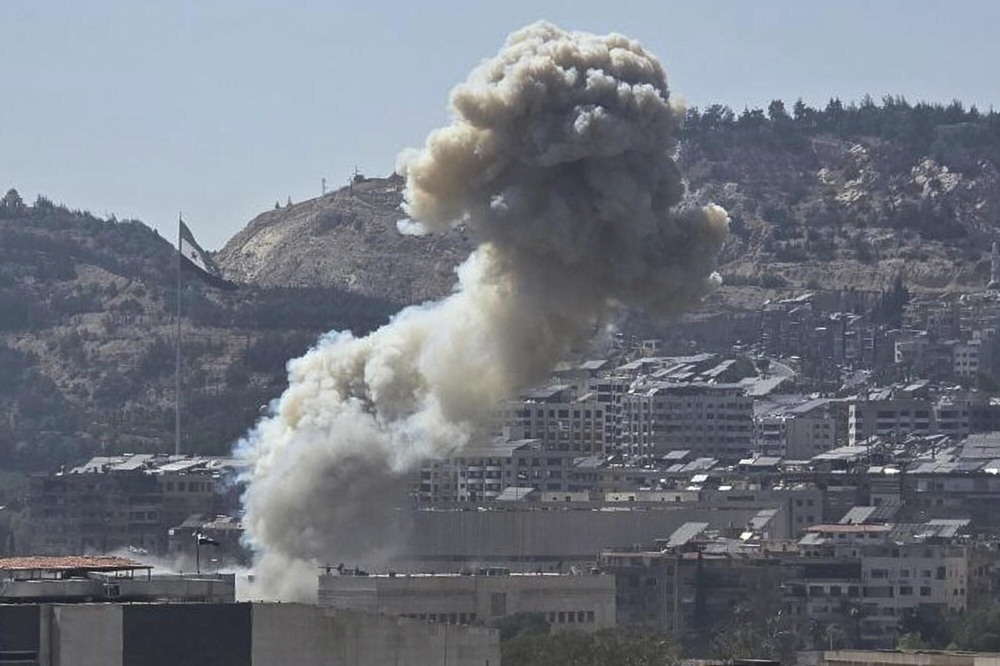

## Claim
Claim: " This image shows Israel bombing the surroundings of Southern Damascus in February 2025, destroying its last remaining army depots."

## Actions
```
reverse_search()
image_search("Israel bombing Damascus February 2025")
```

## Evidence
### Evidence from `reverse_search`
The image in the claim () appears in two sources. One source is an article from Daraa 24, published in January 2025, which is an interview with journalist Muhammad al-Owaid. The article discusses the challenges and prospects of Syrian media. The other source is from Alghad News, published on December 2, 2023, reporting on an Israeli air attack on Damascus.

The Alghad News article ([https://www.alghad.tv/%D8%A3%D8%AE%D8%A8%D8%A7%D8%B1-%D8%A7%D9%84%D8%BA%D8%AF/news/%D9%88%D8%B2%D8%A7%D8%B1%D8%A9-%D8%A7%D9%84%D8%AF%D9%81%D8%A7%D8%B9-%D8%A7%D9%84%D8%B3%D9%88%D8%B1%D9%8A%D8%A9-%D8%AA%D9%83%D8%B4%D9%81-%D8%AA%D9%81%D8%A7%D8%B5%D9%8A%D9%84-%D8%A7%D9%84%D8%B9%D8%AF%D9%88%D8%A7%D9%86-%D8%A7%D9%84%D8%AC%D9%88%D9%8A-%D8%A7%D9%84%D8%A5%D8%B3%D8%B1%D8%A7%D8%A6%D9%8A%D9%84%D9%8A-%D8%B9%D9%84%D9%89-%D8%AF%D9%85%D8%B4%D9%82](https://www.alghad.tv/%D8%A3%D8%AE%D8%A8%D8%A7%D8%B1-%D8%A7%D9%84%D8%BA%D8%AF/news/%D9%88%D8%B2%D8%A7%D8%B1%D8%A9-%D8%A7%D9%84%D8%AF%D9%81%D8%A7%D8%B9-%D8%A7%D9%84%D8%B3%D9%88%D8%B1%D9%8A%D8%A9-%D8%AA%D9%83%D8%B4%D9%81-%D8%AA%D9%81%D8%A7%D8%B5%D9%8A%D9%84-%D8%A7%D9%84%D8%B9%D8%AF%D9%88%D8%A7%D9%86-%D8%A7%D9%84%D8%AC%D9%88%D9%8A-%D8%A7%D9%84%D8%A5%D8%B3%D8%B1%D8%A7%D8%A6%D9%8A%D9%84%D9%8A-%D8%B9%D9%84%D9%89-%D8%AF%D9%85%D8%B4%D9%82)) reports on an Israeli air attack on Damascus. The Daraa 24 article ([https://daraa24.org/%D8%A7%D9%84%D8%B5%D8%AD%D9%81%D9%8A-%D9%85%D8%AD%D9%85%D8%AF-%D8%A7%D9%84%D8%B9%D9%88%D9%8A%D8%AF-%D9%81%D9%8A-%D9%85%D9%82%D8%A7%D8%A8%D9%84%D8%A9-%D9%85%D8%B9-%D8%AF%D8%B1%D8%B9%D8%A7-24/](https://daraa24.org/%D8%A7%D9%84%D8%B5%D8%AD%D9%81%D9%8A-%D9%85%D8%AD%D9%85%D8%AF-%D8%A7%D9%84%D8%B9%D9%88%D9%8A%D8%AF-%D9%81%D9%8A-%D9%85%D9%82%D8%A7%D8%A8%D9%84%D8%A9-%D9%85%D8%B9-%D8%AF%D8%B1%D8%B9%D8%A7-24/)) does not contain the image.


### Evidence from `image_search`
The Los Angeles Times published an article on July 16, 2025, about unrest in Sweida, Syria, which includes an image of an explosion (). The search result from twz.com also contains an image of an explosion ().


## Elaboration
The image in the claim (

## Final Judgement
The image in the claim appears in an article from Alghad News from December 2023, reporting on an Israeli air attack on Damascus. The claim states the image shows an event from February 2025.

The claim is not factually accurate because the image is misrepresented in a new context. `false`

### Verdict: FALSE

### Justification
The image in the claim was found in a December 2023 article from Alghad News ([https://www.alghad.tv/%D8%A3%D8%AE%D8%A7%D8%B1-%D8%A7%D9%84%D8%BA%D8%AF/news/%D9%88%D8%B2%D8%A7%D8%B1%D8%A9-%D8%A7%D9%84%D8%AF%D9%81%D8%A7%D8%B9-%D8%A7%D9%84%D8%B3%D9%88%D8%B1%D9%8A%D8%A9-%D8%AA%D9%83%D8%B4%D9%81-%D8%AA%D9%81%D8%A7%D8%B5%D9%8A%D9%84-%D8%A7%D9%84%D8%B9%D8%AF%D9%88%D8%A7%D9%86-%D8%A7%D9%84%D8%AC%D9%88%D9%8A-%D8%A7%D9%84%D8%A5%D8%B3%D8%B1%D8%A7%D8%A6%D9%8A%D9%84%D9%8A-%D8%B9%D9%84%D9%89-%D8%AF%D9%85%D8%B4%D9%82](https://www.alghad.tv/%D8%A3%D8%AE%D8%A7%D8%B1-%D8%A7%D9%84%D8%BA%D8%AF/news/%D9%88%D8%B2%D8%A7%D8%B1%D8%A9-%D8%A7%D9%84%D8%AF%D9%81%D8%A7%D8%B9-%D8%A7%D9%84%D8%B3%D9%88%D8%B1%D9%8A%D8%A9-%D8%AA%D9%83%D8%B4%D9%81-%D8%AA%D9%81%D8%A7%D8%B5%D9%8A%D9%84-%D8%A7%D9%84%D8%B9%D8%AF%D9%88%D8%A7%D9%86-%D8%A7%D9%84%D8%AC%D9%88%D9%8A-%D8%A7%D9%84%D8%A5%D8%B3%D8%B1%D8%A7%D8%A6%D9%8A%D9%84%D9%8A-%D8%B9%D9%84%D9%89-%D8%AF%D9%85%D8%B4%D9%82)), which predates the February 2025 date mentioned in the claim.
