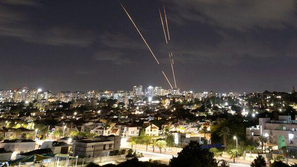
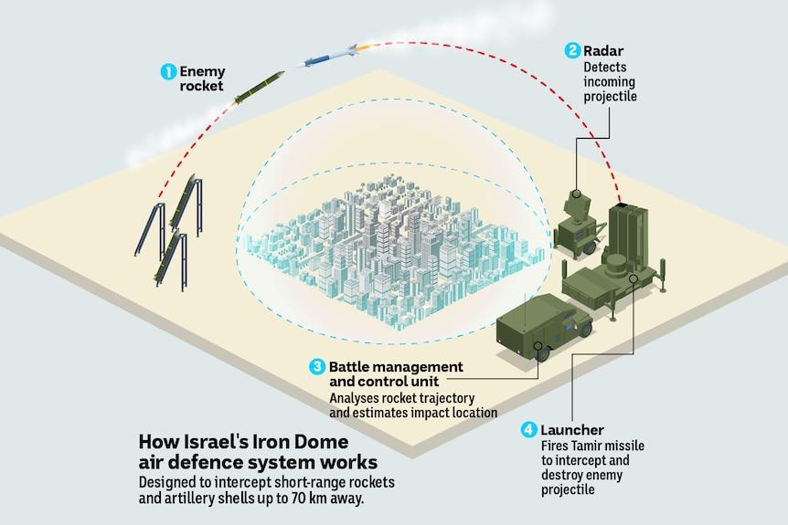

## Claim
Claim: "The Iron Dome intercepted 90% of ballistic missiles fired at Israel in Iran's attack on October 1, 2024."

## Actions
```
image_search("Iron Dome Israel missile interception rate October 1 2024 Iran attack")
```

## Evidence
### Evidence from `image_search`
The search results include articles from [Hindustan Times](https://www.hindustantimes.com/world-news/davids-sling-arrow-iron-dome-how-israel-intercepted-irans-200-missiles-101727829628883.html), [ABC News](https://abcnews.go.com/International/iran-launches-attack-israel-what-is-iron-dome/story?id=109218962), and [Bloomberg](https://www.bloomberg.com/news/articles/2024-04-11/what-are-israel-s-air-defenses-as-iran-threatens-to-attack). The ABC News and Bloomberg articles contain images of the Iron Dome intercepting missiles.  


## Elaboration
The evidence includes articles from Hindustan Times, ABC News, and Bloomberg about the Iranian attack on Israel. However, none of the provided articles mention the interception rate of the Iron Dome.

The claim cannot be verified with the available information. The interception rate is not mentioned in the search results.


## Actions
```
image_search("Iron Dome interception rate Iran attack October 1 2024")
```

## Evidence
### Evidence from `image_search`
From [Source](https://www.livemint.com/news/world/not-a-science-fiction-israel-shares-video-of-iron-dome-intercepting-iranian-missiles-israel-iran-war-news-11727844421348.html): 
Content: Livemint shares a video of the Iron Dome intercepting Iranian missiles. 


## Elaboration
The new evidence from Livemint shows the Iron Dome intercepting missiles during the Iranian attack. However, the evidence still does not provide the interception rate of the Iron Dome.

The claim cannot be verified with the available information. The interception rate is not mentioned in the search results.


## Actions
```
image_search("Iron Dome effectiveness rate Iran attack October 1 2024")
```

## Evidence
### Evidence from `image_search`
Al Jazeera reports that Israel claims the Iron Dome is 90 percent effective.  ABC News published an article about the Iranian attack on Israel and the Iron Dome air defense system. 

*   [https://www.aljazeera.com/news/2024/10/2/iran-and-israel-what-are-their-attack-and-defence-capabilities](https://www.aljazeera.com/news/2024/10/2/iran-and-israel-what-are-their-attack-and-defence-capabilities)
*   [https://www.abc.net.au/news/2024-10-02/iran-ballistic-missile-attack-israel-iron-dome-air-defence/104420966](https://www.abc.net.au/news/2024-10-02/iran-ballistic-missile-attack-israel-iron-dome-air-defence/104420966)


## Elaboration
The Al Jazeera article states that Israel claims the Iron Dome is 90 percent effective. However, this is a general claim about the system's effectiveness, not specifically about the October 1, 2024, attack. The ABC News article discusses the Iranian attack and the Iron Dome but does not provide an interception rate.

The claim cannot be verified. While the evidence suggests the Iron Dome is highly effective, it does not confirm the 90% interception rate for the specific attack on October 1, 2024.


## Final Judgement
The search results provide information about the Iron Dome's general effectiveness and its role in intercepting missiles during the Iranian attack. However, the evidence does not specify the interception rate for the October 1, 2024, attack. While Al Jazeera mentions Israel's claim of 90% effectiveness, this is a general statement and not specific to the date in the claim.

The claim is not supported by the evidence. Therefore, the most appropriate decision option is `false`.

### Verdict: FALSE

### Justification
The claim cannot be verified. While [Al Jazeera](https://www.aljazeera.com/news/2024/10/2/iran-and-israel-what-are-their-attack-and-defence-capabilities) reports that Israel claims the Iron Dome is 90% effective, this is a general statement and not specific to the October 1, 2024, attack. Other sources, such as [ABC News](https://www.abc.net.au/news/2024-10-02/iran-ballistic-missile-attack-israel-iron-dome-air-defence/104420966), discuss the attack but do not provide an interception rate.
