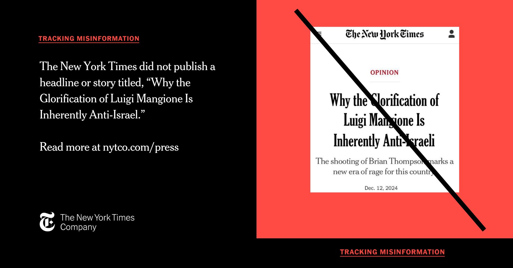

## Claim
Claim: " This image shows a screenshot of an authentic New York Times article from December, 12, 2024 with the title 'Why the Glorification of Luigi Mangione Is Inherently Anti-Israeli."

## Actions
```
image_search("New York Times Luigi Mangione Anti-Israeli")
```

## Evidence
### Evidence from `image_search`
The New York Times did not publish an article with the title "Why the Glorification of Luigi Mangione Is Inherently Anti-Israeli" according to [Source](https://www.nytco.com/press/tracking-misinformation-fabricated-opinion-headline/) and [Source](https://www.yahoo.com/news/york-times-didnt-publish-anti-232547549.html).  

The New York Times published an article on December 10, 2024, which included an image of a person being arrested by the police [Source](https://www.nytimes.com/2024/12/10/briefing/the-search-ends.html). 


## Elaboration
The evidence indicates that the New York Times did not publish an article with the title "Why the Glorification of Luigi Mangione Is Inherently Anti-Israeli" ([Source](https://www.nytco.com/press/tracking-misinformation-fabricated-opinion-headline/) and [Source](https://www.yahoo.com/news/york-times-didnt-publish-anti-232547549.html)). The image provided in the claim is therefore not authentic.


## Final Judgement
The New York Times did not publish an article with the title "Why the Glorification of Luigi Mangione Is Inherently Anti-Israeli." The image provided in the claim is therefore not authentic.

The claim is demonstrably false because it is disproven by evidence from multiple and reliable sources. `false`

### Verdict: FALSE

### Justification
The claim is false. The New York Times did not publish an article with the title "Why the Glorification of Luigi Mangione Is Inherently Anti-Israeli," as confirmed by the New York Times itself ([Source](https://www.nytco.com/press/tracking-misinformation-fabricated-opinion-headline/)) and other news outlets ([Source](https://www.yahoo.com/news/york-times-didnt-publish-anti-232547549.html)).
