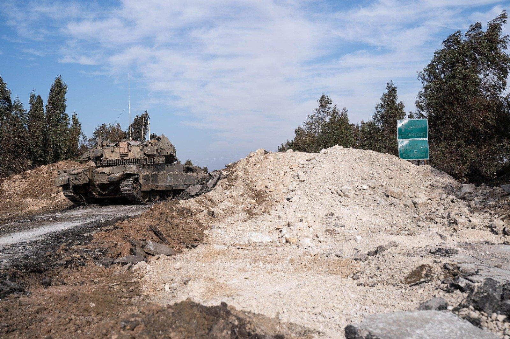

## Claim
Claim: " This image shows the Israeli army reaching Damascus in Syria in December 2024."

## Actions
```
reverse_search()
image_search("Israeli tanks Damascus Syria")
geolocate()
```

## Evidence
### Evidence from `reverse_search`
The image of Israeli tanks () appears in multiple articles. One article from NBC News, published on October 30, 2023, describes a video of an Israeli tank firing at a car in Gaza ([https://www.nbcnews.com/news/world/israel-hamas-war-tank-fires-at-car-gaza-strip-rcna122801](https://www.nbcnews.com/news/world/israel-hamas-war-tank-fires-at-car-gaza-strip-rcna122801)).

Another article from ABC News, published on May 28, 2024, discusses the Israeli offensive in Rafah, Gaza, and mentions Israeli tanks reaching the center of Rafah ([https://www.abc.net.au/news/2024-05-28/israel-rafah-offensive-gaza/103904720](https://www.abc.net.au/news/2024-05-28/israel-rafah-offensive-gaza/103904720)). A third article from the Chicago Council on Global Affairs, published in 2024, discusses Russian views on the Israeli-Palestinian conflict and includes the image of Israeli tanks ([https://globalaffairs.org/commentary-and-analysis/blogs/russian-youth-more-favorable-toward-israel-older-generations](https://globalaffairs.org/commentary-and-analysis/blogs/russian-youth-more-favorable-toward-israel-older-generations)).


### Evidence from `image_search`
The Times of Israel published an image of an Israeli tank ([https://www.timesofisrael.com/liveblog_entry/report-israeli-tanks-reach-point-25km-from-damascus/](https://www.timesofisrael.com/liveblog_entry/report-israeli-tanks-reach-point-25km-from-damascus/)) . NDTV fact-checked the claim that the image  shows Israeli tanks near Damascus and found it to be false .

Al Jazeera published an article on December 8, 2024, about Israel seizing a buffer zone in Syria's Golan Heights, which included an image of an Israeli tank ([https://www.aljazeera.com/news/2024/12/8/israel-seizes-buffer-zone-in-syrias-golan-heights-after-al-assad-falls](https://www.aljazeera.com/news/2024/12/8/israel-seizes-buffer-zone-in-syrias-golan-heights-after-al-assad-falls)) .


### Evidence from `geolocate`
The most likely countries where the image was taken are: {'Israel': 0.78, 'Palestine': 0.2, 'Jordan': 0.01, 'Albania': 0.0, 'Andorra': 0.0, 'Argentina': 0.0, 'Australia': 0.0, 'Austria': 0.0, 'Bangladesh': 0.0, 'Belgium': 0.0}

## Elaboration
The claim that the image shows the Israeli army reaching Damascus in Syria in December 2024 is false. The image has been fact-checked and debunked by NDTV. The image was likely taken in Israel or Palestine.


## Final Judgement
The image has been fact-checked and debunked. The image does not show Israeli tanks reaching Damascus in Syria. Therefore, the claim is false. `false`

### Verdict: FALSE

### Justification
The claim is false. Reverse image searches and fact-checks by NDTV found that the image does not depict Israeli tanks reaching Damascus in Syria. The image was likely taken in Israel or Palestine.
