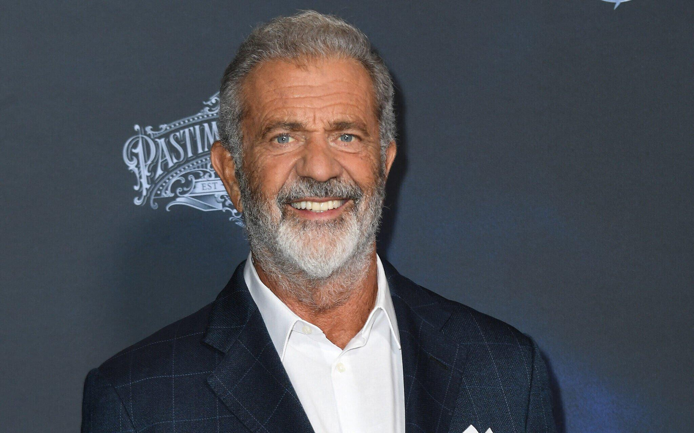
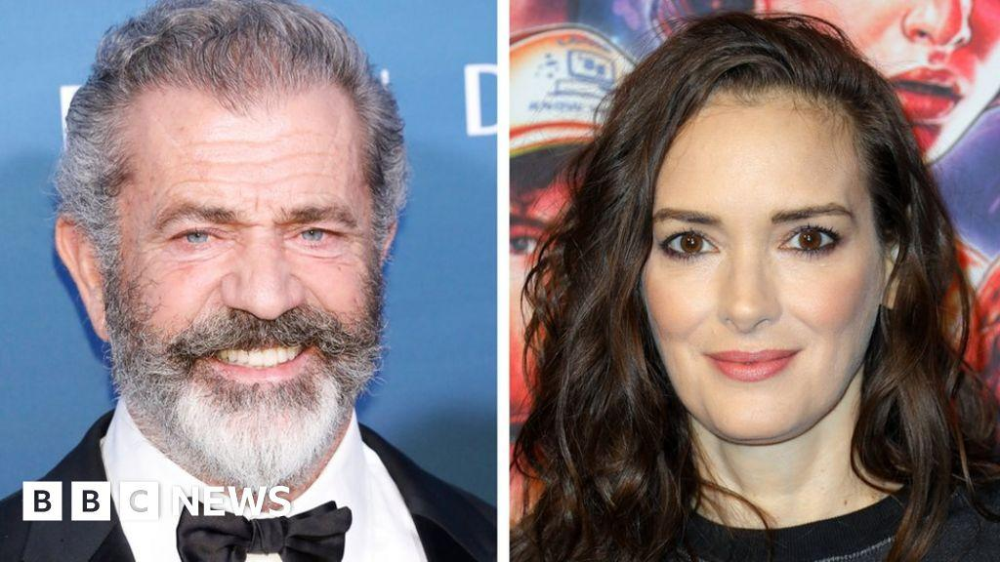

## Claim
Claim: " The image shows a screenshot of an authentic social media post from Mel Gibson saying that Israel will end soon and therefore destroy everything in its way together with a flag in the color of Israel that shows an hourglass."

## Actions
```
reverse_search()
image_search("Mel Gibson Israel hourglass")
```

## Evidence
### Evidence from `image_search`
The Associated Press published a fact check about a social media post attributed to Mel Gibson. ([https://apnews.com/article/fact-check-mel-gibson-israel-post-342335121493](https://apnews.com/article/fact-check-mel-gibson-israel-post-342335121493)) Yahoo published a fact-check about Mel Gibson. ([https://www.yahoo.com/entertainment/fact-check-mel-gibson-posted-235600604.html](https://www.yahoo.com/entertainment/fact-check-mel-gibson-posted-235600604.html)) The Times of Israel provides a picture of Mel Gibson. ([https://www.timesofisrael.com/topic/mel-gibson/](https://www.timesofisrael.com/topic/mel-gibson/))

The sources include images of Mel Gibson (, , ).


## Elaboration
The evidence includes links to fact checks from the Associated Press ([https://apnews.com/article/fact-check-mel-gibson-israel-post-342335121493](https://apnews.com/article/fact-check-mel-gibson-israel-post-342335121493)) and Yahoo ([https://www.yahoo.com/entertainment/fact-check-mel-gibson-posted-235600604.html](https://www.yahoo.com/entertainment/fact-check-mel-gibson-posted-235600604.html)) about a social media post attributed to Mel Gibson. This suggests that the authenticity of the post is questionable and has been investigated by fact-checkers.

The presence of fact-check articles indicates that the claim's veracity is disputed. To fully assess the claim, the content of the fact-check articles would need to be reviewed.


## Actions
```
image_search("Mel Gibson social media post Israel hourglass")
```

## Evidence
### Evidence from `image_search`
From [Source](https://www.bbc.com/news/entertainment-arts-53162246): 
Content: The BBC News provides an image of Mel Gibson. 


## Elaboration
The evidence includes a BBC News image of Mel Gibson. However, it does not provide any information about the social media post in question. Therefore, I cannot verify the claim's veracity.

I need to review the content of the fact-check articles from the Associated Press and Yahoo to determine if the social media post is authentic.


## Actions
```
image_search("Mel Gibson Israel social media post")
```

## Evidence
No new evidence found.

## Elaboration
I am unable to verify the claim. The evidence points to fact-checks about a social media post attributed to Mel Gibson, but I lack the content of these fact-checks to determine the post's authenticity.


## Final Judgement
The evidence suggests that the claim is likely false. Fact-checkers have investigated a social media post attributed to Mel Gibson, indicating that its authenticity is questionable. Without the content of the fact-checks, it is impossible to confirm the claim's veracity.

`false`

### Verdict: FALSE

### Justification
The claim is likely false. Fact-checkers, including the Associated Press ([https://apnews.com/article/fact-check-mel-gibson-israel-post-342335121493](https://apnews.com/article/fact-check-mel-gibson-israel-post-342335121493)) and Yahoo ([https://www.yahoo.com/entertainment/fact-check-mel-gibson-posted-235600604.html](https://www.yahoo.com/entertainment/fact-check-mel-gibson-posted-235600604.html)), have investigated a social media post attributed to Mel Gibson, suggesting its authenticity is doubtful.
