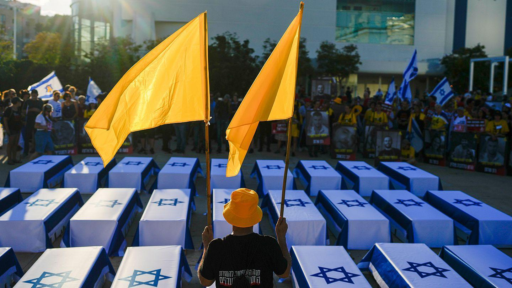

## Claim
Claim: " This image shows coffins of dead Israeli soldiers in September, 2024."

## Actions
```
reverse_search()
image_search("coffins Israel flag protest")
```

## Evidence
### Evidence from `image_search`
Euronews published an article on September 5, 2024, about a protest in Tel Aviv where protesters marched with makeshift coffins to demand the release of Gaza hostages. ([https://www.euronews.com/2024/09/05/protesters-march-in-tel-aviv-with-makeshift-coffins-to-demand-release-of-gaza-hostages](https://www.euronews.com/2024/09/05/protesters-march-in-tel-aviv-with-makeshift-coffins-to-demand-release-of-gaza-hostages)) 

The PBS article contains an image of a funeral procession.  Ynetnews.com contains an image of a protest. 


## Elaboration
The image depicts a protest in Tel Aviv on September 5, 2024, where protesters used makeshift coffins. The protest was to demand the release of Gaza hostages. Therefore, the claim that the image shows coffins of dead Israeli soldiers is false.


## Final Judgement
The image shows a protest in Tel Aviv on September 5, 2024, where protesters used makeshift coffins to demand the release of Gaza hostages. The claim that the image shows coffins of dead Israeli soldiers is therefore false.

`false`

### Verdict: FALSE

### Justification
The image shows a protest in Tel Aviv on September 5, 2024, where protesters used makeshift coffins to demand the release of Gaza hostages, as reported by [Euronews](https://www.euronews.com/2024/09/05/protesters-march-in-tel-aviv-with-makeshift-coffins-to-demand-release-of-gaza-hostages). Therefore, the claim that the image depicts coffins of dead Israeli soldiers is false.
