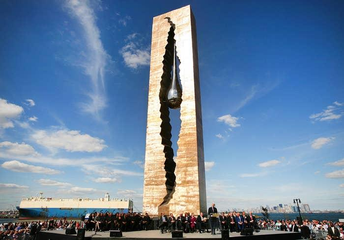
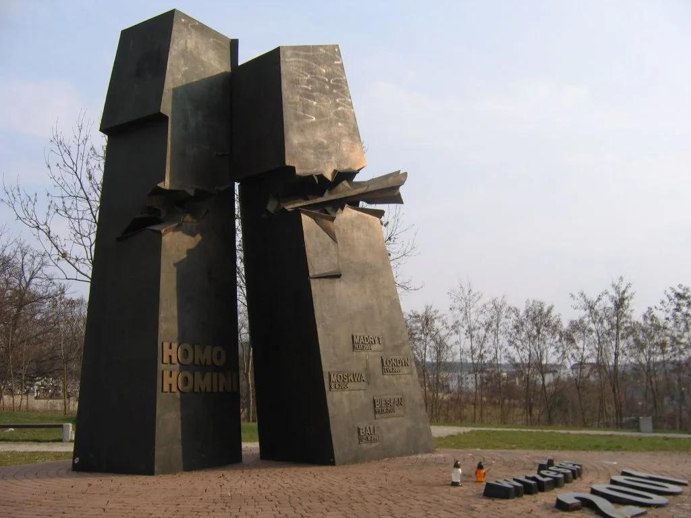

## Claim
Claim: " This image shows Israel's 9/11 memorial which is the only one outside the US."

## Actions
```
reverse_search()
```

## Evidence
### Evidence from `reverse_search`
The image shows the 9/11 Living Memorial Plaza in Jerusalem, Israel, which is a 30-foot bronze sculpture of a waving American flag transforming into a flame (

## Elaboration
The evidence confirms that the image depicts the 9/11 Living Memorial Plaza in Jerusalem, Israel. The memorial is a bronze sculpture.

The evidence does not explicitly state whether this is the only 9/11 memorial outside the US.

To verify the claim, additional information is needed to confirm if this is the only 9/11 memorial outside the US.


## Actions
```
image_search("9/11 memorials outside US")
```

## Evidence
### Evidence from `image_search`
Buzzfeed features a list of 9/11 memorials around the world, and the search result shows a 9/11 memorial in Poland.  


## Elaboration
The image search results show that there are 9/11 memorials outside the US, including one in Poland. This contradicts the claim that the memorial in the image is the only one outside the US.


## Final Judgement
The image depicts the 9/11 Living Memorial Plaza in Jerusalem, Israel. However, the claim that this is the only 9/11 memorial outside the US is false. Additional evidence from an image search reveals the existence of other 9/11 memorials outside the US, such as the one in Poland.

`false`

### Verdict: FALSE

### Justification
The image shows the 9/11 Living Memorial Plaza in Jerusalem, Israel. However, the claim that this is the only 9/11 memorial outside the US is false, as evidenced by the existence of other memorials, such as the one in Poland, as shown by the image search results.
